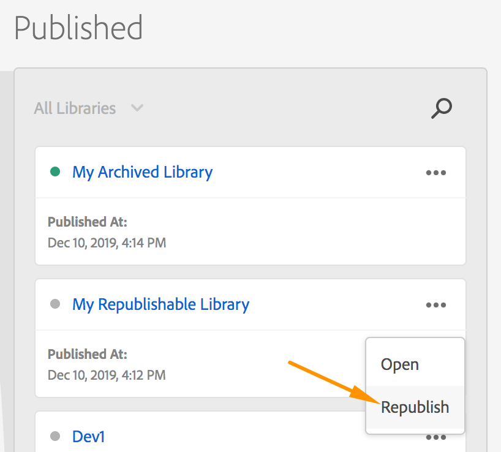

# Republication de bibliothèque

Les cinq bibliothèques les plus récentes qui ont été publiées dans votre environnement de production sur une propriété Web peuvent être récupérées ultérieurement. Cette fonctionnalité est utile lorsque vous trouvez un bogue dans votre bibliothèque de production et que vous devez restaurer immédiatement un état que vous savez correct.

Le processus de récupération dépend des paramètres de votre environnement au moment de la publication initiale de la bibliothèque. Il est important de prendre cette information en compte car la récupération d’une bibliothèque archivée ne change rien directement sur votre site, contrairement à la récupération d’une bibliothèque ordinaire.

Les options disponibles sont les suivantes :

* **Hôte : géré par Adobe, Archive : désactivé :** si vous utilisez lʼhôte Géré par Adobe et que vous nʼarchivez pas votre bibliothèque, vous pouvez republier ces anciennes bibliothèques.

* **Hôte : géré par Adobe, Archive : activé :** si vous utilisez lʼhôte Géré par Adobe et que vous archivez votre bibliothèque, vous pouvez télécharger ces anciennes bibliothèques.

* **Hôte : SFTP ; Archive : Activée ou désactivée**. Si vous utilisez l’hôte SFTP, le système part du principe que vos propres stratégies d’archivage sont en place, aucune option de récupération n’est donc disponible.

Les options de récupération pour les propriétés mobiles ne sont pas encore disponibles.

## Republication

Chaque environnement de balises fournit un lien vers un fichier de bibliothèque. Toute bibliothèque que vous créez dans cet environnement peut être référencée par ce lien.

Lorsque vous lancez la nouvelle version d’un environnement de développement ou d’évaluation, l’ancienne version est nettoyée et la nouvelle version est déployée. Pour votre environnement de production, ce lien est mis à jour afin de pointer vers la dernière version, mais les cinq versions les plus récentes sont conservées avant d’être nettoyées.

Ces cinq dernières versions de votre environnement de production sont celles qui peuvent être récupérées.

Lorsque vous republiez une ancienne bibliothèque, Experience Platform met à jour le lien de l’environnement afin qu’il pointe vers l’une de ces anciennes versions qui n’a pas encore été nettoyée.  Experience Platform émet également une requête de purge dans le cache des nœuds périphériques CDN pour indiquer que la bibliothèque a été mise à jour et qu’une nouvelle copie doit être récupérée à partir de l’origine.

Cela signifie que lorsque vous republiez une ancienne bibliothèque :

* Aucune modification nʼest apportée aux ressources (ou aux révisions historiques) de votre propriété de balise.

* La manière dont les environnements de développement et d’évaluation calculent ce qui est en amont ne change pas.

Prenons comme exemple le cas où vous effectuez une restauration en raison d’un problème avec une règle spécifique. La révision de la règle qui est actuellement en production peut, par exemple, être vieille de trois versions. Lorsque vous affichez cette règle dans l’interface utilisateur pour la corriger, elle reflète toujours les dernières modifications enregistrées au lieu de celles qui sont actuellement en production.

C’est pourquoi Experience Platform vous avertit qu’une propriété est dans un état republié afin de vous rappeler que ce que vous voyez dans l’interface utilisateur de la collecte de données est un peu plus éloigné de la production que d’habitude. Cette notification peut être ignorée et sʼaffiche une seule fois par session du navigateur, lors de la première consultation de la propriété.

### Republication d’une ancienne bibliothèque

Dans l’écran Publication :

1. Dans la colonne Publié, recherchez la bibliothèque que vous souhaitez republier.
1. Sélectionnez les points de suspension (`...`) dans le coin supérieur droit de la Carte de bibliothèque.
1. Sélectionner **[!UICONTROL Republish]**.

## Téléchargement

Le téléchargement d’une bibliothèque archivée est une manipulation très simple. Vous ne référencez pas directement ces fichiers .zip où que ce soit, vous pouvez donc simplement télécharger l’ancienne bibliothèque sur votre ordinateur et exécuter votre processus habituel.

### Téléchargement d’une ancienne bibliothèque

Dans l’écran Publication :

1. Dans la colonne Publié, recherchez la bibliothèque que vous souhaitez télécharger.
1. Sélectionnez les points de suspension (`...`) dans le coin supérieur droit de la carte Bibliothèque.
1. Sélectionner **[!UICONTROL Download]**.
