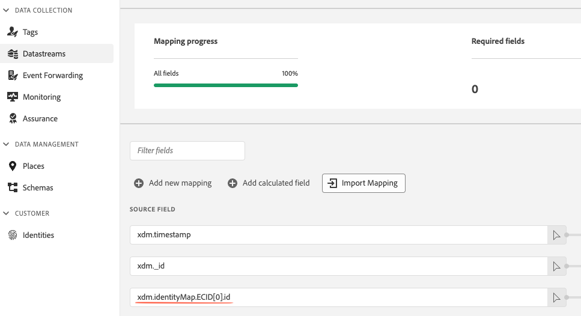

# Données d’identité dans le SDK Web

Le SDK Web de Adobe Experience Platform utilise [Adobe Experience Cloud IDs (ECID)](../../identity-service/features/ecid.md) pour effectuer le suivi du comportement des visiteurs. En utilisant [!DNL ECIDs], vous pouvez vous assurer que chaque appareil dispose d’un identifiant unique qui peut persister sur plusieurs sessions, en liant tous les accès qui se produisent pendant et entre les sessions web à un appareil spécifique.

Ce document présente comment gérer [!DNL ECIDs] et [!DNL CORE IDs] à l’aide du SDK Web.

## Suivi des ECID à l’aide du SDK Web {#tracking-ecids-web-sdk}

Le SDK Web affecte et effectue le suivi de [!DNL ECIDs] à l’aide de cookies, avec plusieurs méthodes disponibles pour configurer la manière dont ces cookies sont générés.

Lorsqu’un nouvel utilisateur arrive sur votre site web, le [service Adobe Experience Cloud Identity](../../identity-service/home.md) tente de définir un cookie d’identification d’appareil pour cet utilisateur.

* Pour les nouveaux visiteurs, un [!DNL ECID] est généré et renvoyé dans la première réponse de l’Edge Network Experience Platform.
* Pour les visiteurs récurrents, le [!DNL ECID] est récupéré du cookie `kndctr_{YOUR-ORG-ID}_AdobeOrg_identity` et ajouté à la charge utile de la requête par l’Edge Network.

Une fois le cookie contenant le [!DNL ECID] défini, chaque requête suivante générée par le SDK Web inclut un [!DNL ECID] codé dans le cookie `kndctr_{YOUR-ORG-ID}_AdobeOrg_identity`.

Lors de l’utilisation de cookies pour l’identification de l’appareil, vous avez deux façons d’interagir avec l’Edge Network :

1. Créez un CNAME sur votre propre domaine qui pointe vers `adobedc.net`. Cette méthode est appelée [collecte de données propriétaires](#first-party).
1. Envoyez directement des données au domaine Edge Network `adobedc.net`. Cette méthode est appelée [collecte de données tierce](#third-party).

Comme expliqué dans les sections ci-dessous, la méthode de collecte de données que vous choisissez d’utiliser a un impact direct sur la durée de vie des cookies dans les navigateurs.

## Suivi des ID principaux à l’aide du SDK Web {#tracking-coreid-web-sdk}

Lors de l’utilisation de Google Chrome avec des cookies tiers activés et qu’aucun cookie `kndctr_{YOUR-ORG-ID}_AdobeOrg_identity` n’est défini, la première requête de l’Edge Network passe par un domaine `demdex.net`, qui définit un cookie demdex. Ce cookie contient un [!DNL CORE ID]. Il s’agit d’un identifiant utilisateur unique, différent de [!DNL ECID].

Selon votre mise en oeuvre, vous pouvez [accéder à [!DNL CORE ID]](#retrieve-coreid).

### Collecte de données propriétaires {#first-party}

La collecte de données propriétaires implique de définir des cookies via un `CNAME` sur votre propre domaine qui pointe vers `adobedc.net`.

Bien que les navigateurs aient longtemps traité les cookies définis par les points de terminaison `CNAME` de la même manière que ceux définis par les points de terminaison détenus par le site, les récentes modifications implémentées par les navigateurs ont créé une distinction dans la manière dont les cookies `CNAME` sont traités. Bien qu’aucun navigateur ne bloque actuellement les cookies `CNAME` propriétaires par défaut, certains navigateurs limitent la durée de vie des cookies définis à l’aide d’un `CNAME` à seulement sept jours.

### Collecte de données tierces {#third-party}

La collecte de données tierces implique l’envoi direct de données au domaine Edge Network `adobedc.net`.

Ces dernières années, les navigateurs web sont devenus de plus en plus restrictifs dans leur gestion des cookies définis par des tiers. Certains navigateurs bloquent par défaut les cookies tiers. Si vous utilisez des cookies tiers pour identifier les visiteurs du site, la durée de vie de ces cookies est presque toujours plus courte que celle qui serait normalement disponible à l’aide de cookies propriétaires. Parfois, un cookie tiers expire dans seulement sept jours.

En outre, lors de l’utilisation de la collecte de données tierces, certains bloqueurs d’annonces limitent le trafic aux points de terminaison de collecte de données d’Adobe.

### Effets de la durée de vie des cookies sur les applications Adobe Experience Cloud {#lifespans}

Que vous choisissiez la collecte de données propriétaires ou tierces, la durée de conservation d’un cookie a un impact direct sur le nombre de visiteurs dans [Adobe Analytics](https://experienceleague.adobe.com/fr/docs/analytics) et [Customer Journey Analytics](https://experienceleague.adobe.com/fr/docs/customer-journey-analytics). En outre, les utilisateurs finaux peuvent rencontrer des expériences de personnalisation incohérentes lorsque [Adobe Target](https://experienceleague.adobe.com/en/docs/target) ou [Offer decisioning](https://experienceleague.adobe.com/en/docs/target/using/integrate/ajo/offer-decision) sont utilisés sur le site.

Supposons, par exemple, que vous ayez créé une expérience de personnalisation qui fait la promotion d’un élément sur la page d’accueil si un utilisateur l’a consulté trois fois au cours des sept derniers jours.

Si un utilisateur final se rend sur le site trois fois par semaine, puis ne revient pas sur le site pendant sept jours, il peut être considéré comme un nouvel utilisateur lorsqu’il revient sur le site, car ses cookies peuvent avoir été supprimés par une stratégie de navigateur (en fonction du navigateur utilisé lors de sa visite). Si cela se produit, votre outil Analytics traite le visiteur comme un nouvel utilisateur, même s’il a visité le site il y a un peu plus de sept jours. En outre, toute tentative de personnalisation de l’expérience pour l’utilisateur recommence.

### Identifiants d’appareils propriétaires (FPID) {#fpid}

Pour tenir compte des effets de la durée de vie des cookies comme indiqué ci-dessus, vous pouvez choisir de définir et de gérer vos propres identifiants d’appareil à la place. Pour plus d’informations, consultez le guide des [Identifiants d’appareils propriétaires](./first-party-device-ids.md).

## Récupération de l’ECID et de la région pour l’utilisateur actuel {#retrieve-ecid}

Selon votre cas d’utilisation, vous pouvez accéder à [!DNL ECID] de deux manières différentes :

* [Récupérez le  [!DNL ECID] par le biais de la préparation des données pour la collecte de données](#retrieve-ecid-data-prep) : il s’agit de la méthode recommandée.
* [Récupérez le  [!DNL ECID]  via la commande `getIdentity()`](#retrieve-ecid-getidentity) : utilisez cette méthode uniquement lorsque vous avez besoin des informations [!DNL ECID] côté client.

### Récupération de [!DNL ECID] par le biais de la préparation de données pour la collecte de données {#retrieve-ecid-data-prep}

Utilisez [Préparation de données pour la collecte de données](../../datastreams/data-prep.md) pour mapper [!DNL ECID] à un champ [!DNL XDM]. Il s’agit de la méthode recommandée pour accéder à [!DNL ECID].

Pour ce faire, définissez le champ source sur le chemin suivant :

```js
xdm.identityMap.ECID[0].id
```

Définissez ensuite le champ cible sur un chemin XDM où le champ est de type `string`.




### Récupérez le [!DNL ECID] via la commande `getIdentity()` {#retrieve-ecid-getidentity}

>[!IMPORTANT]
>
>Vous ne devez récupérer l’ECID qu’à l’aide de la commande `getIdentity()` si vous avez besoin de [!DNL ECID] côté client. Si vous souhaitez uniquement mapper l’ECID à un champ XDM, utilisez [Préparation de données pour la collecte de données](#retrieve-ecid-data-prep) à la place.

Pour récupérer l’ECID unique du visiteur actuel, utilisez la commande `getIdentity`. Pour les nouveaux visiteurs qui n’ont pas encore de [!DNL ECID], cette commande génère un nouveau [!DNL ECID]. `getIdentity` renvoie également l’identifiant de région du visiteur.

>[!NOTE]
>
>Cette méthode est généralement utilisée avec les solutions personnalisées qui nécessitent la lecture de l’ID [!DNL Experience Cloud] ou qui ont besoin d’un indicateur d’emplacement pour Adobe Audience Manager. Il n’est pas utilisé par une mise en oeuvre standard.

```javascript
alloy("getIdentity")
  .then(function(result) {
    // The command succeeded.
    console.log("ECID:", result.identity.ECID);
    console.log("RegionId:", result.edge.regionId);
  })
  .catch(function(error) {
    // The command failed.
    // "error" will be an error object with additional information.
  });
```

## Récupération de l’ID CORE pour l’utilisateur actuel {#retrieve-coreid}

Pour récupérer l’ID CORE d’un utilisateur, vous pouvez utiliser la commande [`getIdentity()`](../commands/getidentity.md), comme illustré ci-dessous.

```js
alloy("getIdentity",{
  "namespaces": ["CORE"]
});
```


## Utilisation de `identityMap` {#using-identitymap}

À l’aide d’un champ XDM [`identityMap` ](../../xdm/schema/composition.md#identityMap), vous pouvez identifier un appareil/utilisateur à l’aide de plusieurs identités, définir leur état d’authentification et décider quel identifiant est considéré comme l’identifiant principal. Si aucun identifiant n’a été défini comme `primary`, la valeur par défaut principale est `ECID`.

Les champs `identityMap` sont mis à jour à l’aide de la commande `sentEvent`.

```javascript
alloy("sendEvent", {
  xdm: {
    "identityMap": {
      "ID_NAMESPACE": [ // Notice how each namespace can contain multiple identifiers.
        {
          "id": "1234",
          "authenticatedState": "authenticated",
          "primary": true
        }
      ]
    }
  }
});
```

>[!NOTE]
>
>Adobe recommande d’envoyer des espaces de noms qui représentent une personne, comme `CRMID`, comme identité principale.


Chaque propriété dans `identityMap` représente les identités appartenant à un [espace de noms d’identité](../../identity-service/features/namespaces.md) particulier. Le nom de la propriété doit être le symbole de l’espace de noms d’identité, que vous trouverez dans l’interface utilisateur de Adobe Experience Platform sous &quot;[!UICONTROL Identités]&quot;. La valeur de propriété doit être un tableau d’identités appartenant à cet espace de noms d’identité.

>[!IMPORTANT]
>
>L’identifiant d’espace de noms transmis dans `identityMap` est sensible à la casse. Veillez à utiliser l’identifiant d’espace de noms correct pour éviter une collecte de données incomplète.

Chaque objet d’identité du tableau identities contient les propriétés suivantes :

| Propriété | Type de données | Description |
| --- | --- | --- |
| `id` | Chaîne | **(Obligatoire)** ID que vous souhaitez définir pour l’espace de noms donné. |
| `authenticatedState` | Chaîne | **(Obligatoire)** État d’authentification de l’ID. Les valeurs possibles sont les suivantes : `ambiguous`, `authenticated` et `loggedOut`. |
| `primary` | Booléen | Détermine si cette identité doit être utilisée comme fragment principal dans le profil. Par défaut, l’ECID est défini comme identifiant principal de l’utilisateur. Cette valeur est définie par défaut sur `false` si vous l’ignorez. |

L’utilisation du champ `identityMap` pour identifier les appareils ou les utilisateurs aboutit au même résultat que l’utilisation de la méthode [`setCustomerIDs`](https://experienceleague.adobe.com/docs/id-service/using/id-service-api/methods/setcustomerids.html) de [!DNL ID Service API]. Pour plus d’informations, consultez la [documentation de l’API du service d’ID](https://experienceleague.adobe.com/docs/id-service/using/id-service-api/methods/get-set.html) .

## Migration de l’API visiteur vers ECID {#migrating-visitor-api-ecid}

Lors de la migration depuis à l’aide de l’API visiteur, vous pouvez également migrer les cookies AMCV existants. Pour activer la migration ECID, définissez le paramètre `idMigrationEnabled` dans la configuration. La migration des identifiants permet les cas d’utilisation suivants :

* Lorsque certaines pages d’un domaine utilisent l’API visiteur et d’autres utilisent ce SDK. Pour prendre en charge ce cas, le SDK lit les cookies AMCV existants et écrit un nouveau cookie avec l’ECID existant. En outre, le SDK écrit des cookies AMCV de sorte que si l’ECID est obtenu en premier sur une page instrumentée avec le SDK, les pages suivantes instrumentées avec l’API visiteur ont le même ECID.
* Lorsque le SDK Web Adobe Experience Platform est configuré sur une page qui comporte également l’API visiteur. Pour prendre en charge ce cas, si le cookie AMCV n’est pas défini, le SDK recherche l’API visiteur sur la page et l’appelle pour obtenir l’ECID.
* Lorsque l’ensemble du site utilise le SDK Web de Adobe Experience Platform et ne dispose pas d’API visiteur, il est utile de migrer les ECID afin de conserver les informations sur les visiteurs renvoyées. Une fois le SDK déployé avec `idMigrationEnabled` pendant un certain temps afin que la plupart des cookies de visiteur soient migrés, le paramètre peut être désactivé.

### Mise à jour des caractéristiques pour la migration

Lorsque des données au format XDM sont envoyées en Audience Manager, ces données doivent être converties en signaux lors de la migration. Vos caractéristiques doivent être mises à jour pour refléter les nouvelles clés fournies par XDM. Ce processus est plus facile en utilisant l’ [outil BAAAM](https://experienceleague.adobe.com/docs/audience-manager/user-guide/reference/bulk-management-tools/bulk-management-intro.html#getting-started-with-bulk-management) créé par l’Audience Manager.

## Utilisation dans le transfert d’événement

Si le [transfert d’événement](../../tags/ui/event-forwarding/overview.md) est actuellement activé et que vous utilisez `appmeasurement.js` et `visitor.js`, vous pouvez conserver la fonctionnalité de transfert d’événement activée, ce qui ne posera aucun problème. Sur le serveur principal, Adobe récupère tous les segments AAM et les ajoute à l’appel à Analytics. Si l’appel à Analytics contient ces segments, Analytics n’appelle pas l’Audience Manager pour transférer aucune donnée. Il n’y a donc pas de collecte de données double. Il n’est pas non plus nécessaire d’avoir des conseils sur l’emplacement lors de l’utilisation du SDK Web, car les mêmes points de fin de segmentation sont appelés dans le serveur principal.
