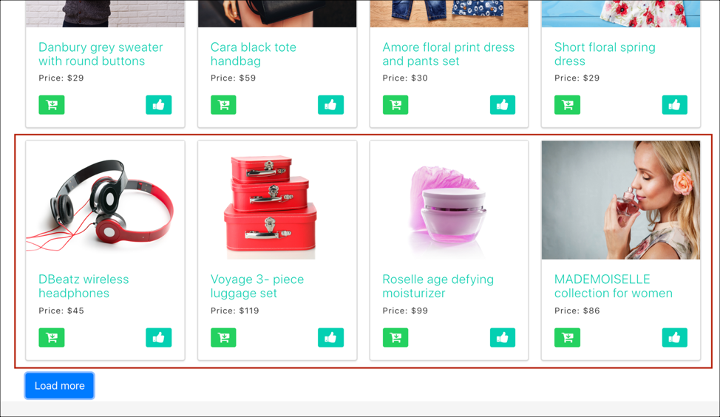
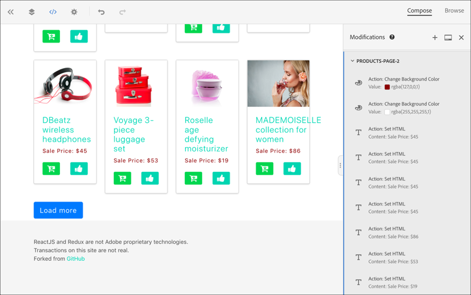

# Implémentation d’applications monopages

Le SDK Web d’Adobe Experience Platform offre des fonctionnalités riches qui permettent à votre entreprise de personnaliser les technologies de nouvelle génération côté client, telles que les applications monopages (SPA).

Les sites web traditionnels fonctionnaient sur des modèles de navigation « page à page », également appelés applications multi-pages, où les conceptions de site web étaient étroitement couplées à des URL et les transitions d’une page web à une autre nécessitaient un chargement de page.

Les applications web modernes, telles que les applications d’une seule page, ont plutôt adopté un modèle qui propulse l’utilisation rapide du rendu de l’interface utilisateur du navigateur, qui est souvent indépendant des rechargements de page. Ces expériences peuvent être déclenchées par des interactions client, comme faire défiler, cliquer et faire bouger le curseur. À mesure que les paradigmes du web moderne ont évolué, la pertinence des événements génériques traditionnels, tels que le chargement d’une page, pour déployer la personnalisation et l’expérimentation ne fonctionne plus.


## Avantages d’Experience Platform Web SDK pour les SPA

Voici quelques avantages offerts par le SDK Web Adobe Experience Platform pour vos applications monopages :

* Capacité à mettre en cache toutes les offres au chargement de la page afin de passer de plusieurs appels au serveur à un seul appel au serveur.
* Amélioration considérable de l’expérience client sur votre site, car les offres sont immédiatement affichées via le cache, sans délai par les appels tradictionnels au serveur.
* Une seule ligne de code et une configuration de développeur unique permettent aux marketeurs de créer et d’exécuter des activités A/B et de ciblage d’expérience (XT) via le Compositeur d’expérience visuelle (VEC) sur votre SPA.

## Vues XDM et applications monopages

Le compositeur d’expérience visuelle d’Adobe Target pour SPA tire parti d’un concept appelé Vues : un groupe logique d’éléments visuels qui constituent ensemble une expérience SPA. Une application d’une seule page peut donc être considérée comme une transition par vues, au lieu d’URL, en fonction des interactions utilisateur. Une vue peut généralement représenter l&#39;ensemble d&#39;un site ou des éléments visuels regroupés au sein d&#39;un site.

Pour mieux expliquer ce que sont les vues, l’exemple suivant utilise un hypothétique site d’e-commerce en ligne implémenté dans React pour explorer des exemples de vues.

Après avoir accédé au site d&#39;accueil, une image de héros promeut une vente de Pâques ainsi que les nouveaux produits disponibles sur le site. Dans ce cas, une vue peut être définie pour l’ensemble de l’écran d’accueil. Cette vue pourrait simplement s’appeler « page d’accueil ».


À mesure que le client s&#39;intéresse davantage aux produits que l&#39;entreprise vend, il décide de cliquer sur le lien **Produits**. Tout comme le site d’accueil, l’intégralité du site des produits peut être définie comme une vue. Cette vue peut être nommée « products-all ».


Étant donné qu&#39;une vue peut être définie comme un site entier ou un groupe d&#39;éléments visuels sur un site, les quatre produits affichés sur le site de produits peuvent être regroupés et considérés comme une vue. Cette vue peut être nommée « produits ».


Lorsque le client décide de cliquer sur le bouton **Charger plus** pour explorer d’autres produits sur le site, l’URL du site web ne change pas dans ce cas, mais une vue peut être créée ici pour représenter uniquement la deuxième ligne de produits affichés. Le nom de la vue peut être « products-page-2 ».



Le client ou la cliente décide d’acheter quelques produits sur le site et passe à l’écran de passage en caisse. Sur le site de passage en caisse, le client a la possibilité de choisir entre une livraison normale ou une livraison express. Une vue peut être n’importe quel groupe d’éléments visuels sur un site. Par conséquent, une vue peut être créée pour les préférences de diffusion et appelée « Préférences de diffusion ».


Le concept de vues peut être étendu bien au-delà de cela. Ce ne sont là que quelques exemples de vues pouvant être définies sur un site.

## Implémenter des vues XDM

Il est possible d’utiliser les vues XDM dans Adobe Target pour permettre aux spécialistes du marketing d’exécuter des tests A/B et XT sur des SPA via le compositeur d’expérience visuelle. Pour effectuer une configuration de développeur ou développeuse unique, procédez comme suit :

1. Installer [Adobe Experience Platform Web SDK](/help/web-sdk/install/overview.md)
2. Déterminez toutes les vues XDM de votre application monopage que vous souhaitez personnaliser.
3. Après avoir défini les vues XDM, pour diffuser des activités AB ou XT VEC, implémentez la fonction `sendEvent()` avec `renderDecisions` définie sur `true` et la vue XDM correspondante dans votre application d’une seule page. La vue XDM doit être transmise en `xdm.web.webPageDetails.viewName`. Cette étape permet aux spécialistes du marketing de tirer parti du compositeur d’expérience visuelle pour lancer des tests A/B et XT pour ces XDM.

   ```javascript
   alloy("sendEvent", { 
     "renderDecisions": true, 
     "xdm": { 
       "web": { 
         "webPageDetails": { 
         "viewName":"home" 
         }
       } 
     } 
   });
   ```

>[!NOTE]
>
>Lors du premier appel `sendEvent()`, toutes les vues XDM qui doivent être rendues à l’utilisateur final sont récupérées et mises en cache. Les appels `sendEvent()` suivants avec les vues XDM transmises sont lus à partir du cache et rendus sans appel au serveur.

## Exemples de fonctions `sendEvent()`

Cette section présente trois exemples montrant comment appeler la fonction `sendEvent()` dans React pour une hypothétique SPA d’e-commerce.

### Exemple 1 : page d’accueil du test A/B

L’équipe marketing souhaite exécuter des tests A/B sur l’ensemble de la page d’accueil.


Pour exécuter des tests A/B sur l’ensemble du site d’accueil, `sendEvent()` doit être appelé avec `viewName` XDM défini sur `home` :

```jsx
function onViewChange() { 
  
  var viewName = window.location.hash; // or use window.location.pathName if router works on path and not hash 

  viewName = viewName || 'home'; // view name cannot be empty 

  // Sanitize viewName to get rid of any trailing symbols derived from URL 

  if (viewName.startsWith('#') || viewName.startsWith('/')) { 
    viewName = viewName.substr(1); 
  }
   
  alloy("sendEvent", { 
    "renderDecisions": true, 
    "xdm": { 
      "web": { 
        "webPageDetails": { 
          "viewName":"home" 
        } 
      } 
    }
  }); 
} 

// react router v4 

const history = syncHistoryWithStore(createBrowserHistory(), store); 

history.listen(onViewChange); 

// react router v3 

<Router history={hashHistory} onUpdate={onViewChange} > 
```

### Exemple 2 : produits personnalisés

L’équipe marketing souhaite personnaliser la deuxième ligne de produits en modifiant la couleur du libellé de prix en rouge après qu’un utilisateur ou une utilisatrice clique sur **Charger plus**.


```jsx
function onViewChange(viewName) { 

  alloy("sendEvent", { 
    "renderDecisions": true, 
    "xdm": { 
      "web": { 
        "webPageDetails": { 
          "viewName": viewName
        }
      } 
    } 
  }); 
} 

class Products extends Component { 
  
  render() { 
    return ( 
      <button type="button" onClick={this.handleLoadMoreClicked}>Load more</button> 
    ); 
  } 

  handleLoadMoreClicked() { 
    var page = this.state.page + 1; // assuming page number is derived from component's state 
    this.setState({page: page}); 
    onViewChange('PRODUCTS-PAGE-' + page); 
  } 

} 
```

### Exemple 3 : préférences de diffusion des tests A/B

L’équipe marketing souhaite exécuter un test A/B pour déterminer si le fait de modifier la couleur du bouton de bleu à rouge lorsque l’option **Diffusion express** est sélectionnée peut stimuler les conversions (contrairement à ce qui se passe lorsque la couleur du bouton est bleue pour les deux options de diffusion).


Pour personnaliser le contenu du site en fonction de la préférence de diffusion sélectionnée, vous pouvez créer une Vue pour chaque préférence de diffusion. Lorsque **Diffusion normale** est sélectionné, la vue peut être nommée « passage en caisse normal ». Si **Diffusion express** est sélectionné, la vue peut être nommée « passage en caisse express ».

```jsx
function onViewChange(viewName) { 
  alloy("sendEvent", { 
    "renderDecisions": true, 
    "xdm": { 
      "web": { 
        "webPageDetails": { 
          "viewName": viewName 
        }
      }
    }
  }); 
} 

class Checkout extends Component { 

  render() { 
    return ( 
      <div onChange={this.onDeliveryPreferenceChanged}> 
        <label> 
          <input type="radio" id="normal" name="deliveryPreference" value={"Normal Delivery"} defaultChecked={true}/> 
          <span> Normal Delivery (7-10 business days)</span> 
        </label> 
        <label> 
          <input type="radio" id="express" name="deliveryPreference" value={"Express Delivery"}/> 
          <span> Express Delivery* (2-3 business days)</span> 
        </label> 
      </div> 
    ); 
  } 

  onDeliveryPreferenceChanged(evt) { 
    var selectedPreferenceValue = evt.target.value; 
    onViewChange(selectedPreferenceValue); 
  } 

} 
```

## Utilisation du compositeur d’expérience visuelle pour une SPA

Une fois que vous avez défini vos vues XDM et implémenté `sendEvent()` avec ces vues XDM transmises, le compositeur d’expérience visuelle sera en mesure de détecter ces vues et de permettre aux utilisateurs de créer des actions et des modifications pour les activités A/B ou XT.

>[!NOTE]
>
>Pour utiliser le VEC pour votre SPA, vous devez installer et activer l’extension d’assistance du VEC [Firefox](https://addons.mozilla.org/en-US/firefox/addon/adobe-target-vec-helper/) ou [Chrome](https://chrome.google.com/webstore/detail/adobe-target-vec-helper/ggjpideecfnbipkacplkhhaflkdjagak).

### Panneau Modifications

Le panneau Modifications capture les actions créées pour une vue spécifique. Toutes les actions d&#39;une vue sont regroupées sous cette vue.


### Actions

Cliquez sur une action pour mettre en surbrillance l’élément sur le site auquel cette action sera appliquée. Chaque action du compositeur d&#39;expérience visuelle créée sous une vue comporte les icônes suivantes : **Informations**, **Modifier**, **Cloner**, **Déplacer** et **Supprimer**. Ces icônes sont expliquées plus en détail dans le tableau ci-dessous.


| Icône | Description |
|---|---|
| Informations | Affiche les détails de l’action. |
| Modifier | Permet de modifier directement les propriétés de l’action. |
| Clone | Clonez l’action sur une ou plusieurs vues existant dans le panneau Modifications ou sur une ou plusieurs vues que vous avez parcourues et auxquelles vous avez accédé dans le compositeur d’expérience visuelle. L’action n’a pas nécessairement à exister dans le panneau Modifications.<br/><br/>**Remarque :** une fois une opération de clonage effectuée, vous devez accéder à la vue dans le VEC via Parcourir pour voir si l’action clonée était une opération valide. Si l&#39;action ne peut pas être appliquée à la vue, une erreur s&#39;affiche. |
| Déplacer | Déplace l’action vers un Événement de chargement de page ou tout autre affichage qui existe déjà dans le panneau des modifications.<br/><br/>**Événement de chargement de page :** toutes les actions correspondant à l’événement de chargement de page sont appliquées au chargement initial de la page de votre application web. <br/><br/>**Remarque :** une fois l’opération de déplacement effectuée, vous devez accéder à la vue dans le compositeur d’expérience visuelle via Parcourir pour voir si le déplacement était une opération valide. Si l&#39;action ne peut pas être appliquée à la vue, une erreur s&#39;affiche. |
| Supprimer | Supprime l’action. |

## Utilisation du compositeur d’expérience visuelle (VEC) pour les SPA

Cette section présente trois exemples d’utilisation du compositeur d’expérience visuelle pour créer des actions et des modifications pour des activités A/B ou XT.

### Exemple 1 : mise à jour de la vue « accueil »

Plus tôt dans ce document, une vue nommée « home » a été définie pour l’ensemble du site d’accueil. L’équipe marketing souhaite maintenant mettre à jour la vue d’accueil des manières suivantes :

* Remplacez les boutons **Ajouter au panier** et **Aimer** par une couleur bleue plus claire. Cela doit se produire lors du chargement de la page, car cela implique de modifier des composants de l’en-tête .
* Remplacez l’étiquette **Derniers produits pour 2019** par **Produits les plus chauds pour 2019** et modifiez la couleur du texte en violet.

Pour effectuer ces mises à jour dans le compositeur d’expérience visuelle, sélectionnez **Composer** et appliquez ces modifications à la vue « accueil ».


### Exemple 2 : modification des libellés de produit

Pour la vue « products-page-2 », l’équipe marketing souhaite remplacer le libellé **Price** par **Prix de vente** et changer la couleur du libellé en rouge.

Pour effectuer ces mises à jour dans le VEC, les étapes suivantes sont requises :

1. Sélectionnez **Parcourir** dans le VEC.
2. Sélectionnez **Produits** dans la barre de navigation supérieure du site.
3. Sélectionnez **Charger plus** une fois pour afficher la deuxième ligne de produits.
4. Sélectionnez **Composer** dans le VEC.
5. Appliquez des actions pour modifier le libellé de texte en **Prix de vente** et la couleur en rouge.



### Exemple 3 : personnalisation du style des préférences de diffusion

Les vues peuvent être définies à un niveau granulaire, par exemple un état ou une option d’un bouton radio. Plus tôt dans ce document, les vues ont été définies pour les préférences de diffusion : « checkout-normal » et « checkout-express ». L’équipe marketing souhaite modifier la couleur du bouton en rouge pour la vue « passage en caisse express ».

Pour effectuer ces mises à jour dans le VEC, les étapes suivantes sont requises :

1. Sélectionnez **Parcourir** dans le VEC.
2. Ajouter des produits au panier sur le site.
3. Sélectionnez l’icône du panier dans le coin supérieur droit du site.
4. Sélectionnez **Extraire votre commande**.
5. Sélectionnez le bouton radio **Diffusion express** sous **Préférences de diffusion**.
6. Sélectionnez **Composer** dans le VEC.
7. Remplacez la couleur du bouton **Pay** par le rouge.

>[!NOTE]
>
>La vue « checkout-express » n’apparaît pas dans le panneau Modifications tant que le bouton radio **Diffusion express** n’est pas sélectionné. Cela est dû au fait que la fonction `sendEvent()` est exécutée lorsque le bouton radio **Diffusion express** est sélectionné. Par conséquent, le compositeur d’expérience visuelle ne connaît pas la vue « checkout-express » tant que le bouton radio n’a pas été sélectionné.


