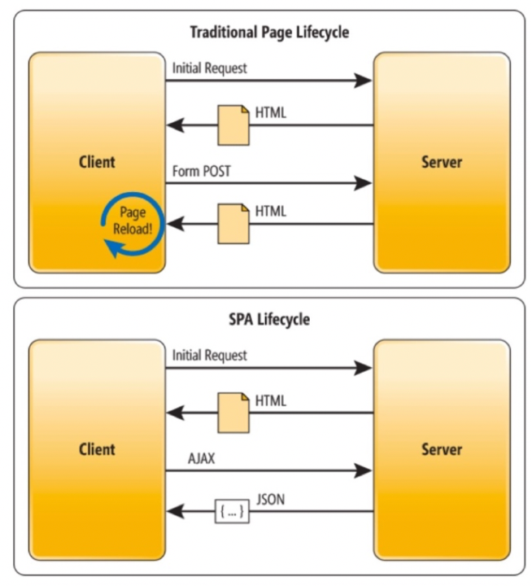

# Implémentation d’applications monopages

Le SDK Web d’Adobe Experience Platform offre des fonctionnalités riches qui permettent à votre entreprise de personnaliser les technologies de nouvelle génération côté client, telles que les applications monopages (SPA).

Les sites web traditionnels fonctionnaient sur des modèles de navigation &quot;page à page&quot;, également appelés applications multi-pages, où les conceptions de site web étaient étroitement couplées à des URL et les transitions d’une page web à une autre nécessitaient un chargement de page.

Les applications web modernes, telles que les applications d’une seule page, ont adopté un modèle qui propulse l’utilisation rapide du rendu de l’interface utilisateur du navigateur, souvent indépendant des rechargements de page. Ces expériences peuvent être déclenchées par des interactions client, comme faire défiler, cliquer et faire bouger le curseur. À mesure que les paradigmes du web moderne évoluent, la pertinence des événements génériques traditionnels, tels qu’un chargement de page, pour déployer la personnalisation et l’expérimentation ne fonctionne plus.



## Avantages du SDK Web Platform pour SPA

Voici quelques avantages offerts par le SDK Web Adobe Experience Platform pour vos applications monopages :

* Capacité à mettre en cache toutes les offres au chargement de la page afin de passer de plusieurs appels au serveur à un seul appel au serveur.
* Amélioration considérable de l’expérience client sur votre site, car les offres sont immédiatement affichées via le cache, sans délai par les appels tradictionnels au serveur.
* Une seule ligne de code et une configuration de développeur unique permettent aux marketeurs de créer et d’exécuter des activités A/B et de ciblage d’expérience (XT) via le compositeur d’expérience visuelle (VEC) sur votre SPA.

## Vues XDM et applications monopages

Le VEC Adobe Target pour SPA tire parti d’un concept appelé Vues : un groupe logique d’éléments visuels qui, ensemble, constituent une expérience SPA. Une application d’une seule page peut donc être considérée comme une transition entre les vues, au lieu des URL, selon les interactions de l’utilisateur. Une Vue peut généralement représenter un site entier ou des éléments visuels regroupés au sein d’un site.

Pour expliquer plus en détail les vues, l’exemple suivant utilise un hypothétique site de commerce électronique en ligne implémenté dans React pour explorer les exemples de vues.

Après avoir accédé au site d’accueil, une image à forte identification fait la promotion d’une vente de Pâques ainsi que des produits les plus récents disponibles sur le site. Dans ce cas, une Vue peut être définie pour l’ensemble de l’écran d’accueil. Ce point de vue peut simplement être appelé &quot;accueil&quot;.


À mesure que le client s’intéresse davantage aux produits que l’entreprise vend, il décide de cliquer sur le lien **Produits** . Tout comme le site d’accueil, l’intégralité du site de produits peut être définie sous la forme d’une vue. Cette vue peut être nommée &quot;products-all&quot;.


Une Vue pouvant être définie comme un site entier ou un groupe d’éléments visuels sur un site, les quatre produits affichés sur le site de produits peuvent être regroupés et considérés comme une Vue. Cette vue peut être appelée &quot;produits&quot;.


Lorsque le client décide de cliquer sur le bouton **Charger plus** pour explorer d’autres produits sur le site, l’URL du site web ne change pas dans ce cas, mais une Vue peut être créée ici pour représenter uniquement la deuxième ligne de produits qui s’affiche. Le nom de la vue peut être &quot;products-page-2&quot;.


Le client ou la cliente décide d’acheter quelques produits sur le site et passe à l’écran de passage en caisse. Sur le site de paiement, le client dispose d’options lui permettant de choisir une diffusion normale ou express. Une Vue peut être n’importe quel groupe d’éléments visuels d’un site. Une Vue peut donc être créée pour les préférences de diffusion et appelée &quot;Préférences de diffusion&quot;.


Le concept de Vues peut être étendu beaucoup plus loin. Il ne s’agit que de quelques exemples de vues qui peuvent être définies sur un site.

## Implémenter des vues XDM

Les vues XDM peuvent être exploitées dans Adobe Target pour permettre aux marketeurs d’exécuter des tests A/B et XT sur SPA via le compositeur d’expérience visuelle. Pour effectuer une configuration de développeur ou développeuse unique, procédez comme suit :

1. Installer [Adobe Experience Platform Web SDK](/help/web-sdk/install/overview.md)
2. Déterminez toutes les vues XDM de votre application d’une seule page que vous souhaitez personnaliser.
3. Après avoir défini les affichages XDM, pour diffuser des activités AB ou XT VEC, implémentez la fonction `sendEvent()` avec `renderDecisions` défini sur `true` et la vue XDM correspondante dans votre application de page unique. La vue XDM doit être transmise dans `xdm.web.webPageDetails.viewName`. Cette étape permet aux marketeurs d’utiliser le compositeur d’expérience visuelle pour lancer des tests A/B et XT pour ces XDM.

   ```javascript
   alloy("sendEvent", { 
     "renderDecisions": true, 
     "xdm": { 
       "web": { 
         "webPageDetails": { 
         "viewName":"home" 
         }
       } 
     } 
   });
   ```

>[!NOTE]
>
>Lors du premier appel `sendEvent()`, toutes les vues XDM qui doivent être rendues à l’utilisateur final seront récupérées et mises en cache. Les appels `sendEvent()` suivants avec les vues XDM transmises seront lus à partir du cache et rendus sans appel au serveur.

## Exemples de fonctions `sendEvent()`

Cette section présente trois exemples illustrant l’appel de la fonction `sendEvent()` dans React pour un hypothétique SPA de commerce électronique.

### Exemple 1 : page d’accueil du test A/B

L’équipe marketing souhaite exécuter des tests A/B sur l’ensemble de la page d’accueil.


Pour exécuter des tests A/B sur l’ensemble du site d’accueil, `sendEvent()` doit être appelé avec `viewName` XDM défini sur `home` :

```jsx
function onViewChange() { 
  
  var viewName = window.location.hash; // or use window.location.pathName if router works on path and not hash 

  viewName = viewName || 'home'; // view name cannot be empty 

  // Sanitize viewName to get rid of any trailing symbols derived from URL 

  if (viewName.startsWith('#') || viewName.startsWith('/')) { 
    viewName = viewName.substr(1); 
  }
   
  alloy("sendEvent", { 
    "renderDecisions": true, 
    "xdm": { 
      "web": { 
        "webPageDetails": { 
          "viewName":"home" 
        } 
      } 
    }
  }); 
} 

// react router v4 

const history = syncHistoryWithStore(createBrowserHistory(), store); 

history.listen(onViewChange); 

// react router v3 

<Router history={hashHistory} onUpdate={onViewChange} > 
```

### Exemple 2 : produits personnalisés

L’équipe marketing souhaite personnaliser la deuxième ligne de produits en définissant la couleur du libellé du prix sur rouge après qu’un utilisateur ait cliqué sur **Charger plus**.


```jsx
function onViewChange(viewName) { 

  alloy("sendEvent", { 
    "renderDecisions": true, 
    "xdm": { 
      "web": { 
        "webPageDetails": { 
          "viewName": viewName
        }
      } 
    } 
  }); 
} 

class Products extends Component { 
  
  render() { 
    return ( 
      <button type="button" onClick={this.handleLoadMoreClicked}>Load more</button> 
    ); 
  } 

  handleLoadMoreClicked() { 
    var page = this.state.page + 1; // assuming page number is derived from component's state 
    this.setState({page: page}); 
    onViewChange('PRODUCTS-PAGE-' + page); 
  } 

} 
```

### Exemple 3 : préférences de diffusion du test A/B

L’équipe marketing souhaite exécuter un test A/B pour déterminer si la modification de la couleur du bouton du bleu au rouge lorsque la **livraison express** est sélectionnée peut augmenter les conversions (au lieu de conserver la couleur du bouton bleu pour les deux options de livraison).


Pour personnaliser le contenu du site en fonction des préférences de diffusion sélectionnées, une Vue peut être créée pour chaque préférence de diffusion. Lorsque l’option **Livraison normale** est sélectionnée, la vue peut être nommée &quot;checkout-normal&quot;. Si **Livraison express** est sélectionné, la vue peut être nommée &quot;Extraction express&quot;.

```jsx
function onViewChange(viewName) { 
  alloy("sendEvent", { 
    "renderDecisions": true, 
    "xdm": { 
      "web": { 
        "webPageDetails": { 
          "viewName": viewName 
        }
      }
    }
  }); 
} 

class Checkout extends Component { 

  render() { 
    return ( 
      <div onChange={this.onDeliveryPreferenceChanged}> 
        <label> 
          <input type="radio" id="normal" name="deliveryPreference" value={"Normal Delivery"} defaultChecked={true}/> 
          <span> Normal Delivery (7-10 business days)</span> 
        </label> 
        <label> 
          <input type="radio" id="express" name="deliveryPreference" value={"Express Delivery"}/> 
          <span> Express Delivery* (2-3 business days)</span> 
        </label> 
      </div> 
    ); 
  } 

  onDeliveryPreferenceChanged(evt) { 
    var selectedPreferenceValue = evt.target.value; 
    onViewChange(selectedPreferenceValue); 
  } 

} 
```

## Utilisation du compositeur d’expérience visuelle pour un SPA

Une fois que vous avez défini vos vues XDM et mis en oeuvre `sendEvent()` avec ces vues XDM transmises, le VEC pourra détecter ces vues et permettre aux utilisateurs de créer des actions et des modifications pour les activités A/B ou XT.

>[!NOTE]
>
>Pour utiliser le VEC pour votre SPA, vous devez installer et activer l’extension d’assistance du VEC [Firefox](https://addons.mozilla.org/en-US/firefox/addon/adobe-target-vec-helper/) ou [Chrome](https://chrome.google.com/webstore/detail/adobe-target-vec-helper/ggjpideecfnbipkacplkhhaflkdjagak).

### Panneau Modifications

Le panneau Modifications capture les actions créées pour une vue spécifique. Toutes les actions d’une vue sont regroupées sous cette vue.


### Actions

Cliquer sur une action met en surbrillance l’élément du site sur lequel cette action sera appliquée. Chaque action du VEC créée sous une vue comporte les icônes suivantes : **Information**, **Edit**, **Clone**, **Move** et **Delete**. Ces icônes sont expliquées plus en détail dans le tableau qui suit.


| Icône | Description |
|---|---|
| Informations | Affiche les détails de l’action. |
| Modifier | Permet de modifier directement les propriétés de l’action. |
| Clone | Cloner l’action vers une ou plusieurs vues figurant dans le panneau Modifications ou vers une ou plusieurs vues que vous avez parcourues et auxquelles vous avez accédé dans le VEC. L’action ne doit pas nécessairement exister dans le panneau Modifications .<br/><br/>**Remarque :** Une fois une opération de clonage effectuée, vous devez accéder à la vue dans le VEC via Parcourir pour vérifier si l’action clonée a été une opération valide. Si l’action ne peut pas être appliquée à la vue, une erreur s’affiche. |
| Déplacer | Déplace l’action vers un événement de chargement de page ou tout autre affichage existant dans le panneau Modifications.<br/><br/>**Événement de chargement de page :** Toutes les actions correspondant à l’événement de chargement de page sont appliquées au chargement initial de la page de votre application web. <br/><br/>**Remarque :** Une fois une opération de déplacement effectuée, vous devez accéder à la vue dans le VEC via Parcourir pour vérifier si le déplacement a été une opération valide. Si l’action ne peut pas être appliquée à la vue, une erreur s’affiche. |
| Supprimer | Supprime l’action. |

## Utilisation du compositeur d’expérience visuelle pour SPA exemples

Cette section présente trois exemples d’utilisation du compositeur d’expérience visuelle pour créer des actions et des modifications pour les activités A/B ou XT.

### Exemple 1 : mise à jour de la vue &quot;home&quot;

Auparavant, dans ce document, une vue nommée &quot;accueil&quot; était définie pour l’ensemble du site d’accueil. L’équipe marketing souhaite maintenant mettre à jour la vue &quot;accueil&quot; de la manière suivante :

* Remplacez les boutons **Ajouter au panier** et **J’aime** par un partage plus clair de bleu. Cela doit se produire lors du chargement de la page, car cela implique de modifier les composants de l’en-tête.
* Remplacez le libellé **Derniers produits pour 2019** par **Produits les plus chauds pour 2019** et remplacez la couleur du texte par le violet.

Pour effectuer ces mises à jour dans le VEC, sélectionnez **Composer** et appliquez ces modifications à la vue &quot;accueil&quot;.


### Exemple 2 : modifier les étiquettes des produits

Pour la vue &quot;products-page-2&quot;, l’équipe marketing souhaite remplacer l’étiquette **Price** par **Prix de vente** et changer la couleur de l’étiquette en rouge.

Pour effectuer ces mises à jour dans le compositeur d’expérience visuelle, procédez comme suit :

1. Sélectionnez **Parcourir** dans le VEC.
2. Sélectionnez **Produits** dans la barre de navigation supérieure du site.
3. Sélectionnez **Charger plus** une fois pour afficher la deuxième ligne de produits.
4. Sélectionnez **Composer** dans le VEC.
5. Appliquez les actions pour remplacer le libellé du texte par **Prix de la vente** et définir la couleur sur rouge.


### Exemple 3 : personnaliser le style des préférences de diffusion

Les vues peuvent être définies à un niveau granulaire, par exemple un état ou une option d’un bouton radio. Auparavant, dans ce document, les vues étaient définies pour les préférences de livraison, &quot;checkout-normal&quot; et &quot;checkout-express&quot;. L’équipe marketing souhaite remplacer la couleur du bouton par le rouge pour la vue &quot;express&quot;.

Pour effectuer ces mises à jour dans le compositeur d’expérience visuelle, procédez comme suit :

1. Sélectionnez **Parcourir** dans le VEC.
2. Ajoutez des produits au panier sur le site.
3. Sélectionnez l’icône de panier dans le coin supérieur droit du site.
4. Sélectionnez **Checkout your order** (Extraire votre commande).
5. Sélectionnez le bouton radio **Livraison express** sous **Préférences de remise**.
6. Sélectionnez **Composer** dans le VEC.
7. Remplacez la couleur du bouton **Payer** par le rouge.

>[!NOTE]
>
>La vue &quot;checkout-express&quot; n’apparaît pas dans le panneau Modifications tant que le bouton radio **Livraison express** n’a pas été sélectionné. En effet, la fonction `sendEvent()` est exécutée lorsque le bouton radio **Livraison express** est sélectionné. Par conséquent, le VEC ne connaît pas la vue &quot;Extraction-express&quot; tant que le bouton radio n’a pas été sélectionné.


