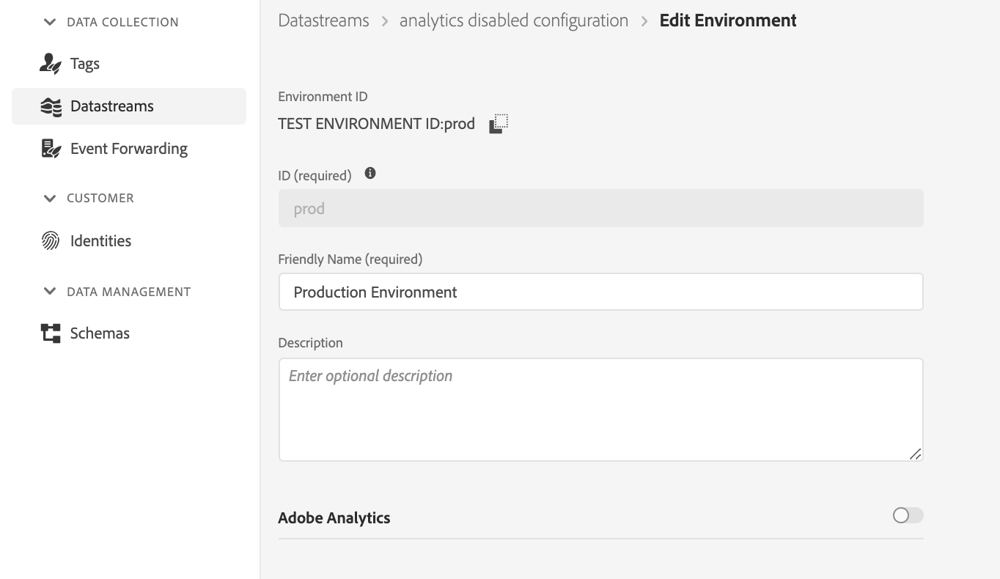
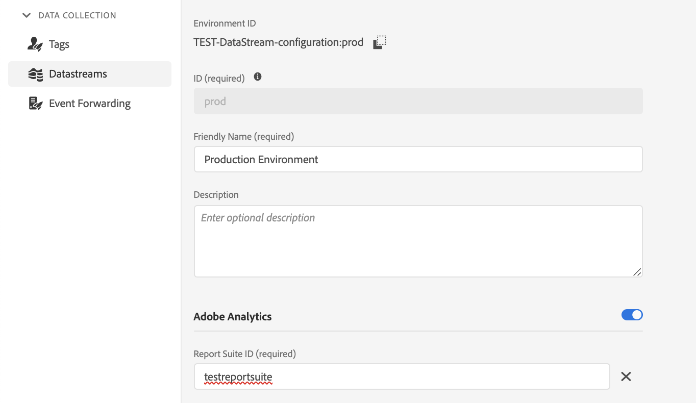
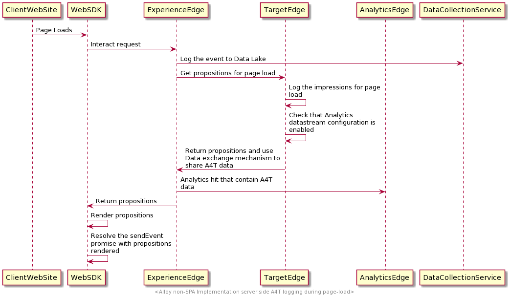
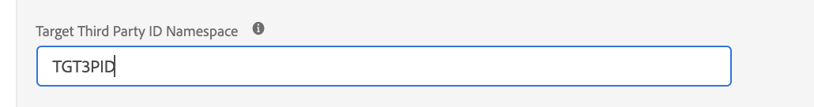

# Comparer la bibliothèque at.js au SDK Web

## Vue d’ensemble

Cet article présente les différences entre la bibliothèque `at.js` et le SDK Web Experience Platform.

## Installation des bibliothèques

### Installation d’at.js

Nous permettons à nos clients de télécharger la bibliothèque directement depuis Adobe Experience Cloud, onglet Implémentation . La bibliothèque at.js est personnalisée avec des paramètres tels que clientCode, imsOrgId, etc.

### Installation du SDK Web

La version préconfigurée est disponible sur un réseau CDN. Vous pouvez référencer la bibliothèque sur le réseau CDN directement sur votre page ou la télécharger et l’héberger sur votre propre infrastructure. Il est disponible dans des formats miniaturisés et non miniaturisés. La version non miniaturisée est utile à des fins de débogage.

Pour plus d’informations, consultez [Installation de Web SDK à l’aide de la bibliothèque JavaScript](/help/web-sdk/install/library.md).

## Configuration des bibliothèques

### Configuration d’at.js

À la fin de chaque fichier at.js, vous trouverez une section dans laquelle nous instancions et transmettons un objet de paramètre. Il est personnalisable. Au téléchargement, nous renseignons cette section avec les paramètres client actuels.

```javascript
window.adobe.target.init(window, document, {
  "clientCode": "demo",
  "imsOrgId": "",
  "serverDomain": "localhost:5000",
  "timeout": 2000,
  "globalMboxName": "target-global-mbox",
  "version": "2.0.0",
  "defaultContentHiddenStyle": "visibility: hidden;",
  "defaultContentVisibleStyle": "visibility: visible;",
  "bodyHiddenStyle": "body {opacity: 0 !important}",
  "bodyHidingEnabled": true,
  "deviceIdLifetime": 63244800000,
  "sessionIdLifetime": 1860000,
  "selectorsPollingTimeout": 5000,
  "visitorApiTimeout": 2000,
  "overrideMboxEdgeServer": false,
  "overrideMboxEdgeServerTimeout": 1860000,
  "optoutEnabled": false,
  "optinEnabled": false,
  "secureOnly": false,
  "supplementalDataIdParamTimeout": 30,
  "authoringScriptUrl": "//cdn.tt.omtrdc.net/cdn/target-vec.js",
  "urlSizeLimit": 2048,
  "endpoint": "/rest/v1/delivery",
  "pageLoadEnabled": true,
  "viewsEnabled": true,
  "analyticsLogging": "server_side",
  "serverState": {},
  "decisioningMethod": "server-side",
  "legacyBrowserSupport":  false
});
```

[En savoir plus](https://experienceleague.adobe.com/docs/target/using/implement-target/client-side/at-js-implementation/functions-overview/targetgobalsettings.html?lang=fr)


### Configuration du SDK Web

La configuration du SDK s’effectue avec la commande [`configure`](/help/web-sdk/commands/configure/overview.md) . La commande `configure` est *toujours* appelée en premier.

## Requête et rendu automatique des offres de Page Load Target

### Utiliser at.js

Avec at.js 2.x, si vous activez le `pageLoadEnabled` de paramètres, la bibliothèque déclenche un appel à Target Edge avec `execute -> pageLoad`. Si tous les paramètres sont définis sur les valeurs par défaut, aucun codage personnalisé n’est nécessaire. Une fois at.js ajouté à la page et chargé par le navigateur, un appel Edge Target est exécuté.

### Utilisation de Web SDK

Le contenu créé dans Adobe Target [compositeur d’expérience visuelle](https://experienceleague.adobe.com/docs/target/using/experiences/vec/visual-experience-composer.html?lang=fr) peut être récupéré et rendu automatiquement par SDK.

Pour demander et générer automatiquement les offres Target, utilisez la commande `sendEvent` et définissez l’option `renderDecisions` sur `true`. Cela force le SDK à effectuer automatiquement le rendu de tout contenu personnalisé éligible au rendu automatique.

Exemple :

```javascript
alloy("sendEvent", {
  "renderDecisions": true,
  "xdm": {
    "commerce": {
      "order": {
        "purchaseID": "a8g784hjq1mnp3",
        "purchaseOrderNumber": "VAU3123",
        "currencyCode": "USD",
        "priceTotal": 999.98
      }
    }
  }
});
```

Experience Platform Web SDK envoie automatiquement une notification avec les offres qui ont été exécutées par le SDK WEB. Voici un exemple de l’apparence d’une payload de demande de notification :

```json
{
  "events": [{
      "xdm": {
        "_experience": {
          "decisioning": {
            "propositions": [
              {
                "id": "AT:eyJhY3Rpdml0eUlkIjoiMTI3MDE5IiwiZXhwZXJpZW5jZUlkIjoiMCJ9",
                "scope": "cart",
                "scopeDetails": {
                  "decisionProvider": "TGT",
                  "activity": {
                    "id": "127019"
                  },
                  "experience": {
                    "id": "0"
                  },
                  "strategies": [
                    {
                      "step": "entry",
                      "algorithmID": "0",
                      "trafficType": "0"
                    },
                    {
                      "step": "display",
                      "algorithmID": "0",
                      "trafficType": "0"
                    }
                  ],
                  "characteristics": {
                    "eventToken": "bKMxJ8dCR1XlPfDCx+2vSGqipfsIHvVzTQxHolz2IpSCnQ9Y9OaLL2gsdrWQTvE54PwSz67rmXWmSnkXpSSS2Q=="
                  }
                }
              }
            ]
          }
        },
        "eventType": "display",
        "web": {
          "webPageDetails": {
            "viewName": "cart",
            "URL": "https://alloyio.com/personalizationSpa/cart"
          },
          "webReferrer": {
            "URL": ""
          }
        },
        "device": {
          "screenHeight": 800,
          "screenWidth": 1280,
          "screenOrientation": "landscape"
        },
        "environment": {
          "type": "browser",
          "browserDetails": {
            "viewportWidth": 1280,
            "viewportHeight": 284
          }
        },
        "placeContext": {
          "localTime": "2021-12-10T15:50:34.467+02:00",
          "localTimezoneOffset": -120
        },
        "timestamp": "2021-12-10T13:50:34.467Z",
        "implementationDetails": {
          "name": "https://ns.adobe.com/experience/alloy",
          "version": "2.6.2",
          "environment": "browser"
        }
      }
    }
  ]
}
```

[En savoir plus](../rendering-personalization-content.md)

## Comment demander et NE PAS générer automatiquement les offres de Page Load Target

### Utiliser at.js

Il existe deux façons de déclencher un appel à Target Edge pour récupérer les offres pour le chargement de la page.

Exemple 1 :

```javascript
adobe.target.getOffer({
   mbox: "target-global-mbox", 
   success: console.log,
   error: console.error
});
```

Exemple 2 :

```javascript
adobe.target.getOffers({
    request: {
      execute: {
        pageLoad: {}
    }
  }
})
.then(console.log)
.catch(console.error);
```

[En savoir plus](https://experienceleague.adobe.com/docs/target/using/implement-target/client-side/at-js-implementation/functions-overview/cmp-atjs-functions.html?lang=fr)

### Utilisation de Web SDK

Exécutez une commande `sendEvent` avec une portée spéciale sous `decisionScopes` : `__view__`. Nous utilisons cette étendue comme signal pour récupérer toutes les activités de chargement de page de Target et prérécupérer toutes les vues. Le SDK Web tentera également d’évaluer toutes les activités basées sur la vue du compositeur d’expérience visuelle. La désactivation de la prérécupération des vues n’est actuellement pas prise en charge dans le SDK Web.

Pour accéder au contenu de personnalisation, vous pouvez fournir une fonction de rappel, qui sera appelée une fois que le SDK aura reçu une réponse réussie du serveur. Votre rappel est fourni avec un objet de résultat , qui peut contenir la propriété propositions contenant tout contenu de personnalisation renvoyé.

Exemple :

```javascript
alloy("sendEvent", {
    xdm: {...},
    decisionScopes: ["__view__"]
  }).then(function(result) {
    if (result.propositions) {
      result.propositions.forEach(proposition => {
        proposition.items.forEach(item => {
          if (item.schema === HTML_SCHEMA) {
            // manually apply offer
            document.getElementById("form-based-offer-container").innerHTML =
              item.data.content;
            const executedPropositions = [
              {
                id: proposition.id,
                scope: proposition.scope,
                scopeDetails: proposition.scopeDetails
              }
            ];
          // manually send the display notification event, so that Target/Analytics impressions aare increased
            alloy("sendEvent",{
              "xdm": {
                "eventType": "decisioning.propositionDisplay",
                "_experience": {
                  "decisioning": {
                    "propositions": executedPropositions
                  }
                }
              }
            });
          }
        });
      });
    }
  });
```

[En savoir plus](../rendering-personalization-content.md#manually-rendering-content)


## Comment demander des mbox Target spécifiques basées sur des formulaires


### Utiliser at.js

Vous pouvez récupérer les activités du compositeur basé sur les formulaires à l’aide de la fonction `getOffer` :

Exemple 1 :

```javascript
adobe.target.getOffer({
   mbox: "hero-banner", 
   success: console.log,
   error: console.error
});
```

Exemple 2 :

```javascript
adobe.target.getOffers({
    request: {
      execute: {
        mboxes: [
        {
          index: 0,
          name: "hero-banner"
        }]
    }
  }
})
.then(console.log)
.catch(console.error);
```

[En savoir plus](https://experienceleague.adobe.com/docs/target/using/implement-target/client-side/at-js-implementation/functions-overview/cmp-atjs-functions.html?lang=fr)


### Utilisation de Web SDK

Vous pouvez récupérer des activités basées sur le compositeur d’après les formulaires à l’aide de la commande `sendEvent` et en transmettant les noms des mbox sous l’option `decisionScopes` . La commande `sendEvent` renvoie une promesse qui est résolue avec un objet contenant les activités/propositions demandées :
Voici à quoi ressemble le tableau `propositions` :

```javascript
[
  {
    "id": "AT:eyJhY3Rpdml0eUlkIjoiNDM0Njg5IiwiZXhwZXJpZW5jZUlkIjoiMCJ9",
    "scope": "hero-banner",
    "scopeDetails": {
      "decisionProvider": "TGT",
      "activity": {
        "id": "434689"
      },
      "experience": {
        "id": "0"
      },
      "strategies": [
        {
          "algorithmID": "0",
          "trafficType": "0"
        }
      ],
      "characteristics": {
        "eventToken": "2lTS5KA6gj4JuSjOdhqUhGqipfsIHvVzTQxHolz2IpTMromRrB5ztP5VMxjHbs7c6qPG9UF4rvQTJZniWgqbOw=="
      }
    },
    "items": [
      {
        "id": "1184844",
        "schema": "https://ns.adobe.com/personalization/html-content-item",
        "meta": {
          "geo.state": "bucuresti",
          "activity.id": "434689",
          "experience.id": "0",
          "activity.name": "a4t test form based activity",
          "offer.id": "1184844",
          "profile.tntId": "04608610399599289452943468926942466370-pybgfJ"
        },
        "data": {
          "id": "1184844",
          "format": "text/html",
          "content": "<div> analytics impressions </div>"
        }
      }
    ]
  },
  {
    "id": "AT:eyJhY3Rpdml0eUlkIjoiNDM0Njg5IiwiZXhwZXJpZW5jZUlkIjoiMCJ9",
    "scope": "hero-banner",
    "scopeDetails": {
      "decisionProvider": "TGT",
      "activity": {
        "id": "434689"
      },
      "characteristics": {
        "eventToken": "E0gb6q1+WyFW3FMbbQJmrg=="
      }
    },
    "items": [
      {
        "id": "434689",
        "schema": "https://ns.adobe.com/personalization/measurement",
        "data": {
          "type": "click",
          "format": "application/vnd.adobe.target.metric"
        }
      }
    ]
  }
]
```

Exemple :

```javascript
alloy("sendEvent", {
  xdm: { ...},
  decisionScopes: ["hero-banner"]
}).then(function (result) {
  var propositions = result.propositions;

  if (propositions) {
    // Find the discount proposition, if it exists.
    for (var i = 0; i < propositions.length; i++) {
      var proposition = propositions[i];
      for (var j = 0; j < proposition.items; j++) {
        var item = proposition.items[j];
        if (item.schema === HTML_SCHEMA) {
          // apply offer
          document.getElementById("form-based-offer-container").innerHTML =
            item.data.content;
          const executedPropositions = [
            {
              id: proposition.id,
              scope: proposition.scope,
              scopeDetails: proposition.scopeDetails
            }
          ];

          alloy("sendEvent", {
            "xdm": {
              "eventType": "decisioning.propositionDisplay",
              "_experience": {
                "decisioning": {
                  "propositions": executedPropositions
                }
              }
            }
          });
        }
      }
    }
  }
});
```

[En savoir plus](../rendering-personalization-content.md#manually-rendering-content)

## Application des activités Target

### Utiliser at.js

Vous pouvez appliquer les activités de Target à l&#39;aide de la fonction `applyOffers` : `adobe.target.applyOffer(options)`

Exemple :

```javascript
adobe.target.getOffers({...})
  .then(response => adobe.target.applyOffers({ response: response }))
  .then(() => console.log("Success"))
  .catch(error => console.log("Error", error));
```

En savoir plus sur la commande `applyOffers` dans la [documentation dédiée](https://experienceleague.adobe.com/docs/target/using/implement-target/client-side/at-js-implementation/functions-overview/adobe-target-applyoffers-atjs-2.html?lang=fr).


### Utilisation de Web SDK

Vous pouvez appliquer les activités de Target à l’aide de la commande `applyPropositions` .

Exemple :

```javascript
alloy("applyPropositions", {
    propositions: [...]
});
```

En savoir plus sur la commande `applyPropositions` dans la [documentation dédiée](../../personalization/rendering-personalization-content.md#applypropositions).

## Suivi des événements

### Utiliser at.js

Vous pouvez effectuer le suivi des événements à l’aide de la fonction `trackEvent` ou de `sendNotifications`.

Cette fonction déclenche une requête pour signaler les actions de l’utilisateur, telles que les clics et les conversions. Il ne fournit pas d’activités dans la réponse.


**Exemple 1**

```javascript
adobe.target.trackEvent({ 
    "type": "click",
    "mbox": "some-mbox"
});
```

**Exemple 2**

```javascript
adobe.target.sendNotifications({ 
    request: {
       notifications: [{
          ...,
          mbox: {
            name: "some-mbox"
          },
          type: "click",
          ...
       }]
    }
});
```

[En savoir plus](https://experienceleague.adobe.com/docs/target/using/implement-target/client-side/at-js-implementation/functions-overview/adobe-target-trackevent.html?lang=fr)

### Utilisation de Web SDK

Vous pouvez effectuer le suivi des événements et des actions des utilisateurs et utilisatrices en appelant la commande `sendEvent`, en renseignant le groupe de champs XDM `_experience.decisioning.propositions` et en définissant la `eventType` sur l’une des 2 valeurs :

* `decisioning.propositionDisplay` : signale le rendu de l’activité Target.
* `decisioning.propositionInteract` : signale une interaction de l’utilisateur avec l’activité, comme un clic de souris.

Le groupe de champs XDM `_experience.decisioning.propositions` est un tableau d’objets . Les propriétés de chaque objet sont dérivées de la `result.propositions` renvoyée dans la commande `sendEvent` : `{ id, scope, scopeDetails }`

**Exemple 1 - Suivi d’un événement `decisioning.propositionDisplay` après le rendu d’une activité**

```javascript
alloy("sendEvent", {
  xdm: {},
  decisionScopes: ['discount']
}).then(function(result) {
  var propositions = result.propositions;

  var discountProposition;
  if (propositions) {
    // Find the discount proposition, if it exists.
    for (var i = 0; i < propositions.length; i++) {
      var proposition = propositions[i];
      if (proposition.scope === "discount") {
        discountProposition = proposition;
        break;
      }
    }
  }

  if (discountProposition) {
    // Find the item from proposition that should be rendered.
    // Rather than assuming there a single item that has HTML
    // content, find the first item whose schema indicates
    // it contains HTML content.
    for (var j = 0; j < discountProposition.items.length; j++) {
      var discountPropositionItem = discountProposition.items[i];
      if (discountPropositionItem.schema === "https://ns.adobe.com/personalization/html-content-item") {
        var discountHtml = discountPropositionItem.data.content;
        // Render the content
        var dailySpecialElement = document.getElementById("daily-special");
        dailySpecialElement.innerHTML = discountHtml;
        
        // For this example, we assume there is only a single place to update in the HTML.
        break;  
      }
    }
    // Send a "decisioning.propositionDisplay" event signaling that the proposition has been rendered.
    alloy("sendEvent", {
      "xdm": {
        "eventType": "decisioning.propositionDisplay",
        "_experience": {
          "decisioning": {
            "propositions": [{
              "id": id,
              "scope": scope,
              "scopeDetails": scopeDetails
            }],
            "propositionEventType": {
              "display": 1
            }
          }
        }
      }
    });
  }
});
```

**Exemple 2 - Suivi d’un événement `decisioning.propositionInteract` après l’exécution d’une mesure de clic**

```javascript
alloy("sendEvent", {
  xdm: { ...},
  decisionScopes: ["hero-banner"]
}).then(function (result) {
  var propositions = result.propositions;

  if (propositions) {
    // Find the discount proposition, if it exists.
    for (var i = 0; i < propositions.length; i++) {
      var proposition = propositions[i];
      for (var j = 0; j < proposition.items.length; j++) {
        var item = proposition.items[j];

        if (item.schema === "https://ns.adobe.com/personalization/measurement") {
          // add metric to the DOM element
          const button = document.getElementById("form-based-click-metric");

          button.addEventListener("click", event => {
            const executedPropositions = [
              {
                id: proposition.id,
                scope: proposition.scope,
                scopeDetails: proposition.scopeDetails
              }
            ];
            // send the click track event
            alloy("sendEvent", {
              "xdm": {
                "eventType": "decisioning.propositionInteract",
                "_experience": {
                  "decisioning": {
                    "propositions": executedPropositions
                  }
                }
              }
            });
          });
        }
      }
    }
  }
});
```

[En savoir plus](../rendering-personalization-content.md#manually-rendering-content)

**Exemple 3 - Suivi d’un événement déclenché après l’exécution d’une action**

Cet exemple montre comment effectuer le suivi d’un événement qui a été déclenché après l’exécution d’une action spécifique, comme cliquer sur un bouton.
Vous pouvez ajouter d’autres paramètres personnalisés via l’objet de données `__adobe.target`.

Vous pouvez également ajouter l’objet XDM `commerce`.

```js
alloy("sendEvent", {
    "xdm": {
        "_experience": {
            "decisioning": {
                "propositions": [
                    {
                        "scope": "orderConfirm" //example scope name
                    }
                ],
                "propositionEventType": {
                    "display": 1
                }
            }
        },
        "eventType": "decisioning.propositionDisplay"
    },
    "commerce": {
        "order": {
            "purchaseID": "a8g784hjq1mnp3",
            "purchaseOrderNumber": "VAU3123",
            "currencyCode": "USD",
            "priceTotal": 999.98
        }
    },
    "data": {
        "__adobe": {
            "target": {
                "pageType": "Order Confirmation",
                "user.categoryId": "Insurance"
            }
        }
    }
})
```

## Comment déclencher un changement d’affichage dans une application monopage

### Utiliser at.js

Utilisez la fonction `adobe.target.triggerView`. Cette fonction peut être appelée à chaque chargement d’une nouvelle page ou lorsqu’un composant fait l’objet d’un nouveau rendu sur une page. adobe.target.triggerView() doit être implémenté pour les applications monopages (SPA) afin d’utiliser le compositeur d’expérience visuelle (VEC) pour créer des tests A/B et des activités de ciblage d’expérience (XT). Si adobe.target.triggerView() n’est pas implémenté sur le site, le VEC ne peut pas être utilisé pour la SPA.

**Exemple**

```javascript
adobe.target.triggerView("homeView")
```

[En savoir plus](https://experienceleague.adobe.com/docs/target/using/implement-target/client-side/at-js-implementation/functions-overview/adobe-target-triggerview-atjs-2.html?lang=fr)


### Utilisation de Web SDK

Pour déclencher ou signaler une modification d’affichage d’application sur une seule page, définissez la propriété `web.webPageDetails.viewName` sous l’option `xdm` de la commande `sendEvent`. Le SDK Web vérifie le cache de vue, s’il existe des offres pour les `viewName` spécifiés dans `sendEvent`, il les exécute et envoie un événement de notification d’affichage.

**Exemple**

```javascript
alloy("sendEvent", {
  renderDecisions: true,
  xdm:{
    web:{
      webPageDetails:{
        viewName: "homeView"
      }
    }
  }
});
```

[En savoir plus](./spa-implementation.md#implementing-xdm-views)

## Utilisation des jetons de réponse

Le contenu Personalization renvoyé par Adobe Target comprend des [jetons de réponse](https://experienceleague.adobe.com/docs/target/using/administer/response-tokens.html?lang=fr), qui sont des détails sur l’activité, l’offre, l’expérience, le profil utilisateur, les informations géographiques, etc. Ces informations peuvent être partagées avec des outils tiers ou utilisées à des fins de débogage. Les jetons de réponse peuvent être configurés dans l’interface utilisateur d’Adobe Target.

### Utiliser at.js

Utilisez des événements personnalisés at.js pour écouter la réponse de Target et lire les jetons de réponse.

**Exemple**

```javascript
document.addEventListener(adobe.target.event.REQUEST_SUCCEEDED, function(e) { 
  console.log("Request succeeded", e.detail); 
}); 
```

[En savoir plus](https://experienceleague.adobe.com/docs/target/using/administer/response-tokens.html?lang=fr)


### Utilisation de Web SDK

>[!IMPORTANT]
>
>Assurez-vous d’utiliser la version 2.6.0 ou ultérieure d’Experience Platform Web SDK.

Les jetons de réponse sont renvoyés dans le cadre des `propositions` exposées dans le résultat de la commande `sendEvent`. Chaque proposition contient un tableau de `items` et chaque élément aura un objet `meta` renseigné avec des jetons de réponse s’ils sont activés dans l’interface utilisateur d’administration de Target. [En savoir plus](https://experienceleague.adobe.com/docs/target/using/administer/response-tokens.html?lang=fr)

**Exemple**

```javascript
alloy("sendEvent", {
    renderDecisions: true,
    xdm: {}
  }).then(function(result) {
    if (result.propositions) {
      // Format of result.propositions:
      /*
        [
            {
                "id": "",
                "scope": "",
                "items": [
                    {
                        "id": "",
                        "schema": "",
                        "data": {},
                        "meta": { // RESPONSE TOKENS
                            "activity.name": ...,
                            "offer.id": ...,
                            "profile.activeActivities": ...
                        }
                    }
                ],
                "scopeDetails": {}
                "renderAttempted": false
            }
        ]
      */
    }
  });
```

[En savoir plus](./accessing-response-tokens.md)

## Comment gérer le scintillement

### Utiliser at.js

Avec at.js, vous pouvez gérer le scintillement en définissant `bodyHidingEnabled: true` de sorte qu’at.js soit celui dont vous avez besoin
masquage préalable des conteneurs personnalisés avant qu’il ne récupère et n’applique les modifications DOM.
Les sections de la page qui contiennent du contenu personnalisé peuvent être prémasquées en remplaçant les `bodyHiddenStyle` at.js.
Par défaut, `bodyHiddenStyle` masque l’ensemble du `body` HTML.
Les deux paramètres peuvent être remplacés à l’aide de `window.targetGlobalSettings`. `window.targetGlobalSettings` doit être placé avant le chargement d’at.js.

### Utilisation de Web SDK

Avec Web SDK, le client peut configurer son style de pré-masquage dans la commande de configuration, comme dans l’exemple ci-dessous :

```javascript
alloy("configure", {
  datastreamId: "configurationId",
  orgId: "orgId@AdobeOrg",
  debugEnabled: true,
  prehidingStyle: "body { opacity: 0 !important }"
});
```

Lors du chargement de la synchronisation de Web SDK, il est recommandé d’injecter le fragment de code suivant dans la page avant l’injection de Web SDK :

```html
<script>
  !function(e,a,n,t){
  if (a) return;
  var i=e.head;if(i){
  var o=e.createElement("style");
  o.id="alloy-prehiding",o.innerText=n,i.appendChild(o),
  setTimeout(function(){o.parentNode&&o.parentNode.removeChild(o)},t)}}
  (document, document.location.href.indexOf("adobe_authoring_enabled") !== -1, "body { opacity: 0 !important }", 3000);
</script>
```

## Comment A4T est-il géré ?

### Utiliser at.js

Deux types de journalisation A4T sont pris en charge à l’aide d’at.js :

* Journalisation côté client Analytics
* Journalisation côté serveur Analytics

#### Journalisation côté client Analytics

**Exemple 1 : Utilisation Du Paramètre Global Target**

La journalisation côté client d’Analytics peut être activée en définissant `analyticsLogging: client_side` dans les paramètres at.js ou en remplaçant l’objet `window.targetglobalSettings` .
Lorsque cette option est configurée, le format de la payload renvoyée est le suivant :

```json
{
  "analytics": {
    "payload": {
      "pe": "tnt",
      "tnta": "167169:0:0|0|100,167169:0:0|2|100,167169:0:0|1|100"
    }
  }
}
```

La payload peut ensuite être transmise à Analytics via l’API Data Insertion.

Exemple 2 : le configurer dans chaque fonction `getOffers` :

```javascript
adobe.target.getOffers({
      request: {
        experienceCloud: {
          analytics: {
            logging: "client_side"
          }
        },
        prefetch: {
          mboxes: [{
            index: 0,
            name: "a1-serverside-xt"
          }]
        }
      }
    })
    .then(console.log)
```

Voici à quoi ressemble la payload de réponse :

```json
{
  "prefetch": {
    "mboxes": [{
      "index": 0,
      "name": "a1-serverside-xt",
      "options": [{
        "content": "",
        "type": "html",
        "eventToken": "n/K05qdH0MxsiyH4gX05/2qipfsIHvVzTQxHolz2IpSCnQ9Y9OaLL2gsdrWQTvE54PwSz67rmXWmSnkXpSSS2Q==",
        "responseTokens": {
          "profile.memberlevel": "0",
          "geo.city": "bucharest",
          "activity.id": "167169",
          "experience.name": "USA Experience",
          "geo.country": "romania"
        }
      }],
      "analytics": {
        "payload": {
          "pe": "tnt",
          "tnta": "167169:0:0|0|100,167169:0:0|2|100,167169:0:0|1|100"
        }
      }
    }]
  }
}
```

La payload Analytics (jeton `tnta`) doit être incluse dans l’accès Analytics à l’aide de l’API [Data Insertion](https://github.com/AdobeDocs/analytics-1.4-apis/blob/master/docs/data-insertion-api/index.md).

#### Journalisation côté serveur Analytics

La journalisation côté serveur d’Analytics peut être activée en définissant `analyticsLogging: server_side` dans les paramètres at.js ou en remplaçant l’objet `window.targetglobalSettings` .
Ensuite, les données circulent comme suit :


[En savoir plus](https://experienceleague.adobe.com/docs/target/using/integrate/a4t/a4timplementation.html?lang=fr)

### Utilisation de Web SDK

Web SDK prend également en charge les éléments suivants :

* Journalisation côté client Analytics
* Journalisation d’Analytics côté serveur

#### Journalisation côté client Analytics

La journalisation côté client d’Analytics est activée lorsqu’Adobe Analytics est désactivé pour cette configuration de flux de données.



Le client a accès au jeton Analytics (`tnta`) qui doit être partagé avec Analytics à l’aide de l’API [Data Insertion](https://github.com/AdobeDocs/analytics-1.4-apis/blob/master/docs/data-insertion-api/index.md)
dans en enchaînant la commande `sendEvent` et en effectuant une itération sur le tableau de propositions résultant.

**Exemple**

```javascript
alloy("sendEvent", {
    "renderDecisions": true,
    "xdm": {
      "web": {
        "webPageDetails": {
          "name": "Home Page"
        }
      }
    }
  }
).then(function (results) {
  var analyticsPayloads = new Set();
  for (var i = 0; i < results.propositions.length; i++) {
    var proposition = results.propositions[i];
    var renderAttempted = proposition.renderAttempted;

    if (renderAttempted === true) {
      var analyticsPayload = getAnalyticsPayload(proposition);
      if (analyticsPayload !== undefined) {
        analyticsPayloads.add(analyticsPayload);
      }
    }
  }
  var analyticsPayloadsToken = concatenateAnalyticsPayloads(analyticsPayloads);
  // send the page view Analytics hit with collected Analytics payload using Data Insertion API
});
```

Voici un diagramme illustrant le flux de données lorsque Analytics côté client est activé :


#### Journalisation côté serveur Analytics

La journalisation côté serveur d’Analytics est activée lorsqu’Analytics est activé pour cette configuration de flux de données.



Lorsque la journalisation Analytics côté serveur est activée, la payload A4T doit être partagée avec Analytics afin que les rapports Analytics s’affichent
les impressions et conversions correctes sont partagées au niveau d’Edge Network, de sorte que le client n’ait pas à effectuer de traitement supplémentaire.

Voici comment les données sont transmises à nos systèmes lorsque la journalisation Analytics côté serveur est activée :



## Définition des paramètres globaux de Target

### Utiliser at.js

Vous pouvez remplacer les paramètres de la bibliothèque at.js à l’aide de `window.targetGlobalSettings`, plutôt que de configurer les paramètres dans l’interface utilisateur de Target Standard/Premium, ou utiliser des API REST.

Le remplacement doit être défini avant le chargement du fichier at.js ou dans Administration > Implémentation > Modifier les paramètres at.js > Paramètres de code > En-tête de bibliothèque.

Exemple :

```javascript
window.targetGlobalSettings = {  
   timeout: 200, // using custom timeout  
   visitorApiTimeout: 500, // using custom API timeout  
   enabled: document.location.href.indexOf('https://www.adobe.com') >= 0 // enabled ONLY on adobe.com  
};
```

[En savoir plus](https://experienceleague.adobe.com/docs/target/using/implement-target/client-side/at-js-implementation/functions-overview/targetgobalsettings.html?lang=fr)

### Utilisation de Web SDK

Cette fonctionnalité n’est pas prise en charge dans Web SDK.

## Mise à jour des attributs de profil Target

### Utiliser at.js

**Exemple 1**

```javascript
adobe.target.getOffer({
   mbox: "target-global-mbox",
   params: {
     "profile.name": "test",
     "profile.gender": "female"
   },
   success: console.log,
   error: console.error
});
```

**Exemple 2**

```javascript
adobe.target.getOffers({
    request: {
      execute: {
        pageLoad: {
          profileParameters: {
            name: "test",
            gender: "female"
          }
        }
    }
  }
})
.then(console.log)
.catch(console.error);
```

### Utilisation de Web SDK

Pour mettre à jour un profil Target, utilisez la commande `sendEvent` et définissez la propriété `data.__adobe.target` en faisant précéder les noms de clé de `profile`.

**Exemple**

```javascript
alloy("sendEvent", {
  renderDecisions: true,
  data: {
    __adobe: {
      target: {
        "profile.gender": "female",
        "profile.age": 30
      }
    }
  }
});
```

## Comment utiliser Target Recommendations ?

### Utiliser at.js

**Exemple 1**

```javascript
adobe.target.getOffer({
   mbox: "target-global-mbox",
   params: {
     "entity.name": "T-shirt",
     "entity.id": "1234"
   },
   success: console.log,
   error: console.error
});
```

**Exemple 2**

```javascript
adobe.target.getOffers({
    request: {
      execute: {
        pageLoad: {
          parameters: {
            "entity.name": "T-shirt",
            "entity.id": "1234"
          }
        }
    }
  }
})
.then(console.log)
.catch(console.error);
```

[En savoir plus](https://experienceleague.adobe.com/docs/target/using/implement-target/client-side/at-js-implementation/functions-overview/adobe-target-getoffers-atjs-2.html?lang=fr)


### Utilisation de Web SDK

Pour envoyer des données de recommandation, utilisez la commande `sendEvent` et définissez la propriété `data.__adobe.target` en faisant précéder les noms de clé à l’aide de `entity`.

**Exemple**

```javascript
alloy("sendEvent", {
  renderDecisions: true,
  data: {
    __adobe: {
      target: {
        "entity.name": "T-shirt",
        "entity.id": "1234"
      }
    }
  }
});
```

## Comment utiliser les identifiants tiers ?

### Utiliser at.js

Avec at.js, il existe plusieurs manières d’envoyer des `mbox3rdPartyId`, en utilisant `getOffer` ou `getOffers` :

**Exemple 1**

```javascript
adobe.target.getOffer({
  mbox:"test",
  params:{
    "mbox3rdPartyId": "1234"
  },
  success: console.log,
  error: console.error
});
```

**Exemple 2**

```javascript
adobe.target.getOffers({
    request: {
      id:{
        thirdPartyId: "1234"
      },
      execute: {
        pageLoad: {}
    }
  }
})
.then(console.log)
.catch(console.error);
```

Il existe également un moyen de configurer le `mbox3rdPartyId` dans `targetPageParams` ou `targetPageParamsAll`.
Lorsque vous la définissez dans `targetPageParams`, elle est envoyée dans les demandes de `target-global-mbox` également appelées `pag-lLoad`.
La recommandation doit être définie à l’aide de `targetPageParamsAll`, car elle sera envoyée dans chaque requête cible.
L’avantage de l’utilisation de `targetPageParamsAll` est que vous pouvez définir le `mbox3rdPartyId` sur la page une seule fois, ce qui garantit que toutes les requêtes Target disposent du `mbox3rdPartyId` approprié.

```javascript
window.targetPageParamsAll = function() {
      return {
        "mbox3rdPartyId": "1234"
      };
    };
```

```javascript
window.targetPageParams = function() {
  return {
    "mbox3rdPartyId": "1234"
  };
};
```

[En savoir plus](https://experienceleague.adobe.com/docs/target/using/implement-target/client-side/at-js-implementation/functions-overview/targetpageparams.html?lang=fr)

### Utilisation de Web SDK

Web SDK prend en charge l’ID tiers de Target. Cependant, quelques étapes supplémentaires sont nécessaires. Avant de passer à la solution, nous devrions parler un peu de `identityMap`.
La carte des identités permet aux clients d’envoyer plusieurs identités. Toutes les identités ont un espace de noms. Chaque espace de noms peut avoir une ou plusieurs identités. Une identité particulière peut être marquée comme principale.
En gardant ces connaissances à l’esprit, nous pouvons voir quelles sont les étapes nécessaires pour configurer le sdk web afin d’utiliser l’identifiant tiers cible.

1. Configurez l’espace de noms qui contiendra l’identifiant tiers cible dans la page de configuration du flux de données :



1. Envoyez cet espace de noms d&#39;identité dans chaque commande sendEvent comme suit :

```javascript
alloy("sendEvent", {
  "renderDecisions": true,
  "xdm": {
    "identityMap": {
      "TGT3PID": [
        {
          "id": "1234",
          "primary": true
        }
      ]
    }
  }
});
```

## Comment définir des jetons de propriété ?

### Utiliser at.js

Avec at.js, vous pouvez configurer les jetons de propriété de deux manières : en utilisant `targetPageParams` ou `targetPageParamsAll`. L’utilisation de `targetPageParams` ajoute le jeton de propriété à l’appel `target-global-mbox`, mais l’utilisation de `targetPageParamsAll` ajoute le jeton à tous les appels cibles :

**Exemple 1**

```javascript
   window.targetPageParamsAll = function() {
      return {
        "at_property": "1234"
      };
    };
```

**Exemple 2**

```javascript
window.targetPageParams = function() {
      return {
        "at_property": "1234"
      };
    };
```

### Utilisation de Web SDK

Avec Web SDK, les clients peuvent configurer la propriété à un niveau supérieur, lors de la configuration du flux de données, sous l’espace de noms Adobe Target :

Cela signifie que chaque appel Target pour cette configuration de flux de données spécifique contiendra ce jeton de propriété.

## Comment prérécupérer des mbox ?

### Utiliser at.js

Cette fonctionnalité est disponible uniquement dans at.js 2.x. at.js 2.x possède une nouvelle fonction appelée `getOffers`. `getOffers` permet aux clients de prérécupérer du contenu pour une ou plusieurs mbox. Voici un exemple :

```javascript
adobe.target.getOffers({
    request: {
      prefetch: {
        mboxes: [{
          index: 0,
          name: "test-mbox",
          parameters: {
            ...
          },
          profileParameters: {
            ...
          }
        }]
    }
  }
})
.then(console.log)
.catch(console.error);
```

REMARQUE : il est vivement conseillé de s’assurer que chaque `mbox` du tableau `mboxes` possède son propre index. En règle générale, la première mbox comporte des `index=0`, la suivante des `index=1`, etc.

### Utilisation de Web SDK

Cette fonctionnalité n’est actuellement pas prise en charge dans Web SDK.

## Comment déboguer ma mise en œuvre de Target

### Utiliser at.js

At.js expose ces fonctionnalités de débogage :

* Mbox désactivée - Désactivez la récupération et le rendu de Target pour vérifier si la page est rompue sans interactions avec Target.
* Débogage de mbox - at.js consigne chaque action
* Target Trace : avec un jeton de mbox trace généré dans Bullseye, un objet de trace avec les détails qui ont participé au processus de prise de décision est disponible sous `window.___target_trace` objet .

Remarque : toutes ces fonctionnalités de débogage sont disponibles avec des fonctionnalités améliorées dans [Adobe Experience Platform Debugger](https://chrome.google.com/webstore/detail/adobe-experience-platform/bfnnokhpnncpkdmbokanobigaccjkpob)

### Utilisation de Web SDK

Vous disposez de plusieurs fonctionnalités de débogage lors de l’utilisation de Web SDK :

* Utilisation de [Assurance](/help/assurance/home.md)
* [Débogage de Web SDK activé](/help/web-sdk/use-cases/debugging.md)
* Utilisation des [hooks de surveillance Web SDK](https://github.com/adobe/alloy/wiki/Monitoring-Hooks)
* Utiliser [Adobe Experience Platform Debugger](/help/debugger/home.md)
* Target Trace
