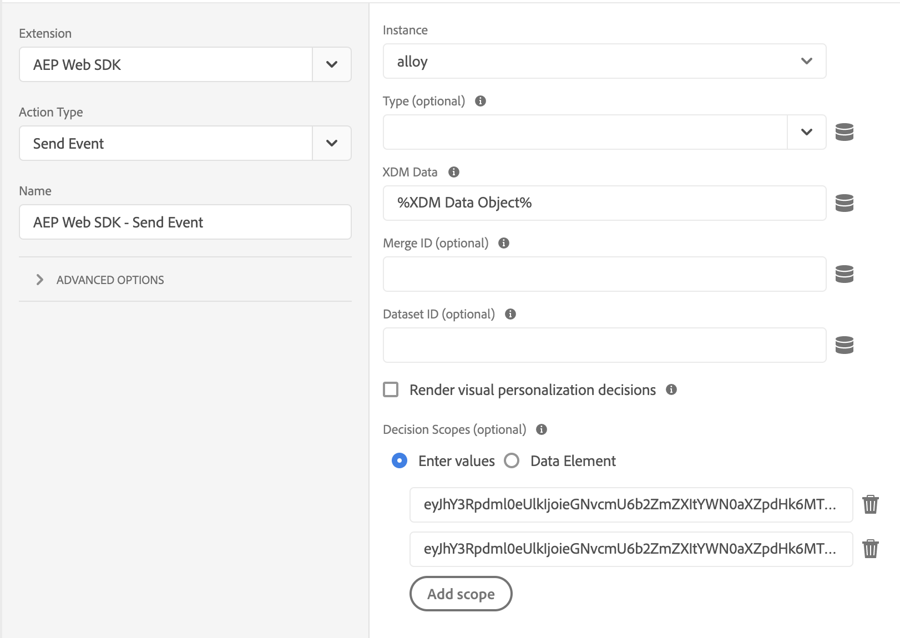

# Utilisation d’Offer Decisioning avec Experience Platform Web SDK

Les [!DNL Web SDK] Adobe Experience Platform peuvent diffuser et générer des offres personnalisées qui sont gérées dans Offer Decisioning. Vous pouvez créer vos offres et d’autres objets associés à l’aide de l’interface utilisateur (IU) ou des API d’Offer Decisioning.

## Conditions préalables

* L’organisation est activée pour la prise de décision Edge
* Offres, Activités créées
* Le flux de données est publié

## Terminologie

Il est important de comprendre la terminologie suivante lorsque vous utilisez Offer Decisioning. Pour plus d’informations et pour afficher des termes supplémentaires, consultez le [glossaire Offer Decisioning](https://experienceleague.adobe.com/docs/offer-decisioning/using/get-started/glossary.html?lang=fr).

* **Portées de décision :** pour Offer Decisioning, les portées de décision sont les chaînes de caractères JSON codées en Base64 contenant les identifiants d’activité et d’emplacement que le service Offer Decisioning doit utiliser pour proposer des offres.

  *JSON de la portée de décision :*

  ```json
  {
    "activityId":"xcore:offer-activity:11cfb1fa93381aca",
    "placementId":"xcore:offer-placement:1175009612b0100c"
  }
  ```

  *Chaîne codée en Base64 de la portée de décision :*

  ```json
  "eyJhY3Rpdml0eUlkIjoieGNvcmU6b2ZmZXItYWN0aXZpdHk6MTFjZmIxZmE5MzM4MWFjYSIsInBsYWNlbWVudElkIjoieGNvcmU6b2ZmZXItcGxhY2VtZW50OjExNzUwMDk2MTJiMDEwMGMifQ=="
  ```

  >[!TIP]
  >
  >Vous pouvez copier la valeur de la portée de décision à partir de la page **Présentation des activités** de l’interface utilisateur.

  

* **Flux de données :** pour plus d’informations, consultez la documentation [flux de données](/help/datastreams/overview.md).

* **Identité** : pour plus d’informations, consultez cette documentation décrivant comment [Experience Platform Web SDK utilise Identity Service](../../identity/overview.md).

## Activation d’Offer Decisioning

Pour activer Offer Decisioning, procédez comme suit :

1. Activation de Adobe Experience Platform dans votre [flux de données](/help/datastreams/overview.md) et cochez la case « Offer Decisioning ».

   

1. Suivez les instructions de la section [Installation du SDK](/help/web-sdk/install/overview.md) (le SDK peut être installé seul ou via l’interface utilisateur. Pour plus d’informations, consultez le [guide de démarrage rapide des balises](/help/tags/quick-start/quick-start.md)).
1. Configurez le SDK pour Offer Decisioning à l’aide de `personalization.decisionScopes`. Vous trouverez ci-dessous d’autres étapes spécifiques à Offer Decisioning.

   * Installation du SDK autonome

      1. Configurez l’action « sendEvent » avec `personalization.decisionScopes`

     ```javascript
     alloy("sendEvent", {
       ...
       "personalization": {
         "decisionScopes": [
           "eyJhY3Rpdml0eUlkIjoieGNvcmU6b2ZmZXItYWN0aXZpdHk6MTIxYWIwOWMxM2JkZDIyNCIsInBsYWNlbWVudElkIjoieGNvcmU6b2ZmZXItcGxhY2VtZW50OjEyMWFiMDZhODRkMDViMTEifQ==",
           "eyJhY3Rpdml0eUlkIjoieGNvcmU6b2ZmZXItYWN0aXZpdHk6MTIxYWIyNWI5NTUwNWIxZiIsInBsYWNlbWVudElkIjoieGNvcmU6b2ZmZXItcGxhY2VtZW50OjEyMWFiMjFmOTQzMDE0MmIifQ=="
         ]
       }
     });
     ```

   * Installation de SDK par le biais de balises

      1. [Création d’une propriété de balise](/help/tags/ui/administration/companies-and-properties.md)
      1. [Ajouter du code incorporé](https://experienceleague.adobe.com/docs/core-services-learn/implementing-in-websites-with-launch/configure-launch/launch-add-embed.html?lang=fr)
      1. Installez et configurez l’extension Experience Platform Web SDK avec le flux de données créé lors de la sélection de la configuration dans le menu déroulant « Flux de données ». Consultez la documentation relative aux [extensions](/help/tags/ui/managing-resources/extensions/overview.md).

         

         

      1. Créez les [Éléments de données](/help/tags/ui/managing-resources/data-elements.md) nécessaires. Au minimum, vous devez créer un mappage d’identité Experience Platform Web SDK et un élément de données Objet XDM Experience Platform Web SDK .

         

         

      1. Créez vos [Règles](/help/tags/ui/managing-resources/rules.md).

         * Ajoutez une action d’envoi d’événement Experience Platform Web SDK et ajoutez les `decisionScopes` appropriées à la configuration de cette action

         

      1. [Créer et publier une bibliothèque](/help/tags/ui/publishing/libraries.md) contenant toutes les règles, éléments de données et extensions pertinents que vous avez configurés

## Exemples de requêtes et de réponses

### Une valeur de `decisionScopes`

**Requête**

```json
{
  "events": [
    {
      "xdm": {
        "identityMap": {
          "ECID": [
            {
              "id": "91133425615229052182584359620783097099"
            }
          ]
        }
      },
      "query": {
        "personalization": {
          "decisionScopes": [
            "eyJhY3Rpdml0eUlkIjoieGNvcmU6b2ZmZXItYWN0aXZpdHk6MTFjZmIxZmE5MzM4MWFjYSIsInBsYWNlbWVudElkIjoieGNvcmU6b2ZmZXItcGxhY2VtZW50OjExNzUwMDk2MTJiMDEwMGMifQ=="
          ]
        }
      }
    }
  ]
}
```

| Propriété | Obligatoire | Description | Limites | Exemple |
|---|---|---|---|---|
| `identityMap` | Oui | Reportez-vous à cette [documentation du service d’identités](../../identity/overview.md). | Une identité par requête. | `{ "identityMap": { "ECID": [ { "id": "91133425615229052182584359620783097099" } ] } }`. <br><br> Remarque : les utilisateurs n’ont pas besoin d’inclure le paramètre `ECID` dans l’appel API. Ce paramètre est automatiquement ajouté à l’appel, si nécessaire. |
| `decisionScopes` | Oui | Tableau de chaînes codées en Base64 de JSON contenant les identifiants d’activité et d’emplacement. | Maximum de 30 `decisionScopes` par requête. | `"decisionScopes": ["eyJhY3Rpdml0eUlkIjoieGNvcmU6b2ZmZXItYWN0aXZpdHk6MTFjZmIxZmE5MzM4MWFjYSIsInBsYWNlbWVudElkIjoieGNvcmU6b2ZmZXItcGxhY2VtZW50OjExNzUwMDk2MTJiMDEwMGMifQ=="]` |

**Réponse**

```json
{
  "requestId": "94c4f2f1-9218-43ce-afd3-eb0d853c5174",
  "handle": [
    {
      "payload": [
        {
          "id": "2862bb89-5df2-4bc6-85c2-d8f7e1a091de",
          "scope": "eyJhY3Rpdml0eUlkIjoieGNvcmU6b2ZmZXItYWN0aXZpdHk6MTFjZmIxZmE5MzM4MWFjYSIsInBsYWNlbWVudElkIjoieGNvcmU6b2ZmZXItcGxhY2VtZW50OjExNzUwMDk2MTJiMDEwMGMifQ==",
          "activity": {
            "id": "xcore:offer-activity:11cfb1fa93381aca",
            "etag": "2"
          },
          "placement": {
            "id": "xcore:offer-placement:1175009612b0100c",
            "etag": "1"
          },
          "items": [
            {
              "id": "xcore:personalized-offer:124cc332095cfa74",
              "schema": "https://ns.adobe.com/experience/offer-management/content-component-html",
              "etag": "1",
              "data": {
                "id": "xcore:personalized-offer:124cc332095cfa74",
                "format": "text/html",
                "language": [
                  "en-US"
                ],
                "content": "<p>20% Off on shipping</p>",
                "characteristics": {
                  "foo": "bar",
                  "foo1": "bar1"
                }
              }
            }
          ]
        }
      ],
      "type": "personalization:decisions",
      "eventIndex": 0
    }
  ]
}
```

| Propriété | Description | Exemple |
|---|---|---|
| `scope` | Portée de décision ayant abouti aux offres proposées. | `"scope": "eyJhY3Rpdml0eUlkIjoieGNvcmU6b2ZmZXItYWN0aXZpdHk6MTFjZmIxZmE5MzM4MWFjYSIsInBsYWNlbWVudElkIjoieGNvcmU6b2ZmZXItcGxhY2VtZW50OjExNzUwMDk2MTJiMDEwMGMifQ=="` |
| `activity.id` | Identifiant unique de l’activité d’offre. | `"id": "xcore:offer-activity:11cfb1fa93381aca"` |
| `placement.id` | Identifiant unique de l’emplacement de l’offre. | `"id": "xcore:offer-placement:1175009612b0100c"` |
| `items.id` | L’identifiant de l’offre proposée. | `"id": "xcore:personalized-offer:124cc332095cfa74"` |
| `schema` | Schéma du contenu associé à l’offre proposée. | `"schema": "https://ns.adobe.com/experience/offer-management/content-component-html"` |
| `data.id` | L’identifiant de l’offre proposée. | `"id": "xcore:personalized-offer:124cc332095cfa74"` |
| `format` | Format du contenu associé à l’offre proposée. | `"format": "text/html"` |
| `language` | Tableau de langues associées au contenu de l’offre proposée. | `"language": [ "en-US" ]` |
| `content` | Contenu associé à l&#39;offre proposée sous la forme d&#39;une chaîne. | `"content": "<p style="color:red;">20% Off on shipping</p>"` |
| `deliveryUrl` | Contenu de l&#39;image associé à l&#39;offre proposée sous la forme d&#39;une URL. | `"deliveryURL": "https://image.jpeg"` |
| `characteristics` | Caractéristiques associées à l’offre proposée au format d’un objet JSON. | `"characteristics": { "foo": "bar", "foo1": "bar1" }` |

### Plusieurs valeurs de `decisionScopes`

**Requête**

```json
{
  "events": [
    {
      "xdm": {
        "identityMap": {
          "ECID": [
            {
              "id": "91133425615229052182584359620783097099"
            }
          ]
        }
      },
      "query": {
        "personalization": {
          "decisionScopes": [
            "eyJhY3Rpdml0eUlkIjoieGNvcmU6b2ZmZXItYWN0aXZpdHk6MTFjZmIxZmE5MzM4MWFjYSIsInBsYWNlbWVudElkIjoieGNvcmU6b2ZmZXItcGxhY2VtZW50OjExNzUwMDk2MTJiMDEwMGMifQ==",
            "eyJhY3Rpdml0eUlkIjoieGNvcmU6b2ZmZXItYWN0aXZpdHk6MTIyMjA4YjNhODc0MDU1OCIsInBsYWNlbWVudElkIjoieGNvcmU6b2ZmZXItcGxhY2VtZW50OjEyMjIwNDUyOTUxNGEyYzAifQ==",
            "eyJhY3Rpdml0eUlkIjoieGNvcmU6b2ZmZXItYWN0aXZpdHk6MTIyYzkxMzg1Mjc2MDE4YyIsInBsYWNlbWVudElkIjoieGNvcmU6b2ZmZXItcGxhY2VtZW50OjEyMzMxZjU2MTYyYWEyZjcifQ=="
          ]
        }
      }
    }
  ]
}
```

| Propriété | Obligatoire | Description | Limites | Exemple |
|---|---|---|---|---|
| `identityMap` | Oui | Reportez-vous à cette [documentation du service d’identités](../../identity/overview.md). | Une identité par requête. | `{ "identityMap": { "ECID": [ { "id": "91133425615229052182584359620783097099" } ] } }`. <br><br> Remarque : les utilisateurs n’ont pas besoin d’inclure le paramètre `ECID` dans l’appel API. Ce paramètre est automatiquement ajouté à l’appel, si nécessaire. |
| `decisionScopes` | Oui | Tableau de chaînes codées en Base64 de JSON contenant les identifiants d’activité et d’emplacement. | Maximum de 30 `decisionScopes` par requête. | `"decisionScopes":["eyJhY3Rpdml0eUlkIjoieGNvcmU6b2ZmZXItYWN0aXZpdHk6MTFjZmIxZmE5MzM4MWFjYSIsInBsYWNlbWVudElkIjoieGNvcmU6b2ZmZXItcGxhY2VtZW50OjExNzUwMDk2MTJiMDEwMGMifQ==", "eyJhY3Rpdml0eUlkIjoieGNvcmU6b2ZmZXItYWN0aXZpdHk6MTIyMjA4YjNhODc0MDU1OCIsInBsYWNlbWVudElkIjoieGNvcmU6b2ZmZXItcGxhY2VtZW50OjEyMjIwNDUyOTUxNGEyYzAifQ=="` |

**Réponse**

```json
{
  "requestId": "94c4f2f1-9218-43ce-afd3-eb0d853c5174",
  "handle": [
    {
      "payload": [
        {
          "id": "a2804dfb-a0ec-4df9-8311-59d3ecdeb642",
          "scope": "eyJhY3Rpdml0eUlkIjoieGNvcmU6b2ZmZXItYWN0aXZpdHk6MTFjZmIxZmE5MzM4MTEyMyIsInBsYWNlbWVudElkIjoieGNvcmU6b2ZmZXItcGxhY2VtZW50OjExNzUwMDk2MTJiMDExMjMifQ==",
          "activity": {
            "id": "xcore:offer-activity:11cfb1fa93381123",
            "etag": "1"
          },
          "placement": {
            "id": "xcore:offer-placement:1175009612b01123",
            "etag": "3"
          },
          "items": [
            {
              "id": "xcore:personalized-offer:11e36d4a22954123",
              "schema": "https://ns.adobe.com/experience/offer-management/content-component-text",
              "etag": "2",
              "data": {
                "id": "xcore:personalized-offer:11e36d4a22954123",
                "format": "text/text",
                "language": [
                  "en"
                ],
                "content": "20% Off on shipping",
                "characteristics": {
                  "foo2": "bar2"
                }
              }
            }
          ]
        },
        {
          "id": "a2804dfb-a0ec-4df9-8311-59d3ecdeb642",
          "scope": "eyJhY3Rpdml0eUlkIjoieGNvcmU6b2ZmZXItYWN0aXZpdHk6MTFjZmIxZmE5MzM4MWFjYSIsInBsYWNlbWVudElkIjoieGNvcmU6b2ZmZXItcGxhY2VtZW50OjExNzUwMDk2MTJiMDEwMGMifQ==",
          "activity": {
            "id": "xcore:offer-activity:11cfb1fa93381aca",
            "etag": "2"
          },
          "placement": {
            "id": "xcore:offer-placement:1175009612b0100c",
            "etag": "1"
          },
          "items": [
            {
              "id": "xcore:personalized-offer:11e36d4a2295415d",
              "schema": "https://ns.adobe.com/experience/offer-management/content-component-imagelink",
              "etag": "1",
              "data": {
                "id": "xcore:personalized-offer:11e36d4a2295415d",
                "format": "image/png",
                "language": [
                  "en"
                ],
                "deliveryURL": "https://image.jpeg",
                "characteristics": {
                  "foo": "bar",
                  "foo1": "bar1"
                }
              }
            }
          ]
        }
      ],
      "type": "personalization:decisions",
      "eventIndex": 0
    }
  ]
}
```

| Propriété | Description | Exemple |
|---|---|---|
| `scope` | Portée de décision ayant abouti aux offres proposées. | `"scope": "eyJhY3Rpdml0eUlkIjoieGNvcmU6b2ZmZXItYWN0aXZpdHk6MTFjZmIxZmE5MzM4MWFjYSIsInBsYWNlbWVudElkIjoieGNvcmU6b2ZmZXItcGxhY2VtZW50OjExNzUwMDk2MTJiMDEwMGMifQ=="` |
| `activity.id` | Identifiant unique de l’activité d’offre. | `"id": "xcore:offer-activity:11cfb1fa93381123"` |
| `placement.id` | Identifiant unique de l’emplacement de l’offre. | `"xcore:offer-placement:1175009612b01123"` |
| `items.id` | L’identifiant de l’offre proposée. | `"id": "xcore:personalized-offer:11e36d4a22954123"` |
| `schema` | Schéma du contenu associé à l’offre proposée. | `"schema": "https://ns.adobe.com/experience/offer-management/content-component-text"` |
| `data.id` | L’identifiant de l’offre proposée. | `"id": "xcore:personalized-offer:11e36d4a22954123"` |
| `format` | Format du contenu associé à l’offre proposée. | `"format": "text/text"` |
| `language` | Tableau de langues associées au contenu de l’offre proposée. | `"language": [ "en-US" ]` |
| `content` | Contenu associé à l&#39;offre proposée sous la forme d&#39;une chaîne. | `"content": "<p style="color:red;">20% Off on shipping</p>"` |
| `deliveryUrl` | Contenu de l&#39;image associé à l&#39;offre proposée sous la forme d&#39;une URL. | `"deliveryURL": "https://image.jpeg"` |
| `characteristics` | Caractéristiques associées à l’offre proposée au format d’un objet JSON. | `"characteristics": { "foo": "bar", "foo1": "bar1" }` |

## Limites

Certaines contraintes d’offre ne sont actuellement pas prises en charge avec les workflows Edge Network mobiles, par exemple la limitation. La valeur du champ Limitation indique le nombre de fois où une offre peut être présentée à tous les utilisateurs. Pour plus d’informations, voir [Documentation sur les règles d’éligibilité et les contraintes d’offres](https://experienceleague.adobe.com/docs/offer-decisioning/using/managing-offers-in-the-offer-library/creating-personalized-offers.html?lang=fr#eligibility).
