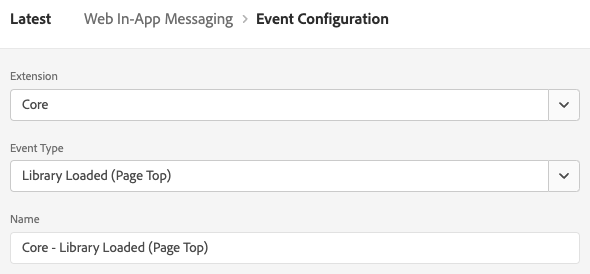
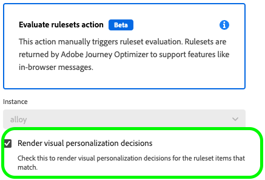

# Configuration de la prise en charge de la messagerie web in-app dans le SDK web

Les messages in-app sont des notifications que vous pouvez envoyer aux utilisateurs dans votre application web, en les guidant vers des points ciblés spécifiques.

Vous pouvez utiliser ces notifications à différentes fins, par exemple pour promouvoir de nouvelles fonctionnalités, présenter des offres spéciales ou faciliter l’intégration des utilisateurs.

En utilisant les messages in-app, vous pouvez interagir efficacement avec votre audience et l’orienter vers des aspects importants de votre application.

>[!IMPORTANT]
>
>La messagerie in-app web est une fonctionnalité [Adobe Journey Optimizer](https://experienceleague.adobe.com/docs/journey-optimizer/using/ajo-home.html?lang=fr) qui utilise le SDK web pour diffuser le contenu personnalisé.
>
>Pour obtenir des instructions détaillées sur la configuration de votre campagne de messagerie web in-app, consultez la [documentation de Adobe Journey Optimizer](https://experienceleague.adobe.com/docs/journey-optimizer/using/in-app/create-in-app-web.html).


## Conditions préalables {#prerequisites}

### Version de l’extension de balise SDK Web {#extension-version}

La fonctionnalité de messagerie in-app web requiert la dernière version de l’extension de balise SDK web.

### Configuration d’une CSP pour la messagerie web in-app {#csp}

Lorsque vous configurez la [messagerie in-app web](../personalization/web-in-app-messaging.md), vous devez inclure la directive suivante dans votre CSP :

```
default-src  blob:;
```

Pour plus d’informations sur la configuration d’une CSP, consultez la [documentation dédiée](../use-cases/configuring-a-csp.md).

## Configuration de la messagerie web in-app à l’aide de l’extension de balise SDK web {#tag-extension}

Reportez-vous à la [page de configuration de l’extension de balise SDK Web](../../tags/extensions/client/web-sdk/web-sdk-extension-configuration.md) pour savoir où trouver les paramètres décrits ci-dessous.

Une fois [installé](../../tags/extensions/client/web-sdk/web-sdk-extension-configuration.md#install-the-web-sdk-tag-extension) sur l’extension de balise SDK Web, suivez les étapes ci-dessous pour configurer l’extension pour la messagerie in-app web.

Dans la section **[!UICONTROL Personalization]** , cochez l&#39;option **[!UICONTROL Activer le stockage de personnalisation]** . Cette option permet au SDK Web de suivre les expériences qui ont été vues par l’utilisateur lors du chargement d’une page.


La messagerie web in-app prend en charge deux types de déclencheurs :

* [Envoi de données à Platform](#send-data-platform)
* [Déclenchement manuel des messages](#manual-trigger)

Reportez-vous aux sections suivantes pour configurer l’extension de balise du SDK Web en fonction des déclencheurs que vous souhaitez utiliser.

### Étapes de configuration du déclencheur **[!UICONTROL Envoyer des données à Platform]** {#send-data-platform}

Sélectionnez la propriété de balise qui contient votre extension SDK Web et [créez une règle](../../tags/ui/managing-resources/rules.md##create-a-rule) avec les paramètres suivants :

1. **[!UICONTROL Extension]** : [!UICONTROL Core]
2. **[!UICONTROL Type d’événement]** : [!UICONTROL Bibliothèque chargée (Haut de page)]

   

3. Sélectionnez **[!UICONTROL Conserver les modifications]** pour enregistrer la configuration de l’événement.

Vous devez ensuite ajouter une action à la règle que vous avez créée.

1. Dans la section [!DNL Actions], sélectionnez **[!UICONTROL Ajouter]**.
   

2. Utilisez les paramètres **[!UICONTROL Action]** suivants :
   * **[!UICONTROL Extension]** : [!UICONTROL SDK Web Adobe Experience Platform]
   * **[!UICONTROL Type d’action]** : [!UICONTROL Envoyer l’événement]

     

3. Sur le côté droit de l’écran, dans la section **[!UICONTROL Personalization]**, activez l’option **[!UICONTROL Render Visual personalization Decisions]** .
   

4. Sur le côté droit de l’écran, dans la section **[!UICONTROL Contexte de décision]**, définissez les paires **[!UICONTROL Clé]**/**[!UICONTROL Valeur]** que vous avez utilisées dans la configuration de votre campagne pour remplir les critères du message in-app.
   

5. Sélectionnez **[!UICONTROL Conserver les modifications]** pour enregistrer votre configuration.


Vous devez ensuite ajouter la règle nouvellement créée à la bibliothèque de propriétés de balise. Pour ce faire, accédez à **[!UICONTROL Flux de publication]** et sélectionnez la règle que vous avez créée précédemment.


Après avoir ajouté la règle à la bibliothèque, sélectionnez **[!UICONTROL Enregistrer et créer dans le développement]**.


Le processus de configuration est maintenant terminé et votre message est prêt à être présenté à vos utilisateurs.

### Étapes de configuration pour l’utilisation de déclencheurs manuels {#manual-trigger}

Sélectionnez la propriété de balise qui contient votre extension SDK Web et [créez une règle](../../tags/ui/managing-resources/rules.md##create-a-rule) avec les paramètres suivants :

1. **[!UICONTROL Extension]** : [!UICONTROL Core]
2. **[!UICONTROL Type d’événement]** : [!UICONTROL Cliquez sur]
3. Définissez le déclencheur d’un élément spécifique sur la page, l’identifiant par un sélecteur CSS de votre choix.

   


Vous devez ensuite ajouter une action à la règle que vous avez créée.

1. Dans la section [!DNL Actions], sélectionnez **[!UICONTROL Ajouter]**.
   

2. Utilisez les paramètres **[!UICONTROL Action]** suivants :
   * **[!UICONTROL Extension]** : [!UICONTROL SDK Web Adobe Experience Platform]
   * **[!UICONTROL Type d’action]** : [!UICONTROL Évaluer les jeux de règles]

     

3. Sur le côté droit de l’écran, activez l’option **[!UICONTROL Render Visual personalization Decisions]** (Rendre les décisions de personnalisation visuelle).
   


4. Sur le côté droit de l’écran, dans la section **[!UICONTROL Contexte de décision]**, définissez les paires **[!UICONTROL Clé]**/**[!UICONTROL Valeur]** que vous avez utilisées dans la configuration de votre campagne pour remplir les critères du message in-app.
   

5. Sélectionnez **[!UICONTROL Conserver les modifications]** pour enregistrer votre configuration.

Vous devez ensuite ajouter la règle nouvellement créée à la bibliothèque de propriétés de balise. Pour ce faire, accédez à **[!UICONTROL Flux de publication]** et sélectionnez la règle que vous avez créée précédemment.


Après avoir ajouté la règle à la bibliothèque, sélectionnez **[!UICONTROL Enregistrer et créer dans le développement]**.


Le processus de configuration est maintenant terminé et votre message est prêt à être présenté à vos utilisateurs.

## Configuration de la messagerie web in-app à l’aide de la bibliothèque JavaScript SDK web {#js-library}

Au lieu d’utiliser l’extension de balise du SDK Web, vous pouvez également configurer la messagerie web in-app directement à partir de la bibliothèque JavaScript du SDK Web.


Vous pouvez afficher les messages web in-app à partir de Adobe Journey Optimizer de deux manières.

### Méthode 1 : récupération automatique du contenu de personnalisation {#automatic}

Pour que le SDK Web récupère automatiquement le contenu de personnalisation au chargement de la page, utilisez la commande `sendEvent`, comme illustré dans l’exemple ci-dessous.

```js
  alloy("sendEvent", {
      renderDecisions: true,
      personalization: {
          surfaces: ['#welcome']
      }
  });
```

### Méthode 2 : récupération manuelle du contenu de personnalisation selon l’action de l’utilisateur {#manual}

Pour afficher le contenu de personnalisation uniquement une fois que l’utilisateur a effectué une action spécifique, utilisez la commande `evaluateRulesets` comme illustré dans l’exemple ci-dessous.

Dans cet exemple, le contenu de personnalisation s’affiche lorsqu’un utilisateur clique sur le bouton **[!UICONTROL Acheter maintenant]** de votre site web.

```js
 alloy("evaluateRulesets", {
     renderDecisions: true,
     personalization: {
         decisionContext: {
             "userAction": "buy_now"
         }
     }
 });
```

### Configuration du stockage de personnalisation {#personalization-storage}

Vous pouvez choisir d’afficher les messages in-app aux utilisateurs pour un nombre défini de fois, ou chaque fois qu’ils visitent une page, par le biais de l’option de configuration `personalizationStorageEnabled`.

Dans la [configuration du SDK Web](../commands/configure/overview.md), définissez l’option `personalizationStorageEnabled` en fonction de vos besoins :

* `personalizationStorageEnabled: true` déclenche le message in-app avec la fréquence que vous avez définie dans la [campagne Adobe Journey Optimizer](https://experienceleague.adobe.com/docs/journey-optimizer/using/in-app/create-in-app-web.html#configure-inapp).
* `personalizationStorageEnabled: false` déclenche le message in-app à chaque chargement de page.
