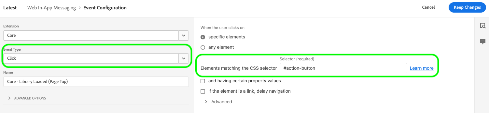

# Configuration de la prise en charge de la messagerie web in-app dans Web SDK

Les messages in-app sont des notifications que vous pouvez envoyer aux utilisateurs et utilisatrices dans votre application web, les guidant vers des points ciblés spécifiques.

Vous pouvez utiliser ces notifications à différentes fins, par exemple pour promouvoir de nouvelles fonctionnalités, présenter des offres spéciales ou faciliter l’intégration des utilisateurs et utilisatrices.

En utilisant les messages in-app, vous pouvez interagir efficacement avec votre audience et l’orienter vers des aspects importants de votre application.

>[!IMPORTANT]
>
>La messagerie Web In-App est une fonctionnalité de [Adobe Journey Optimizer](https://experienceleague.adobe.com/docs/journey-optimizer/using/ajo-home.html?lang=fr) qui utilise le SDK Web pour diffuser le contenu personnalisé.
>
>Pour obtenir des instructions détaillées sur la configuration de votre campagne de messagerie Web In-App, consultez la [documentation de Adobe Journey Optimizer](https://experienceleague.adobe.com/docs/journey-optimizer/using/in-app/create-in-app-web.html).


## Conditions préalables {#prerequisites}

### Version de l’extension de balise Web SDK {#extension-version}

La fonctionnalité de messagerie Web in-app nécessite la dernière version de l’extension de balise Web SDK.

### Configuration d’un CSP pour la messagerie web in-app {#csp}

Lorsque vous configurez la [messagerie Web In-App](../personalization/web-in-app-messaging.md), vous devez inclure la directive suivante dans votre CSP :

```
default-src  blob:;
```

Pour plus d’informations sur la configuration d’une CSP, consultez la [documentation dédiée](../use-cases/configuring-a-csp.md).

## Configuration de la messagerie Web In-App à l’aide de l’extension de balise Web SDK {#tag-extension}

Reportez-vous à la page [Configuration de l’extension de balise Web SDK](../../tags/extensions/client/web-sdk/web-sdk-extension-configuration.md) pour savoir où trouver les paramètres décrits ci-dessous.

Après avoir [installé](../../tags/extensions/client/web-sdk/web-sdk-extension-configuration.md#install-the-web-sdk-tag-extension) l’extension de balise Web SDK, suivez les étapes ci-dessous pour configurer l’extension pour la messagerie web in-app.

Dans la section **[!UICONTROL Personalization]**, cochez l&#39;option **[!UICONTROL Activer le stockage de personnalisation]**. Cette option permet au SDK Web de suivre les expériences qui ont été vues par l’utilisateur ou l’utilisatrice à travers les chargements de page.


La messagerie web in-app prend en charge deux types de déclencheurs :

* [Envoi de données à Experience Platform](#send-data-platform)
* [Déclenchement manuel des messages](#manual-trigger)

Reportez-vous aux sections suivantes pour configurer l’extension de balise Web SDK en fonction des déclencheurs que vous souhaitez utiliser.

### Étapes de configuration du déclencheur **[!UICONTROL Envoyer les données à Experience Platform]** {#send-data-platform}

Sélectionnez la propriété de balise qui contient votre extension Web SDK, puis [créez une règle](../../tags/ui/managing-resources/rules.md##create-a-rule) avec les paramètres suivants :

1. **[!UICONTROL Extension]** : [!UICONTROL Core]
2. **[!UICONTROL Type D’Événement]** : [!UICONTROL Bibliothèque Chargée (Haut De Page)]

   

3. Sélectionnez **[!UICONTROL Conserver les modifications]** pour enregistrer la configuration de l’événement.

Vous devez ensuite ajouter une action à la règle que vous avez créée.

1. Dans la section [!DNL Actions], sélectionnez **[!UICONTROL Ajouter]**.
   

2. Utilisez les paramètres **[!UICONTROL Action]** suivants :
   * **[!UICONTROL Extension]** : [!UICONTROL Adobe Experience Platform Web SDK]
   * **[!UICONTROL Type d’action]** : [!UICONTROL Envoyer l’événement]

     

3. Dans la partie droite de l’écran, dans la section **[!UICONTROL Personalization]**, activez l’option **[!UICONTROL Rendre les décisions de personnalisation visuelle]**.
   

4. Dans la partie droite de l’écran, dans la section **[!UICONTROL Contexte de décision]**, définissez les paires **[!UICONTROL Clé]**/**[!UICONTROL Valeur]** que vous avez utilisées dans la configuration de votre campagne, pour être qualifiées pour le message in-app.
   

5. Sélectionnez **[!UICONTROL Conserver les modifications]** pour enregistrer votre configuration.


Vous devez ensuite ajouter la règle nouvellement créée à la bibliothèque de propriétés de balises. Pour ce faire, accédez à **[!UICONTROL Flux de publication]** et sélectionnez la règle que vous avez précédemment créée.


Après avoir ajouté la règle à la bibliothèque, sélectionnez **[!UICONTROL Enregistrer et créer dans le développement]**.


Le processus de configuration est maintenant terminé et votre message est prêt à être affiché à vos utilisateurs.

### Étapes de configuration pour l’utilisation de déclencheurs manuels {#manual-trigger}

Sélectionnez la propriété de balise qui contient votre extension Web SDK, puis [créez une règle](../../tags/ui/managing-resources/rules.md##create-a-rule) avec les paramètres suivants :

1. **[!UICONTROL Extension]** : [!UICONTROL Core]
2. **[!UICONTROL Type D’Événement]** : [!UICONTROL Clic]
3. Définissez le déclencheur pour un élément spécifique de la page, identifié par un sélecteur CSS de votre choix.

   


Vous devez ensuite ajouter une action à la règle que vous avez créée.

1. Dans la section [!DNL Actions], sélectionnez **[!UICONTROL Ajouter]**.
   

2. Utilisez les paramètres **[!UICONTROL Action]** suivants :
   * **[!UICONTROL Extension]** : [!UICONTROL Adobe Experience Platform Web SDK]
   * **[!UICONTROL Type d’action]** : [!UICONTROL évaluation des ensembles de règles]

     

3. Sur le côté droit de l’écran, activez l’option **[!UICONTROL Rendre les décisions de personnalisation visuelle]**.
   


4. Dans la partie droite de l’écran, dans la section **[!UICONTROL Contexte de décision]**, définissez les paires **[!UICONTROL Clé]**/**[!UICONTROL Valeur]** que vous avez utilisées dans la configuration de votre campagne, pour être qualifiées pour le message in-app.
   

5. Sélectionnez **[!UICONTROL Conserver les modifications]** pour enregistrer votre configuration.

Vous devez ensuite ajouter la règle nouvellement créée à la bibliothèque de propriétés de balises. Pour ce faire, accédez à **[!UICONTROL Flux de publication]** et sélectionnez la règle que vous avez précédemment créée.


Après avoir ajouté la règle à la bibliothèque, sélectionnez **[!UICONTROL Enregistrer et créer dans le développement]**.


Le processus de configuration est maintenant terminé et votre message est prêt à être affiché à vos utilisateurs.

## Configuration de la messagerie Web In-App à l’aide de la bibliothèque JavaScript Web SDK {#js-library}

Au lieu d’utiliser l’extension de balise Web SDK, vous pouvez également configurer la messagerie Web In-App directement à partir de la bibliothèque JavaScript Web SDK.


Vous pouvez afficher des messages web in-app depuis Adobe Journey Optimizer de deux façons.

### Méthode 1 : récupérer automatiquement le contenu de personnalisation {#automatic}

Pour que Web SDK récupère automatiquement le contenu de personnalisation au chargement de la page, utilisez la commande `sendEvent` , comme illustré dans l’exemple ci-dessous.

```js
  alloy("sendEvent", {
      renderDecisions: true,
      personalization: {
          surfaces: ['#welcome']
      }
  });
```

### Méthode 2 : récupérer manuellement le contenu de personnalisation en fonction de l’action de l’utilisateur {#manual}

Pour afficher le contenu de personnalisation uniquement après que l’utilisateur a effectué une action spécifique, utilisez la commande `evaluateRulesets` comme illustré dans l’exemple ci-dessous.

Dans cet exemple, le contenu de personnalisation s’affiche lorsqu’un utilisateur clique sur le bouton **[!UICONTROL Acheter maintenant]** de votre site web.

```js
 alloy("evaluateRulesets", {
     renderDecisions: true,
     personalization: {
         decisionContext: {
             "userAction": "buy_now"
         }
     }
 });
```

### Configuration du stockage de personnalisation {#personalization-storage}

Vous pouvez choisir d’afficher des messages in-app aux utilisateurs et utilisatrices pour un nombre défini de fois, ou à chaque fois qu’ils ou elles visitent une page, via l’option de configuration `personalizationStorageEnabled`.

Dans la configuration [Web SDK](../commands/configure/overview.md) définissez l’option `personalizationStorageEnabled` en fonction de vos besoins :

* `personalizationStorageEnabled: true` déclenche le message in-app avec la fréquence que vous avez définie dans la campagne [Adobe Journey Optimizer](https://experienceleague.adobe.com/docs/journey-optimizer/using/in-app/create-in-app-web.html#configure-inapp).
* `personalizationStorageEnabled: false` déclenche le message in-app à chaque chargement de page.
