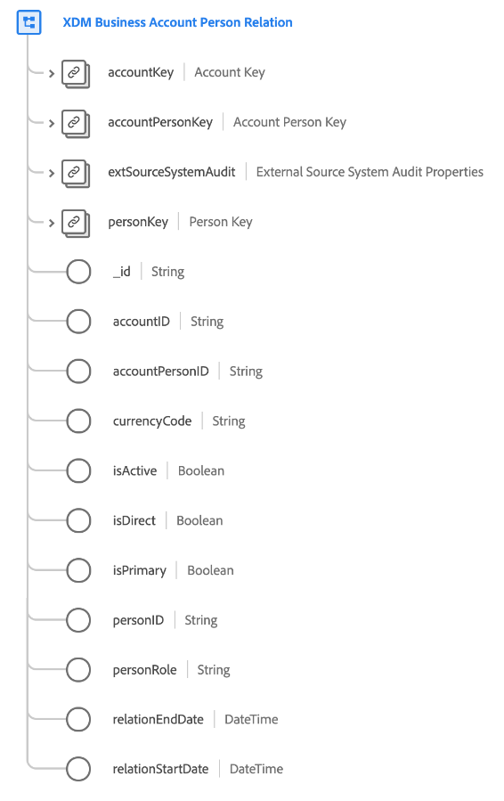

# Classe [!UICONTROL XDM Business Account Person Relation]

>[!IMPORTANT]
>
>Cette classe est destinée aux organisations ayant accès à [Adobe Real-Time Customer Data Platform B2B edition](../../../rtcdp/b2b-overview.md). Vous devez avoir accès à Real-Time CDP B2B edition pour que cette classe puisse participer au [profil client en temps réel](../../../profile/home.md).

[!UICONTROL XDM Business Account Person Relation] est une classe XDM (modèle de données d’expérience) standard qui recueille les propriétés minimales requises d’une personne associée à un compte professionnel.

| Propriété | Type de données | Description |
| --- | --- | --- |
| `accountKey` | [[!UICONTROL B2B Source]](../../data-types/b2b-source.md) | Identifiant composite du compte dans la relation compte-personne. |
| `accountPersonKey` | [[!UICONTROL B2B Source]](../../data-types/b2b-source.md) | Identifiant composite de l’entité de relation compte-personne. |
| `extSourceSystemAudit` | [[!UICONTROL External Source System Audit Attributes]](../../data-types/external-source-system-audit-attributes.md) | Si la relation compte-personne provient d’un système source externe, cet objet capture les attributs d’audit de ce système. |
| `personKey` | [[!UICONTROL B2B Source]](../../data-types/b2b-source.md) | Identifiant composite de la personne dans la relation compte-personne. |
| `_id` | Chaîne | Identifiant unique de l’enregistrement. Il s’agit d’une valeur générée par le système qui est distincte des autres champs d’identification capturés par la classe . |
| `accountID` | Chaîne | Identifiant unique du compte dans la relation compte-personne. |
| `accountPersonID` | Chaîne | Identifiant unique de l’entité de relation compte-personne. |
| `currencyCode` | Chaîne | Code de devise ISO 4217 utilisé pour la relation entre le compte et la personne. |
| `isActive` | Booléen | Indique si la relation entre le compte et la personne est active. |
| `isDeleted` | Booléen | Indique si cette relation compte-personne a été supprimée dans Marketo Engage.  Lors de l’utilisation du connecteur source [Marketo](../../../sources/connectors/adobe-applications/marketo/marketo.md), tous les enregistrements supprimés dans Marketo sont automatiquement répercutés dans le profil client en temps réel. Cependant, les enregistrements relatifs à ces profils peuvent toujours persister dans le lac de données. En définissant `isDeleted` sur `true`, vous pouvez utiliser le champ pour filtrer les enregistrements qui ont été supprimés de vos sources lors de l’interrogation du lac de données. |
| `isDirect` | Booléen | Indique s’il s’agit d’une relation directe entre le compte et la personne. |
| `isPrimary` | Booléen | Indique si la personne est le contact principal sur ce compte. |
| `personID` | Chaîne | Identifiant unique de la personne dans la relation compte-personne. |
| `personRoles` | Tableau de chaînes | Indique les rôles de la personne dans la relation compte-personne. |
| `relationEndDate` | DateTime | Date de fin de la relation entre le compte et la personne. |
| `relationStartDate` | DateTime | Date de début de la relation entre le compte et la personne. |
| `relationshipSource` | Chaîne | Source de la relation compte-personne. |

{style="table-layout:auto"}

Consultez le guide sur les [relations de schéma dans Real-Time CDP B2B edition](../../tutorials/relationship-b2b.md) pour savoir comment cette classe est conceptuellement liée aux autres classes B2B et comment vous pouvez établir ces relations dans l’interface utilisateur de Adobe Experience Platform.
