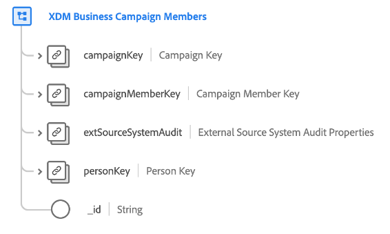

# Classe [!UICONTROL XDM Business Campaign Members]

>[!IMPORTANT]
>
>Cette classe est destinée aux organisations ayant accès à [Adobe Real-Time Customer Data Platform B2B edition](../../../rtcdp/b2b-overview.md). Vous devez avoir accès à Real-Time CDP B2B edition pour que cette classe puisse participer au [profil client en temps réel](../../../profile/home.md).

[!UICONTROL XDM Business Campaign Members] est une classe XDM (modèle de données d’expérience) standard qui décrit un contact ou un prospect associé à une campagne commerciale.

| Propriété | Type de données | Description |
| --- | --- | --- |
| `campaignKey` | [[!UICONTROL B2B Source]](../../data-types/b2b-source.md) | Identifiant composite de la campagne associée. |
| `campaignMemberKey` | [[!UICONTROL B2B Source]](../../data-types/b2b-source.md) | Identifiant composite de l’entité d’appartenance à la campagne. |
| `extSourceSystemAudit` | [[!UICONTROL External Source System Audit Attributes]](../../data-types/external-source-system-audit-attributes.md) | Si l’appartenance à la campagne provient d’un système source externe, cet objet capture les attributs d’audit de ce système. |
| `personKey` | [[!UICONTROL B2B Source]](../../data-types/b2b-source.md) | Identifiant composite de la personne qui est membre de la campagne associée. |
| `_id` | Chaîne | Identifiant unique de l’enregistrement. Il s’agit d’une valeur générée par le système et distincte de la `campaignMemberID`. |

{style="table-layout:auto"}

Pour découvrir comment cette classe est conceptuellement liée aux autres classes B2B et comment vous pouvez établir ces relations dans l’interface utilisateur de Adobe Experience Platform, consultez le guide sur les [relations de schéma dans Real-Time CDP B2B edition](../../tutorials/relationship-b2b.md)

Pour les champs supplémentaires compatibles avec cette classe, reportez-vous à la référence du groupe de champs pour [[!UICONTROL XDM Business Campaign Member Details]](../../field-groups/b2b-campaign-members/details.md).
