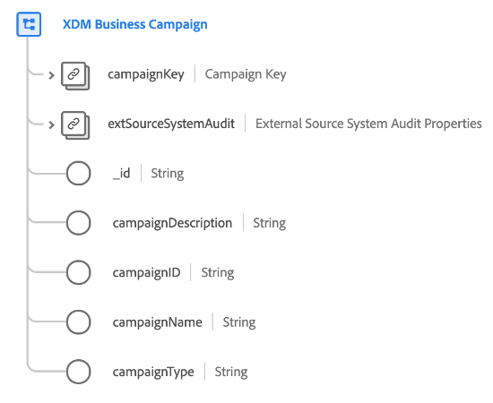

# Classe [!UICONTROL  XDM Business Campaign ]

>[!IMPORTANT]
>
>Cette classe est destinée aux organisations ayant accès à [Adobe Real-Time Customer Data Platform B2B edition](../../../rtcdp/b2b-overview.md). Vous devez avoir accès à Real-Time CDP B2B edition pour que cette classe puisse participer au [profil client en temps réel](../../../profile/home.md).

[!UICONTROL XDM Business Campaign] est une classe de modèle de données d’expérience (XDM) standard qui capture les propriétés minimales requises d’une campagne commerciale.

| Propriété | Type de données | Description |
| --- | --- | --- |
| `campaignKey` | Source B2B]](../../data-types/b2b-source.md)[[!UICONTROL  | Identifiant composite de l’entité de campagne. |
| `extSourceSystemAudit` | [[!UICONTROL Attributs d’audit du système Source externe]](../../data-types/external-source-system-audit-attributes.md) | Si la campagne provient d’un système source externe, cet objet capture les attributs d’audit de ce système. |
| `_id` | Chaîne | Identifiant unique de l’enregistrement. Il s’agit d’une valeur générée par le système et distincte de la `campaignID`. |
| `campaignDescription` | Chaîne | Description de la campagne. |
| `campaignID` | Chaîne | Identifiant unique de l’entité de campagne. |
| `campaignName` | Chaîne | Nom de la campagne. |
| `campaignType` | Chaîne | Type de campagne ou audience cible. |

{style="table-layout:auto"}

Pour découvrir comment cette classe est conceptuellement liée aux autres classes B2B et comment vous pouvez établir ces relations dans l’interface utilisateur de Adobe Experience Platform, consultez le guide sur les [relations de schéma dans Real-Time CDP B2B edition](../../tutorials/relationship-b2b.md)

Pour des champs supplémentaires compatibles avec cette classe, consultez la référence du groupe de champs pour [[!UICONTROL Détails de XDM Business Campaign]](../../field-groups/b2b-campaign/details.md).
