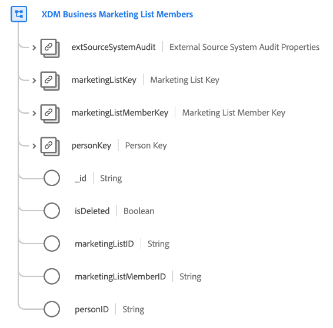

# Classe [!UICONTROL XDM Business Marketing List Members]

>[!IMPORTANT]
>
>Cette classe est destinée aux organisations ayant accès à [Adobe Real-Time Customer Data Platform B2B edition](../../../rtcdp/b2b-overview.md). Vous devez avoir accès à Real-Time CDP B2B edition pour que cette classe puisse participer au [profil client en temps réel](../../../profile/home.md).

[!UICONTROL XDM Business Marketing List Members] est une classe XDM (modèle de données d’expérience) standard qui décrit les membres, les personnes ou les contacts associés à une liste marketing.

| Propriété | Type de données | Description |
| --- | --- | --- |
| `extSourceSystemAudit` | [[!UICONTROL External Source System Audit Attributes]](../../data-types/external-source-system-audit-attributes.md) | Si l’appartenance à la liste marketing provient d’un système source externe, cet objet capture les attributs d’audit de ce système. |
| `marketingListKey` | [[!UICONTROL B2B Source]](../../data-types/b2b-source.md) | Identifiant composite de la liste marketing dont la personne est membre. |
| `marketingListMemberKey` | [[!UICONTROL B2B Source]](../../data-types/b2b-source.md) | Identifiant composite de l’entité d’appartenance à la liste marketing. |
| `personKey` | [[!UICONTROL B2B Source]](../../data-types/b2b-source.md) | Identifiant composite de la personne qui est membre de la liste marketing. |
| `_id` | Chaîne | Identifiant unique de l’enregistrement. Il s’agit d’une valeur générée par le système et distincte de la `marketingListMemberID`. |
| `isDeleted` | Booléen | Indique si cette entité membre de la liste marketing a été supprimée dans Marketo Engage.  Lors de l’utilisation du connecteur source [Marketo](../../../sources/connectors/adobe-applications/marketo/marketo.md), tous les enregistrements supprimés dans Marketo sont automatiquement répercutés dans le profil client en temps réel. Cependant, les enregistrements relatifs à ces profils peuvent toujours persister dans le lac de données. En définissant `isDeleted` sur `true`, vous pouvez utiliser le champ pour filtrer les enregistrements qui ont été supprimés de vos sources lors de l’interrogation du lac de données. |
| `marketingListID` | Chaîne | ID unique de la liste marketing. |
| `marketingListMemberID` | Chaîne | ID unique de l’entité d’appartenance à la liste marketing. |
| `personId` | Chaîne | ID unique de la personne. |

{style="table-layout:auto"}

Consultez le guide sur les [relations de schéma dans Real-Time CDP B2B edition](../../tutorials/relationship-b2b.md) pour savoir comment cette classe est conceptuellement liée aux autres classes B2B et comment vous pouvez établir ces relations dans l’interface utilisateur de Adobe Experience Platform.
