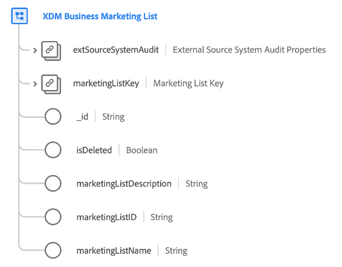

# Classe [!UICONTROL Liste marketing professionnelle XDM]

>[!IMPORTANT]
>
>Cette classe est destinée aux organisations ayant accès à [Adobe Real-Time Customer Data Platform B2B edition](../../../rtcdp/b2b-overview.md). Vous devez avoir accès à Real-Time CDP B2B edition pour que cette classe puisse participer au [profil client en temps réel](../../../profile/home.md).

[!UICONTROL Liste XDM Business Marketing] est une classe XDM (modèle de données d’expérience) standard qui capture les propriétés minimales requises d’une liste marketing. Les listes marketing vous permettent de donner la priorité aux prospects qui sont les plus susceptibles d’acheter votre produit.

| Propriété | Type de données | Description |
| --- | --- | --- |
| `extSourceSystemAudit` | [[!UICONTROL Attributs d’audit du système Source externe]](../../data-types/external-source-system-audit-attributes.md) | Si la liste marketing provient d’un système source externe, cet objet capture les attributs d’audit de ce système. |
| `marketingListKey` | Source B2B[&#128279;](../../data-types/b2b-source.md) | Identifiant composite de l’entité de liste marketing. |
| `_id` | Chaîne | Identifiant unique de l’enregistrement. Il s’agit d’une valeur générée par le système et distincte de la `marketingListID`. |
| `isDeleted` | Booléen | Indique si cette entité de liste marketing a été supprimée dans Marketo Engage.  Lors de l’utilisation du connecteur source [Marketo](../../../sources/connectors/adobe-applications/marketo/marketo.md), tous les enregistrements supprimés dans Marketo sont automatiquement répercutés dans le profil client en temps réel. Cependant, les enregistrements relatifs à ces profils peuvent toujours persister dans le lac de données. En définissant `isDeleted` sur `true`, vous pouvez utiliser le champ pour filtrer les enregistrements qui ont été supprimés de vos sources lors de l’interrogation du lac de données. |
| `marketingListDescription` | Chaîne | Description de la liste marketing. |
| `marketingListID` | Chaîne | ID unique de l’entité de liste marketing. |
| `marketingListName` | Chaîne | Nom de la liste marketing. |

{style="table-layout:auto"}

Consultez le guide sur les [relations de schéma dans Real-Time CDP B2B edition](../../tutorials/relationship-b2b.md) pour savoir comment cette classe est conceptuellement liée aux autres classes B2B et comment vous pouvez établir ces relations dans l’interface utilisateur de Adobe Experience Platform.
