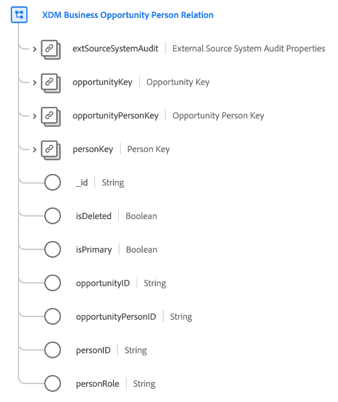

# Classe [!UICONTROL XDM Business Opportunity Person Relation]

>[!IMPORTANT]
>
>Cette classe est conçue pour être utilisée par les organisations ayant accès à [Adobe Real-Time Customer Data Platform B2B Edition](../../../rtcdp/b2b-overview.md). Vous devez avoir accès à l’édition B2B de Real-Time CDP pour que cette classe puisse participer à [Real-time Customer Profile](../../../profile/home.md).

[!UICONTROL XDM Business Opportunity Person Relation] est une classe de modèle de données d’expérience (XDM) standard qui capture les propriétés minimales requises d’une personne associée à une opportunité commerciale.

| Propriété | Type de données | Description |
| --- | --- | --- |
| `extSourceSystemAudit` | [[!UICONTROL  Attributs d’audit système Source externes]](../../data-types/external-source-system-audit-attributes.md) | Si la relation homme-entreprise provient d’un système source externe, cet objet capture les attributs de contrôle de ce système. |
| `opportunityKey` | [[!UICONTROL Source B2B]](../../data-types/b2b-source.md) | Identifiant composite de l’opportunité dans la relation opportunité-personne. |
| `opportunityPersonKey` | [[!UICONTROL Source B2B]](../../data-types/b2b-source.md) | Identifiant composite de l’entité de relation opportunité-personne. |
| `personKey` | [[!UICONTROL Source B2B]](../../data-types/b2b-source.md) | Identifiant composite de la personne dans la relation opportunité-personne. |
| `_id` | Chaîne | Identifiant unique de l’enregistrement. Il s’agit d’une valeur générée par le système qui est distincte des autres champs d’ID capturés par la classe . |
| `isDeleted` | Booléen | Indique si cette entité de liste marketing a été supprimée dans Marketo Engage.  Lors de l’utilisation du [connecteur source Marketo](../../../sources/connectors/adobe-applications/marketo/marketo.md), tous les enregistrements supprimés dans Marketo sont automatiquement répercutés dans Real-time Customer Profile. Cependant, les enregistrements relatifs à ces profils peuvent toujours persister dans le lac de données. En définissant `isDeleted` sur `true`, vous pouvez utiliser le champ pour filtrer les enregistrements qui ont été supprimés de vos sources lors de l’interrogation du lac de données. |
| `isPrimary` | Booléen | Indique si la personne est le premier contact pour cette opportunité. |
| `opportunityID` | Chaîne | Identifiant unique de l’opportunité dans la relation opportunité-personne. |
| `opportunityPersonID` | Chaîne | Identifiant unique de l’entité de relation opportunité-personne |
| `personID` | Chaîne | Identifiant unique de la personne dans la relation opportunité-personne. |
| `personRole` | Chaîne | Le rôle de la personne dans la relation opportunité-personne. |

{style="table-layout:auto"}

Consultez le guide sur les [relations de schéma dans Real-Time CDP B2B Edition](../../tutorials/relationship-b2b.md) pour découvrir comment cette classe est liée conceptuellement aux autres classes B2B et comment établir ces relations dans l’interface utilisateur de Adobe Experience Platform.
