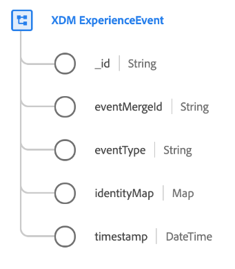

# [!DNL XDM ExperienceEvent] class

[!DNL XDM ExperienceEvent] est une classe XDM (Experience Data Model) standard qui vous permet de créer un instantané horodaté du système lorsqu’un événement spécifique se produit ou qu’un certain ensemble de conditions a été atteint.

Un événement d’expérience est un enregistrement factuel de ce qui s’est produit, y compris le moment et l’identité de la personne impliquée. Les événements peuvent être explicites (actions humaines directement observables) ou implicites (générés sans action humaine directe) et sont enregistrés sans agrégation ni interprétation. Pour plus d’informations de haut niveau sur l’utilisation de cette classe dans l’écosystème de Platform, reportez-vous à la section [Présentation de XDM](../home.md#data-behaviors).

Le [!DNL XDM ExperienceEvent] fournit plusieurs champs liés à une série temporelle à un schéma. Les valeurs de certains de ces champs sont automatiquement renseignées lors de l’ingestion des données :

| Propriété | Description |
| --- | --- |
| `_id` | Identifiant de chaîne unique pour l’événement. Ce champ permet de suivre l’unicité d’un événement individuel, d’éviter la duplication des données et de rechercher cet événement dans les services en aval. Dans certains cas, `_id` peut être [Identifiant unique universel (UUID)](https://tools.ietf.org/html/rfc4122) ou [Identifiant global unique (GUID)](https://docs.microsoft.com/en-us/dotnet/api/system.guid?view=net-5.0).  Si vous diffusez des données depuis une connexion source ou que vous ingérez directement à partir d’un fichier Parquet, vous devez générer cette valeur en concaténant une certaine combinaison de champs qui rend l’événement unique, comme un identifiant Principal, un horodatage, un type d’événement, etc. La valeur concaténée doit être une `uri-reference` chaîne formatée, ce qui signifie que tout caractère deux-points doit être supprimé. Par la suite, la valeur concaténée doit être hachée à l’aide de SHA-256 ou d’un autre algorithme de votre choix.  Il est important de distinguer que **ce champ ne représente pas une identité liée à une personne individuelle**, mais plutôt l’enregistrement des données elles-mêmes. Les données d’identité relatives à une personne doivent être reléguées à [champs d’identité](../schema/composition.md#identity) fournies par des groupes de champs compatibles à la place. |
| `eventMergeId` | Si vous utilisez la variable [SDK Web Adobe Experience Platform](../../edge/home.md) pour ingérer des données, cela représente l’identifiant du lot ingéré à l’origine de la création de l’enregistrement. Ce champ est automatiquement renseigné par le système lors de l’ingestion des données. L’utilisation de ce champ en dehors du contexte d’une mise en oeuvre de SDK Web n’est pas prise en charge. |
| `eventType` | Chaîne indiquant le type ou la catégorie de l’événement. Ce champ peut être utilisé si vous souhaitez distinguer différents types d’événements au sein du même schéma et du même jeu de données, par exemple en distinguant un événement de consultation de produit d’un événement de &quot;add-to-shopping-panier&quot; pour une société de vente au détail.  Les valeurs standard de cette propriété sont fournies dans la variable [section de l’annexe](#eventType), y compris des descriptions de leur cas d’utilisation prévu. Ce champ est une énumération extensible, ce qui signifie que vous pouvez également utiliser vos propres chaînes de type d’événement pour classer les événements dont vous effectuez le suivi.  `eventType` vous limite à l’utilisation d’un seul événement par accès sur votre application. Par conséquent, vous devez utiliser des champs calculés pour indiquer au système quel événement est le plus important. Pour plus d’informations, voir la section sur [bonnes pratiques relatives aux champs calculés](#calculated). |
| `producedBy` | Une valeur string qui décrit le producteur ou l’origine de l’événement. Ce champ peut être utilisé pour filtrer certains producteurs d’événements si nécessaire à des fins de segmentation.  Certaines valeurs suggérées pour cette propriété sont fournies dans la variable [section de l’annexe](#producedBy). Ce champ est une énumération extensible, ce qui signifie que vous pouvez également utiliser vos propres chaînes pour représenter différents producteurs d’événements. |
| `identityMap` | Champ de mappage contenant un ensemble d’identités d’espace de noms pour l’individu auquel s’applique l’événement. Ce champ est automatiquement mis à jour par le système lors de l’ingestion des données d’identité. Pour utiliser correctement ce champ pour [Real-time Customer Profile](../../profile/home.md), ne tentez pas de mettre à jour manuellement le contenu du champ dans vos opérations de données.  Consultez la section sur les mappages d’identité dans la [principes de base de la composition des schémas](../schema/composition.md#identityMap) pour plus d’informations sur leur cas d’utilisation. |
| `timestamp` | Horodatage ISO 8601 du moment où l’événement s’est produit, formaté selon [RFC 3339, section 5.6](https://tools.ietf.org/html/rfc3339#section-5.6). Cet horodatage doit avoir lieu dans le passé. Consultez la section ci-dessous sur [horodatages](#timestamps) pour connaître les bonnes pratiques relatives à l’utilisation de ce champ. |

{style=&quot;table-layout:auto&quot;}

## Bonnes pratiques relatives à la modélisation des événements

Les sections suivantes présentent les bonnes pratiques relatives à la conception de vos schémas de modèle de données d’expérience (XDM) basés sur un événement dans Adobe Experience Platform.

### Horodatages {#timestamps}

La racine `timestamp` champ d’un schéma d’événement **only** représente l’observation de l’événement lui-même et doit se produire dans le passé. Si vos cas d’utilisation de segmentation nécessitent l’utilisation d’horodatages qui peuvent se produire ultérieurement, ces valeurs doivent être contraintes ailleurs dans votre schéma d’événement d’expérience.

Par exemple, si une entreprise du secteur du voyage et de l’hôtellerie modélise un événement de réservation de vol, la classe `timestamp` représente le moment où l’événement de réservation a été observé. D’autres horodatages liés à l’événement, tels que la date de début de la réservation de voyage, doivent être capturés dans des champs distincts fournis par des groupes de champs standard ou personnalisés.

En séparant l’horodatage au niveau de la classe des autres valeurs datetime associées dans vos schémas d’événement, vous pouvez mettre en oeuvre des cas d’utilisation de segmentation flexibles tout en conservant un compte horodaté des parcours client dans votre application d’expérience.

### Utilisation des champs calculés {#calculated}

Certaines interactions dans vos applications d’expérience peuvent entraîner plusieurs événements associés partageant techniquement le même horodatage d’événement et pouvant donc être représentés comme un seul enregistrement d’événement. Si, par exemple, un client consulte un produit sur votre site web, un enregistrement d’événement comportant deux variables `eventType` values : un événement &quot;product view&quot; (`commerce.productViews`) ou un événement générique &quot;page vue&quot; (`web.webpagedetails.pageViews`). Dans ce cas, vous pouvez utiliser des champs calculés pour capturer les attributs les plus importants lorsque plusieurs événements sont capturés dans un seul accès.

[Préparation de données Adobe Experience Platform](../../data-prep/home.md) vous permet de mapper, de transformer et de valider des données vers et depuis XDM. Utilisation de la [fonctions de mappage](../../data-prep/functions.md) fourni par le service, vous pouvez appeler des opérateurs logiques pour prioriser, transformer et/ou consolider des données provenant d’enregistrements multi-événements lors de leur ingestion dans Experience Platform. Dans l’exemple ci-dessus, vous pouvez désigner `eventType` comme champ calculé qui donne la priorité à une &quot;consultation de produit&quot; plutôt qu’à une &quot;page vue&quot; chaque fois qu’elles se produisent.

Si vous ingérez manuellement des données dans Platform via l’interface utilisateur, consultez le guide sur [champs calculés](../../data-prep/ui/mapping.md#calculated-fields) pour obtenir des instructions spécifiques sur la création de champs calculés.

Si vous diffusez des données en continu vers Platform à l’aide d’une connexion source, vous pouvez configurer la source pour qu’elle utilise à la place des champs calculés. Reportez-vous à la section [la documentation de votre source spécifique ;](../../sources/home.md) pour obtenir des instructions sur la mise en oeuvre des champs calculés lors de la configuration de la connexion.

## Groupes de champs de schéma compatibles {#field-groups}

>[!NOTE]
>
>Les noms de plusieurs groupes de champs ont changé. Consultez le document sur [mises à jour des noms de groupe de champs](../field-groups/name-updates.md) pour plus d’informations.

Adobe fournit plusieurs groupes de champs standard à utiliser avec le [!DNL XDM ExperienceEvent] classe . Voici une liste de certains groupes de champs couramment utilisés pour la classe :

* [[!UICONTROL Détails du marketing de campagne]](../field-groups/event/campaign-marketing-details.md)
* [[!UICONTROL Détails du canal]](../field-groups/event/channel-details.md)
* [[!UICONTROL Détails du commerce]](../field-groups/event/commerce-details.md)
* [[!UICONTROL Détails sur l’entrée des appareils]](../field-groups/event/device-trade-in-details.md)
* [[!UICONTROL Définition de la réservation]](../field-groups/event/dining-reservation.md)
* [[!UICONTROL Détails de l’ID d’utilisateur final]](../field-groups/event/enduserids.md)
* [[!UICONTROL Détails de l’environnement]](../field-groups/event/environment-details.md)
* [[!UICONTROL Réservation en vol]](../field-groups/event/flight-reservation.md)
* [[!UICONTROL Consentement IAB TCF 2.0]](../field-groups/event/iab.md)
* [[!UICONTROL Réservation logement]](../field-groups/event/lodging-reservation.md)
* [[!UICONTROL Détails de la réservation]](../field-groups/event/reservation-details.md)
* [[!UICONTROL Détails web]](../field-groups/event/web-details.md)

## Annexe

La section suivante contient des informations supplémentaires sur la variable [!UICONTROL XDM ExperienceEvent] classe .

### Valeurs acceptées pour `eventType` {#eventType}

Le tableau suivant décrit les valeurs acceptées pour `eventType`, ainsi que leurs définitions :

| Valeur | Définition |
| --- | --- |
| `advertising.clicks` | Cliquez sur la ou les actions sur une publicité. |
| `advertising.completes` | Une ressource multimédia minutée a été visionnée jusqu’à la fin. Cela ne signifie pas nécessairement que l’utilisateur a visionné l’ensemble de la vidéo, car l’utilisateur aurait pu sauter devant. |
| `advertising.conversions` | Actions prédéfinies exécutées par un client qui déclenche un événement pour l’évaluation des performances. |
| `advertising.federated` | Indique si un événement d’expérience a été créé par le biais d’une fédération de données (partage de données entre clients). |
| `advertising.firstQuartiles` | Une publicité vidéo numérique a été lue pendant 25 % de sa durée à une vitesse normale. |
| `advertising.impressions` | Impressions d’une publicité destinée à un client ayant le potentiel d’être visualisé. |
| `advertising.midpoints` | Une publicité vidéo numérique a été lue pendant 50% de sa durée à une vitesse normale. |
| `advertising.starts` | Une publicité vidéo numérique a commencé à être lue. |
| `advertising.thirdQuartiles` | Une publicité vidéo numérique a été lue pendant 75 % de sa durée à une vitesse normale. |
| `advertising.timePlayed` | Décrit le temps passé par un utilisateur sur une ressource multimédia minutée spécifique. |
| `application.close` | Une application a été fermée ou envoyée en arrière-plan. |
| `application.launch` | Une application a été lancée ou mise en premier plan. |
| `commerce.checkouts` | Un événement de passage en caisse s’est produit pour une liste de produits. Il peut y avoir plusieurs événements de passage en caisse s’il existe plusieurs étapes dans un processus de passage en caisse. S’il existe plusieurs étapes, l’horodatage et la page/expérience référencée pour chaque événement sont utilisés pour identifier chaque événement (étape) individuel, représenté dans l’ordre. |
| `commerce.productListAdds` | Un produit a été ajouté à la liste de produits ou au panier. |
| `commerce.productListOpens` | Une nouvelle liste de produits (panier) a été initialisée ou créée. |
| `commerce.productListRemovals` | Une ou plusieurs entrées de produit ont été supprimées d’une liste de produits ou d’un panier. |
| `commerce.productListReopens` | Une liste de produits (panier) qui n’était plus accessible (abandonnée) a été réactivée par un client, par exemple via une activité de remarketing. |
| `commerce.productListViews` | Une liste de produits ou un panier a reçu une ou plusieurs consultations. |
| `commerce.productViews` | Un produit a reçu une ou plusieurs consultations. |
| `commerce.purchases` | Une commande a été acceptée. Il s’agit de la seule action requise dans une conversion de commerce. Une liste de produits doit être référencée pour un événement d’achat. |
| `commerce.saveForLaters` | Une liste de produits a été enregistrée en vue d’une utilisation ultérieure, par exemple une liste de souhaits de produits. |
| `decisioning.propositionDisplay` | Une proposition de prise de décision s’affichait à une personne. |
| `decisioning.propositionInteract` | Une personne a interagi avec une proposition de prise de décision. |
| `delivery.feedback` | Événements de retour pour une diffusion, par exemple une diffusion par email. |
| `directMarketing.emailBounced` | Un email à une personne qui a rebondi. |
| `directMarketing.emailBouncedSoft` | Un email à une personne rebondissant doucement. |
| `directMarketing.emailClicked` | Une personne a cliqué sur un lien dans un email marketing. |
| `directMarketing.emailDelivered` | Un message électronique a été correctement envoyé au service de messagerie de la personne. |
| `directMarketing.emailOpened` | Une personne a ouvert un email marketing. |
| `directMarketing.emailUnsubscribed` | Une personne s’est désinscrite d’un email marketing. |
| `leadOperation.convertLead` | Une piste a été convertie. |
| `leadOperation.interestingMoment` | Un moment intéressant a été enregistré pour une personne. |
| `leadOperation.newLead` | Une piste a été créée. |
| `leadOperation.scoreChanged` | La valeur de l’attribut de score du prospect a été modifiée. |
| `leadOperation.statusInCampaignProgressionChanged` | L’état d’un prospect dans une campagne a changé. |
| `listOperation.addToList` | Une personne a été ajoutée à une liste marketing. |
| `listOperation.removeFromList` | Une personne a été supprimée d’une liste marketing. |
| `message.feedback` | Événements de retour comme envoyé/rebond/erreur pour les messages envoyés à un client. |
| `message.tracking` | Suivi des événements tels que les actions d’ouverture/de clic/personnalisées sur les messages envoyés à un client. |
| `opportunityEvent.addToOpportunity` | Une personne a été ajoutée à une opportunité. |
| `opportunityEvent.opportunityUpdated` | Une opportunité a été mise à jour. |
| `opportunityEvent.removeFromOpportunity` | Une personne a été privée d&#39;une opportunité. |
| `pushTracking.applicationOpened` | Une personne a ouvert une application à partir d’une notification push. |
| `pushTracking.customAction` | Une personne a cliqué sur une action personnalisée dans une notification push. |
| `web.formFilledOut` | Une personne a rempli un formulaire sur une page Web. |
| `web.webinteraction.linkClicks` | Un lien a été sélectionné une ou plusieurs fois. |
| `web.webpagedetails.pageViews` | Une page web a reçu une ou plusieurs vues. |

{style=&quot;table-layout:auto&quot;}

### Valeurs proposées pour `producedBy` {#producedBy}

Le tableau suivant présente certaines valeurs acceptées pour `producedBy`:

| Valeur | Définition |
| --- | --- |
| `self` | Auto |
| `system` | Système |
| `salesRef` | représentant commercial |
| `customerRep` | Représentant client |
