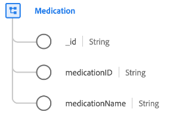

# Classe [!UICONTROL Médicaments]

Dans le modèle de données d’expérience (XDM), la classe [!UICONTROL Médicament] capture l’ensemble minimum des propriétés qui définissent une substance utilisée pour un traitement médical, en particulier un médicament ou un médicament.

| Propriété | Type de données | Description |
| --- | --- | --- |
| `_id` | [!UICONTROL Chaîne] | Identifiant de chaîne unique généré par le système pour l’enregistrement. Ce champ permet de déterminer l’unicité d’un enregistrement individuel, d’éviter la duplication des données et de rechercher cet enregistrement dans les services en aval.  Ce champ étant généré par le système, il ne reçoit pas de valeur explicite lors de l’ingestion des données. Cependant, vous pouvez toujours choisir de fournir vos propres valeurs d’ID uniques si vous le souhaitez. |
| `medicationId` | [!UICONTROL Chaîne] | Identifiant unique du médicament. |
| `medicationName` | [!UICONTROL Chaîne] | Le nom du médicament. |

{style="table-layout:auto"}

La classe peut être étendue avec le groupe de champs [[!UICONTROL Médicaments pour les soins de santé] ](../field-groups/medication/healthcare-medication.md) pour décrire plus de détails sur le médicament ou le médicament.
