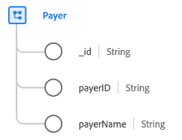

# Classe [!UICONTROL Payer]

Dans le modèle de données d’expérience (XDM), la classe [!UICONTROL Payer] capture l’ensemble minimal de propriétés qui définissent une entité professionnelle du payeur qui collecte des données relatives aux compagnies d’assurance (telles que l’assurance maladie).

| Propriété | Type de données | Description |
| --- | --- | --- |
| `_id` | [!UICONTROL String] | Identifiant de chaîne unique généré par le système pour l’enregistrement. Ce champ permet de déterminer l’unicité d’un enregistrement individuel, d’éviter la duplication des données et de rechercher cet enregistrement dans les services en aval.  Ce champ étant généré par le système, il ne reçoit pas de valeur explicite lors de l’ingestion des données. Cependant, vous pouvez toujours choisir de fournir vos propres valeurs d’ID uniques si vous le souhaitez. |
| `payerId` | [!UICONTROL String] | Identifiant unique du payeur. |
| `payerName` | [!UICONTROL String] | Nom du payeur. |

{style="table-layout:auto"}
