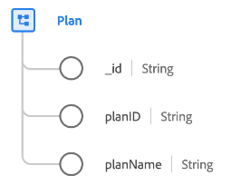

# Classe [!UICONTROL Plan]

Dans le modèle de données d’expérience (XDM), la classe [!UICONTROL Plan] capture l’ensemble minimal de propriétés qui définissent un plan, comme un plan de santé ou un plan d’assurance.

| Propriété | Type de données | Description |
| --- | --- | --- |
| `_id` | [!UICONTROL String] | Identifiant de chaîne unique généré par le système pour l’enregistrement. Ce champ permet de déterminer l’unicité d’un enregistrement individuel, d’éviter la duplication des données et de rechercher cet enregistrement dans les services en aval.  Ce champ étant généré par le système, il ne reçoit pas de valeur explicite lors de l’ingestion des données. Cependant, vous pouvez toujours choisir de fournir vos propres valeurs d’ID uniques si vous le souhaitez. |
| `planId` | [!UICONTROL String] | Identifiant unique du plan. |
| `planName` | [!UICONTROL String] | Nom du plan. |

{style="table-layout:auto"}

La classe peut être étendue avec le groupe de champs [&#128279;](../field-groups/plan/healthcare-plan-details.md) pour décrire plus de détails sur un régime d’assurance maladie.[!UICONTROL Healthcare Plan Details]
