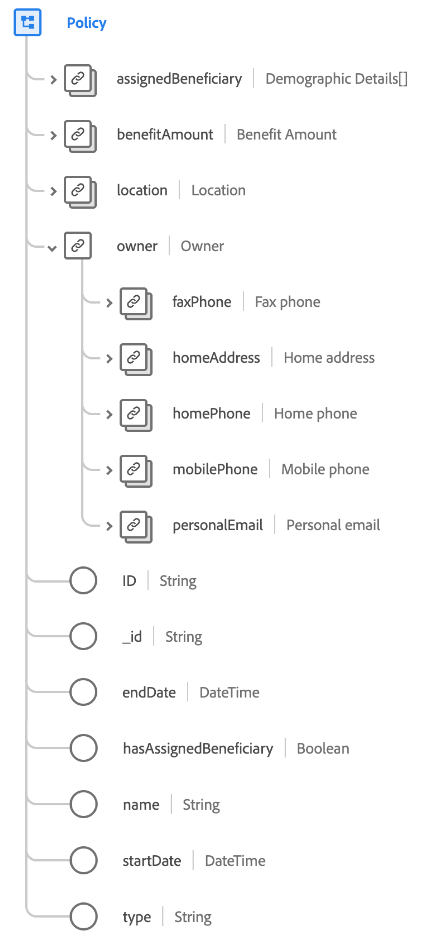

# Classe [!UICONTROL Policy]

Dans le modèle de données d’expérience (XDM), la classe [!UICONTROL Policy] capture l’ensemble minimal de propriétés qui définissent une police d’assurance.

| Propriété | Type de données | Description |
| --- | --- | --- |
| `assignedBeneficiary` | Tableau des types de données [[!UICONTROL Person]](../data-types/person.md) | Capture le ou les bénéficiaires affectés à la stratégie. |
| `benefitAmount` | [[!UICONTROL Devise]](../data-types/currency.md) | Montant à payer selon les termes de la politique. |
| `location` | [[!UICONTROL Adresse postale]](../data-types/postal-address.md) | L’emplacement d’émission de la police d’assurance. |
| `owner` | [!UICONTROL Objet] | Capture les informations de profil du détenteur de la stratégie. |
| `owner.faxPhone` | [[!UICONTROL Numéro de téléphone]](../data-types/phone-number.md) | Numéro de fax du propriétaire. |
| `owner.homeAddress` | [[!UICONTROL Adresse postale]](../data-types/postal-address.md) | Adresse du domicile du propriétaire. |
| `owner.homePhone` | [[!UICONTROL Numéro de téléphone]](../data-types/phone-number.md) | Numéro de téléphone du propriétaire. |
| `owner.mobilePhone` | [[!UICONTROL Numéro de téléphone]](../data-types/phone-number.md) | Numéro de téléphone portable du propriétaire. |
| `owner.personalEmail` | [[!UICONTROL Adresse électronique]](../data-types/email-address.md) | Adresse électronique personnelle du propriétaire. |
| `ID` | [!UICONTROL Chaîne] | Identifiant de la police d’assurance. |
| `_id` | [!UICONTROL Chaîne] | Identifiant de chaîne unique généré par le système pour l’enregistrement. Ce champ permet de suivre l’unicité d’un enregistrement individuel, d’éviter la duplication des données et de rechercher cet enregistrement dans les services en aval.  Comme ce champ est généré par le système, il ne reçoit pas de valeur explicite lors de l’ingestion des données. Cependant, vous pouvez toujours choisir de fournir vos propres valeurs d’identifiant uniques si vous le souhaitez. |
| `endDate` | [!UICONTROL DateTime] | Date à laquelle la couverture de police d’assurance se termine (ou se termine). |
| `hasAssignedBeneficiary` | [!UICONTROL Booléen] | Indique si un destinataire est affecté à la stratégie. |
| `name` | [!UICONTROL Chaîne] | Nom de la police d’assurance. |
| `startDate` | [!UICONTROL DateTime] | Date à laquelle la couverture de police d’assurance commence (ou commence). |
| `type` | [!UICONTROL Chaîne] | Type de police d’assurance, telle que maison, automobile, location ou bateau. |

{style="table-layout:auto"}
