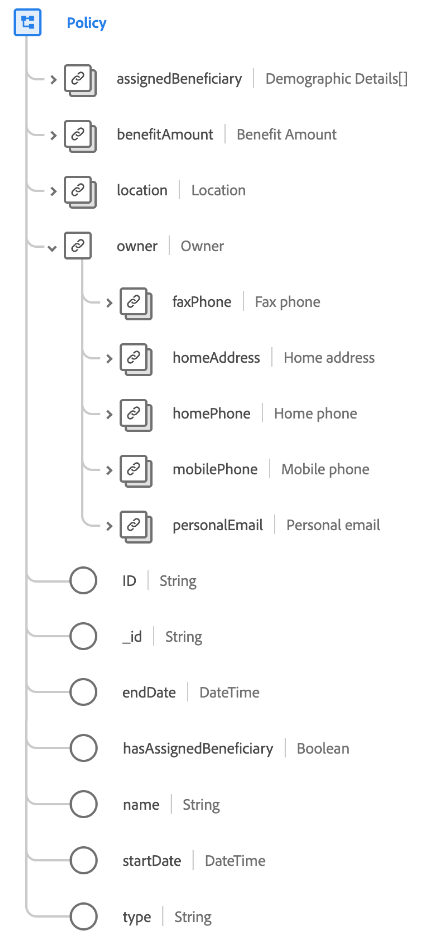

# Classe [!UICONTROL Policy]

Dans le modèle de données d’expérience (XDM), la classe [!UICONTROL Policy] capture l’ensemble minimal de propriétés qui définissent une police d’assurance.

| Propriété | Type de données | Description |
| --- | --- | --- |
| `assignedBeneficiary` | Tableau de types de données [[!UICONTROL Personne]](../data-types/person.md) | Capture le(s) bénéficiaire(s) affecté(s) à la police. |
| `benefitAmount` | [[!UICONTROL Devise]](../data-types/currency.md) | Montant à payer conformément aux conditions de la police. |
| `location` | [[!UICONTROL Adresse postale]](../data-types/postal-address.md) | Lieu d’émission de la police d’assurance. |
| `owner` | [!UICONTROL Objet] | Capture les informations de profil du titulaire de la police. |
| `owner.faxPhone` | [[!UICONTROL Numéro de téléphone]](../data-types/phone-number.md) | Numéro de fax du propriétaire. |
| `owner.homeAddress` | [[!UICONTROL Adresse postale]](../data-types/postal-address.md) | Adresse personnelle du propriétaire. |
| `owner.homePhone` | [[!UICONTROL Numéro de téléphone]](../data-types/phone-number.md) | Numéro de téléphone personnel du propriétaire. |
| `owner.mobilePhone` | [[!UICONTROL Numéro de téléphone]](../data-types/phone-number.md) | Numéro de téléphone portable du propriétaire. |
| `owner.personalEmail` | [[!UICONTROL Adresse électronique]](../data-types/email-address.md) | Adresse e-mail personnelle du propriétaire. |
| `ID` | [!UICONTROL Chaîne] | Identifiant de la police d’assurance. |
| `_id` | [!UICONTROL Chaîne] | Identifiant de chaîne unique généré par le système pour l’enregistrement. Ce champ permet de déterminer l’unicité d’un enregistrement individuel, d’éviter la duplication des données et de rechercher cet enregistrement dans les services en aval.  Ce champ étant généré par le système, il ne reçoit pas de valeur explicite lors de l’ingestion des données. Cependant, vous pouvez toujours choisir de fournir vos propres valeurs d’ID uniques si vous le souhaitez. |
| `endDate` | [!UICONTROL DateHeure] | Date de fin (ou de fin) de la couverture de la police d’assurance. |
| `hasAssignedBeneficiary` | [!UICONTROL booléen] | Indique si un bénéficiaire est affecté à la police. |
| `name` | [!UICONTROL Chaîne] | Nom de la police d’assurance. |
| `startDate` | [!UICONTROL DateHeure] | Date à laquelle la couverture de la police d’assurance commence (ou a commencé). |
| `type` | [!UICONTROL Chaîne] | Type de police d’assurance, comme habitation, automobile, locataire ou bateau. |

{style="table-layout:auto"}
