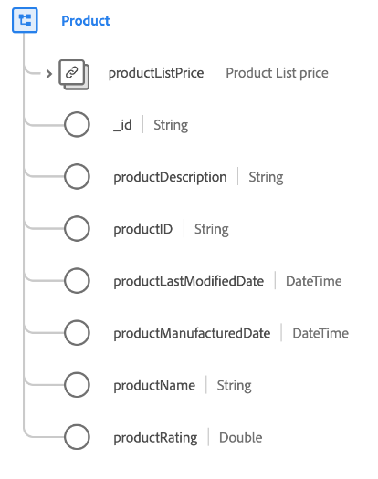

# Classe [!UICONTROL Product]

Dans le modèle de données d’expérience (XDM), la classe [!UICONTROL Product] capture l’ensemble minimal de propriétés qui définissent un produit vendu au détail.

| Propriété | Type de données | Description |
| --- | --- | --- |
| `productListPrice` | [Devise](../data-types/currency.md) | Décrit le prix par défaut du produit avant soldes et remises. |
| `_id` | Chaîne | Identifiant de chaîne unique généré par le système pour l’enregistrement. Ce champ permet de déterminer l’unicité d’un enregistrement individuel, d’éviter la duplication des données et de rechercher cet enregistrement dans les services en aval.  Ce champ étant généré par le système, il ne reçoit pas de valeur explicite lors de l’ingestion des données. Cependant, vous pouvez toujours choisir de fournir vos propres valeurs d’ID uniques si vous le souhaitez. |
| `productDescription` | Chaîne | Description du produit. |
| `productID` | Chaîne | Identifiant unique du produit. |
| `productLastModifiedDate` | DateTime | Date et heure [ISO 8601](https://datatracker.ietf.org/doc/html/rfc3339#section-5.6) (`yyyy-MM-dd'T'HH:mm:ssXXX`) de la dernière modification de ce produit pour toutes les mises à jour. |
| `productManufacturedDate` | DateTime | Date et heure ISO 8601 (`yyyy-MM-dd'T'HH:mm:ssXXX`) de la création de ce produit. |
| `productName` | Chaîne | Nom du produit. |
| `productRating` | Chaîne | Note attribuée au produit par le client. |

{style="table-layout:auto"}

## Groupes de champs compatibles {#field-groups}

Adobe fournit plusieurs groupes de champs standard à utiliser avec la classe [!UICONTROL Product]. Voici une liste de groupes de champs couramment utilisés pour la classe :

* [[!UICONTROL Catalogue des produits]](../field-groups/product/product-catalog.md)
* [[!UICONTROL Catégorie de produits]](../field-groups/product/product-category.md)
