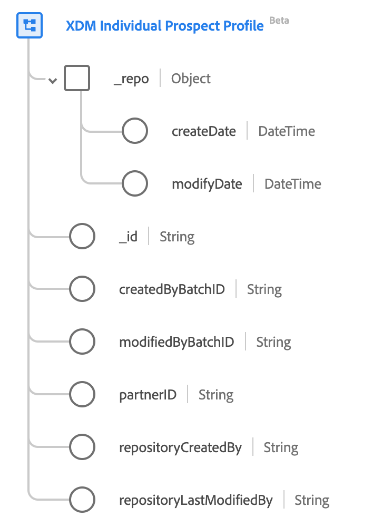

# Classe [!UICONTROL XDM Individual Prospect Profile]

Dans le modèle de données d’expérience (XDM), la classe [!UICONTROL XDM Individual Prospect Profile] capture les profils de prospects généralement issus des partenaires de données pour les cas d’utilisation d’acquisition de clients haut de gamme.

>[!NOTE]
>
>Pour définir un champ du profil de prospect individuel XDM en tant qu’identité, vous devez d’abord créer au moins un espace de noms d’identifiant de partenaire. Pour en savoir plus sur les espaces de noms Partner ID, consultez la [section consacrée aux types d’identité](../../identity-service/features/namespaces.md).

| Propriété | Type de données | Description |
| --- | --- | --- |
| `_repo` | Objet | Cette classe vous permet d’importer des profils de prospects provenant de fournisseurs de données dans des cas d’utilisation d’acquisition de clients funnel. |
| `_repo.createDate` | [!UICONTROL DateHeure] | Date et heure du serveur auxquelles la ressource a été créée dans le référentiel. L’heure de création peut être la première fois qu’un fichier de ressource est chargé, ou qu’un répertoire est créé par le serveur en tant que parent d’une nouvelle ressource. La propriété datetime doit être conforme à la norme [ISO 8601](https://datatracker.ietf.org/doc/html/rfc3339#section-5.6) (`yyyy-MM-dd'T'HH:mm:ssXXX`). |
| `_repo.modifyDate` | [!UICONTROL DateHeure] | Date et heure du serveur auxquelles la ressource a été modifiée dans le référentiel pour la dernière fois, par exemple lorsqu’une ressource est chargée ou que la ressource enfant d’un répertoire est ajoutée ou supprimée. La propriété datetime doit être conforme à la norme ISO 8601 (`yyyy-MM-dd'T'HH:mm:ssXXX`). |
| `_id` | [!UICONTROL Chaîne] | Identifiant de chaîne unique généré par le système pour l’enregistrement. Ce champ permet de déterminer l’unicité d’un enregistrement individuel, d’éviter la duplication des données et de rechercher cet enregistrement dans les services en aval.  Ce champ étant généré par le système, il ne fournit pas de valeur explicite lors de l’ingestion des données. Cependant, vous pouvez choisir de fournir vos propres valeurs d’ID uniques si vous le souhaitez. |
| `createdByBatchID` | [!UICONTROL Chaîne] | L’identifiant du lot ingéré qui a provoqué la création de l’enregistrement. |
| `modifiedByBatchID` | [!UICONTROL Chaîne] | L’identifiant du dernier lot ingéré qui a provoqué la mise à jour de l’enregistrement. |
| `partnerID` | [!UICONTROL Chaîne] | En règle générale, il s’agit d’un identifiant pseudonyme unique qui identifie un prospect individuel. Consultez la documentation sur les [types d’identité](../../identity-service/features/namespaces.md#identity-type) pour en savoir plus sur l’identifiant partenaire et les autres types d’identité disponibles dans Adobe Experience Platform. |
| `repositoryCreatedBy` | [!UICONTROL Chaîne] | ID de l’utilisateur qui a créé l’enregistrement. |
| `repositoryLastModifiedBy` | [!UICONTROL Chaîne] | ID du dernier utilisateur ayant modifié l’enregistrement. Lorsque l’enregistrement est créé, la valeur `modifiedByUser` est définie comme valeur `createdByUser`. |
