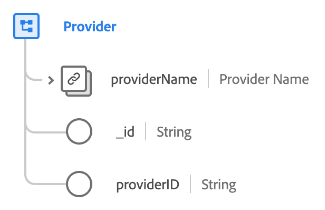

# Classe [!UICONTROL Provider]

Dans le modèle de données d’expérience (XDM), la classe [!UICONTROL Provider] capture l’ensemble minimal de propriétés qui définissent une entité commerciale de fournisseur (comme un fournisseur de soins de santé ou un fournisseur d’assurance).

| Propriété | Type de données | Description |
| --- | --- | --- |
| `providerName` | [[!UICONTROL &#x200B; Nom de la personne &#x200B;]](../data-types/person-name.md) | Nom du fournisseur. |
| `_id` | [!UICONTROL Chaîne] | Identifiant de chaîne unique généré par le système pour l’enregistrement. Ce champ permet de déterminer l’unicité d’un enregistrement individuel, d’éviter la duplication des données et de rechercher cet enregistrement dans les services en aval.  Ce champ étant généré par le système, il ne reçoit pas de valeur explicite lors de l’ingestion des données. Cependant, vous pouvez toujours choisir de fournir vos propres valeurs d’ID uniques si vous le souhaitez. |
| `providerId` | [!UICONTROL Chaîne] | Identifiant unique du fournisseur. |

{style="table-layout:auto"}

La classe peut être étendue avec le groupe de champs [[!UICONTROL Prestataire de soins de santé] &#x200B;](../field-groups/provider/healthcare-provider.md) pour décrire plus de détails sur un prestataire de soins de santé.
