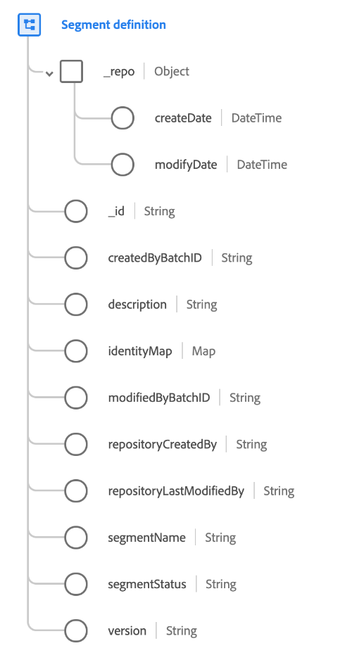

# Classe [!UICONTROL Définition du segment]

« [!UICONTROL  Définition de segment ] » est une classe XDM (modèle de données d’expérience) standard qui capture les détails d’une définition de segment. La classe comprend les champs obligatoires tels que l’identifiant et le nom d’une audience, ainsi que d’autres attributs facultatifs. Cette classe doit être utilisée si vous importez des définitions de segment de systèmes externes dans Adobe Experience Platform.

>[!NOTE]
>
>Cette classe ne doit être utilisée que pour capturer des informations sur les définitions de segment elles-mêmes. Pour capturer les informations d’appartenance à une audience dans vos données de profil, vous devez utiliser le groupe de champs [Détails sur l’appartenance à un segment](../field-groups/profile/segmentation.md) dans votre schéma [!UICONTROL Profil individuel XDM].

| Propriété | Description |
| --- | --- |
| `_repo` | Objet contenant les champs [!UICONTROL DateTime] suivants : <ul><li>`createDate` : date et heure de création de la ressource dans l’entrepôt de données, par exemple la date de la première ingestion des données.</li><li>`modifyDate` : date et heure de la dernière modification de la ressource.</li></ul> |
| `_id` | Identifiant de chaîne unique généré par le système pour l’enregistrement. Ce champ permet de déterminer l’unicité d’un enregistrement individuel, d’éviter la duplication des données et de rechercher cet enregistrement dans les services en aval.  Ce champ étant généré par le système, il ne reçoit pas de valeur explicite lors de l’ingestion des données. Cependant, vous pouvez toujours choisir de fournir vos propres valeurs d’ID uniques si vous le souhaitez.  Il est important de distinguer que ce champ **ne représente pas** une identité liée à une personne individuelle, mais plutôt l’enregistrement des données lui-même. Les données d’identité relatives à une personne doivent plutôt être reléguées dans des [champs d’identité](../schema/composition.md#identity). |
| `createdByBatchID` | L’identifiant du lot ingéré qui a provoqué la création de l’enregistrement. |
| `description` | Description de la définition de segment. |
| `identityMap` | Champ de mappage contenant un ensemble d’identités d’espace de noms pour les personnes auxquelles l’audience s’applique. Pour plus d’informations sur leur cas d’utilisation, consultez la section sur les mappages d’identité dans la [principes de base de la composition des schémas](../schema/composition.md#identityMap). |
| `modifiedByBatchID` | L’identifiant du dernier lot ingéré qui a provoqué la mise à jour de l’enregistrement. |
| `repositoryCreatedBy` | ID de l’utilisateur qui a créé l’enregistrement. |
| `repositoryLastModifiedBy` | ID du dernier utilisateur ayant modifié l’enregistrement. |
| `segmentName` | **(Obligatoire)** Nom de la définition de segment. |
| `segmentStatus` | Statut de l’audience à partir du système externe. Les valeurs suivantes sont acceptées : <ul><li>`ACTIVE`</li><li>`INACTIVE`</li><li>`DELETED`</li><li>`DRAFT`</li><li>`REVOKED`</li></ul> |
| `version` | Dernier numéro de version de la définition de segment. |

{style="table-layout:auto"}
