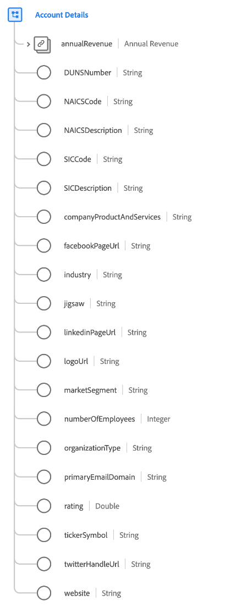

# Type de données [!UICONTROL Account Details]

[!UICONTROL Account Details] est un type de données standard du modèle de données d’expérience (XDM) qui décrit les détails liés à une organisation commerciale.

| Propriété | Type de données | Description |
| --- | --- | --- |
| `annualRevenue` | [[!UICONTROL Currency]](./currency.md) | Montant estimé des recettes annuelles de l’organisation. |
| `DUNSNumber` | Chaîne | Numéro D-U-N-S de Dun &amp; Bradstreet de l&#39;organisation. Il s&#39;agit d&#39;un numéro non indicatif à neuf chiffres attribué à chaque emplacement d&#39;affaires de la base de données Dun &amp; Bradstreet ayant une activité unique, séparée et distincte, et géré uniquement par Dun &amp; Bradstreet. |
| `NAICSCode` | Chaîne | Classification de l&#39;organisation dans le Système de classification des industries de l&#39;Amérique du Nord. |
| `NAICSDescription` | Chaîne | Brève description du secteur d&#39;activité d&#39;une organisation, selon son code SCIAN. |
| `SICCode` | Chaîne | Code SIC (Standard Industrial Classification) de l’organisation. Il s’agit d’un code à quatre chiffres qui classe le secteur d’activité auquel appartiennent les entreprises en fonction de leurs activités commerciales. |
| `SICDescription` | Chaîne | Brève description du secteur d’activité d’une organisation, en fonction de son code SIC. |
| `companyProductAndServices` | Chaîne | Produits et services que l’organisation commercialise. |
| `facebookPageUrl` | Chaîne | Lien de site web vers le compte Facebook de l’organisation. |
| `industry` | Chaîne | L’industrie dont cette organisation fait partie. Il s’agit d’un champ de forme libre, et il est conseillé d’utiliser une valeur structurée pour les requêtes ou d’utiliser la propriété `xdm:classifier`. |
| `jigsaw` | Chaîne | La clé Data.com de l’organisation. |
| `linkedinPageUrl` | Chaîne | Lien de site web vers le compte LinkedIn de l’organisation. |
| `logoUrl` | Chaîne | Chemin à associer à l’URL d’une instance Salesforce (par exemple, `https://yourInstance.salesforce.com/`) afin de générer une URL pour demander l’image de profil du réseau social associé à l’organisation. L’URL générée renvoie une redirection HTTP (code 302) vers l’image de profil du réseau social de l’organisation. |
| `marketSegment` | Chaîne | Audience de marché nommée à laquelle l’organisation participe. Il s’agit d’un champ de forme libre, et il est conseillé d’utiliser une valeur structurée pour les requêtes ou d’utiliser la propriété `xdm:identifier`. |
| `numberOfEmployees` | Entier | Nombre d’employés dans l’organisation. |
| `organizationType` | Chaîne | Libellé décrivant le type d’organisation. |
| `primaryEmailDomain` | Chaîne | Domaine d’e-mail principal que l’organisation utilise pour son personnel. |
| `rating` | Double | Score calculé ou évaluation par étoiles pour cette organisation. `1` indique l’évaluation maximale possible et `0` est l’évaluation minimale possible. |
| `tickerSymbol` | Chaîne | Symbole boursier de ce compte. 20 caractères maximum. |
| `twitterHandleUrl` | Chaîne | Lien de site web vers le pseudo Twitter de l’organisation. |
| `website` | Chaîne | URL du site web de l’organisation. |

{style="table-layout:auto"}

Pour plus d’informations sur ce type de données, reportez-vous au référentiel XDM public :

* [Exemple renseigné](https://github.com/adobe/xdm/blob/master/components/datatypes/b2b/account-organization.example.1.json)
* [Schéma complet](https://github.com/adobe/xdm/blob/master/components/datatypes/b2b/account-organization.schema.json)
