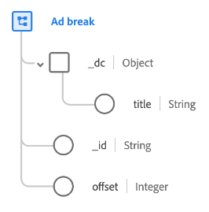

# Type de données [!UICONTROL Ad break]

[!UICONTROL Ad break] est un type de données standard du modèle de données d’expérience (XDM) qui décrit comment une annonce publicitaire horodatée est insérée dans un média horodaté.

| Propriété | Type de données | Description |
| --- | --- | --- |
| `_dc.title` | Chaîne | Nom convivial de la coupure publicitaire. |
| `_id` | Chaîne | Identifiant unique de la coupure publicitaire. |
| `offset` | Entier | Décalage, en secondes, de la coupure publicitaire par rapport au début du contenu principal. |

{style="table-layout:auto"}

Pour plus d’informations sur ce type de données, reportez-vous au référentiel XDM public :

* [Exemple renseigné](https://github.com/adobe/xdm/blob/master/components/datatypes/marketing/advertising-break.example.1.json)
* [Schéma complet](https://github.com/adobe/xdm/blob/master/components/datatypes/marketing/advertising-break.schema.json)
