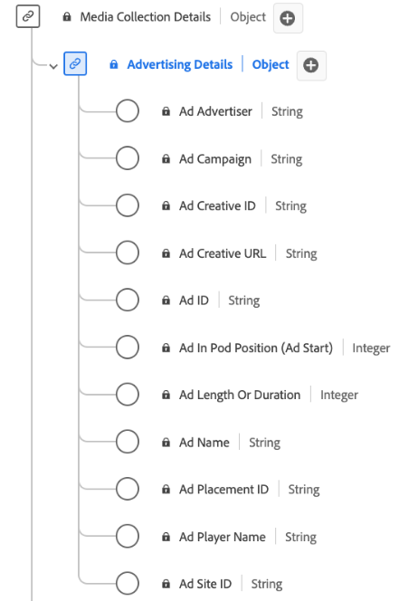

# Type de données de la collecte de [!UICONTROL Advertising Details]

La collecte de [!UICONTROL Advertising Details] est un type de données standard du modèle de données d’expérience (XDM) qui capture les attributs clés liés aux publicités. Elle contient des informations telles que l’ID de l’annonce, les ID de l’annonceur et de la campagne, la longueur, la position dans une séquence, les détails sur le lecteur qui effectue le rendu de l’annonce, etc. Vous pouvez utiliser ce type de données pour suivre et analyser divers aspects des performances et de l’engagement des publicités, et fournir des informations sur la manière dont les audiences interagissent avec différentes publicités et y répondent. Ces informations sont utilisées pour effectuer le suivi de vos données de diffusion en continu.

+++Sélectionnez cette option pour afficher un diagramme du type de données Collecte des détails Advertising .

+++

>[!NOTE]
>
>Chaque nom d’affichage contient un lien vers des informations supplémentaires sur ses paramètres audio et vidéo. Les pages liées contiennent des détails sur la vidéo et les données collectées par Adobe, les valeurs d’implémentation, les paramètres réseau, les rapports et des considérations importantes.

| Nom d’affichage | Propriété | Type de données | Obligatoire | Description |
|-----------------------------------------------------------------------------------------------------------------------------------------------------------------|-----------------|-----------|----------|-----------------------------------------------------------------------------------------------------------------------|
| [[!UICONTROL Ad Advertiser]](https://experienceleague.adobe.com/docs/media-analytics/using/implementation/variables/ad-parameters.html#advertiser) | `advertiser` | chaîne | Non | Société ou marque dont le produit apparaît dans la publicité. |
| [[!UICONTROL Ad Campaign]](https://experienceleague.adobe.com/docs/media-analytics/using/implementation/variables/ad-parameters.html#campaign-id) | `campaignID` | chaîne | Non | Identifiant de la campagne publicitaire. |
| [[!UICONTROL Ad Creative ID]](https://experienceleague.adobe.com/docs/media-analytics/using/implementation/variables/ad-parameters.html#creative-id) | `creativeID` | chaîne | Non | Identifiant du contenu publicitaire. |
| [[!UICONTROL Ad Creative URL]](https://experienceleague.adobe.com/docs/media-analytics/using/implementation/variables/ad-parameters.html#creative-url) | `creativeURL` | chaîne | Non | URL de la création publicitaire. |
| [[!UICONTROL Ad In Pod Position (Ad Start)]](https://experienceleague.adobe.com/docs/media-analytics/using/implementation/variables/ad-parameters.html#ad-start) | `podPosition` | entier | Oui | Index de la publicité à l’intérieur du début de la publicité parent. Par exemple, la première publicité a un index de 0 et la seconde un index de 1. |
| [[!UICONTROL Ad Length Or Duration]](https://experienceleague.adobe.com/docs/media-analytics/using/implementation/variables/ad-parameters.html#ad-length) | `length` | entier | Oui | Durée de la publicité vidéo en secondes. |
| [[!UICONTROL Ad Name]](https://experienceleague.adobe.com/docs/media-analytics/using/implementation/variables/ad-parameters.html#ad-name) | `friendlyName` | chaîne | Oui | Nom lisible par l’utilisateur de la publicité. Dans les rapports, « Nom de la publicité » est la classification et « Nom de la publicité (variable) » est l’eVar. |
| [[!UICONTROL Ad Placement ID]](https://experienceleague.adobe.com/docs/media-analytics/using/implementation/variables/ad-parameters.html#placement-id) | `placementID` | chaîne | Non | Identifiant d’emplacement de la publicité. |
| [[!UICONTROL Ad Player Name]](https://experienceleague.adobe.com/docs/media-analytics/using/implementation/variables/ad-parameters.html#ad-player-name) | `playerName` | chaîne | Oui | Nom du lecteur responsable du rendu de la publicité. |
| [[!UICONTROL Ad Site ID]](https://experienceleague.adobe.com/docs/media-analytics/using/implementation/variables/ad-parameters.html#site-id) | `siteID` | chaîne | Non | Identifiant du site publicitaire. |

{style="table-layout:auto"}
