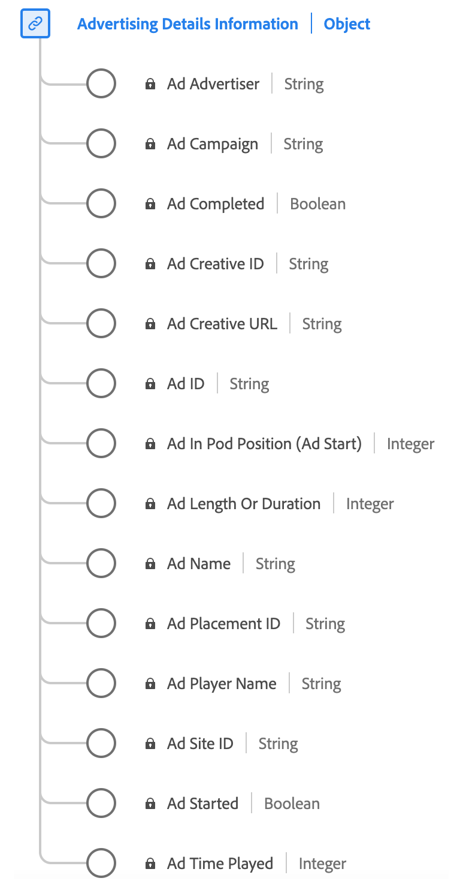

# Type de données [!UICONTROL Advertising Details] Reporting

[!UICONTROL Advertising Details] Reporting est un type de données standard du modèle de données d’expérience (XDM) qui capture les attributs clés liés aux publicités. Elle contient des informations telles que l’ID de l’annonce, les ID de l’annonceur et de la campagne, la longueur, la position dans une séquence, les détails sur le lecteur qui effectue le rendu de l’annonce, etc. Vous pouvez utiliser ce type de données pour suivre et analyser divers aspects des performances et de l’engagement des publicités, et fournir des informations sur la manière dont les audiences interagissent avec différentes publicités et y répondent.

+++Sélectionnez cette option pour afficher un diagramme du type de données Rapports détaillés Advertising .

+++

| Nom d’affichage | Propriété | Type de données | Description |
|----------------------------------------|-----------------|-----------|-----------------------------------------------------------------------------------------------|
| [!UICONTROL Ad Name] | `friendlyName` | chaîne | Nom lisible par l’utilisateur de la publicité. Dans les rapports, « Nom de la publicité » est la classification et « Nom de la publicité (variable) » est l’eVar. |
| [!UICONTROL Ad ID] | `name` | chaîne | Identifiant de l’annonce publicitaire. Toute combinaison de nombres entiers et/ou de lettres. |
| [!UICONTROL Ad Length Or Duration] | `length` | entier | Durée de la publicité vidéo en secondes. |
| [!UICONTROL Ad In Pod Position (Ad Start)] | `podPosition` | entier | Index de la publicité à l’intérieur du début de la publicité parent. Par exemple, la première publicité a un index de 0 et la seconde un index de 1. |
| [!UICONTROL Ad Player Name] | `playerName` | chaîne | Nom du lecteur responsable du rendu de la publicité. |
| [!UICONTROL Ad Advertiser] | `advertiser` | chaîne | Société ou marque dont le produit apparaît dans la publicité. |
| [!UICONTROL Ad Campaign] | `campaignID` | chaîne | Identifiant de la campagne publicitaire. |
| [!UICONTROL Ad Creative ID] | `creativeID` | chaîne | Identifiant du contenu publicitaire. |
| [!UICONTROL Ad Site ID] | `siteID` | chaîne | Identifiant du site publicitaire. |
| [!UICONTROL Ad Creative URL] | `creativeURL` | chaîne | URL de la création publicitaire. |
| [!UICONTROL Ad Placement ID] | `placementID` | chaîne | Identifiant d’emplacement de la publicité. |
| [!UICONTROL Ad Completed] | `isCompleted` | booléen | Indique si la publicité est terminée. |
| [!UICONTROL Ad Started] | `isStarted` | booléen | Indique si la publicité a commencé. |
| [!UICONTROL Ad Time Played] | `timePlayed` | entier | Durée totale (en secondes) passée à regarder la publicité (c’est-à-dire le nombre de secondes lues). |

{style="table-layout:auto"}

Pour plus d’informations sur le groupe de champs , consultez le [référentiel XDM public](https://github.com/adobe/xdm/blob/master/components/datatypes/advertisingdetails.schema.json)
