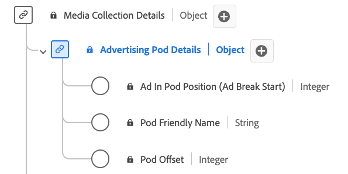

# [!UICONTROL Détails de capsule Advertising &#x200B;] type de données de collection

[!UICONTROL Détails du pod Advertising &#x200B;] la collecte est un type de données standard du modèle de données d’expérience (XDM). Il définit une séquence ou un groupe d’annonces généralement lues successivement pendant les pauses de contenu. Utilisez le type de données de collection [!UICONTROL Détails du pod &#x200B;] pour capturer des détails tels que l’identifiant de la coupure publicitaire, un nom convivial pour la coupure publicitaire, l’index des publicités dans la coupure et le décalage de la coupure publicitaire dans le journal du contenu en secondes.

+++Sélectionnez cette option pour afficher un diagramme du type de données Collection [!UICONTROL Détails de capsule &#x200B;].

+++

>[!NOTE]
>
>Ce type de données appartient au schéma `mediaCollection`, à savoir les champs que votre implémentation envoie au serveur principal des médias en flux continu. Adobe traite ces données et génère les champs de `mediaReporting` correspondants, qui sont ingérés dans les jeux de données Platform. Voir [Schéma de reporting XDM des médias en flux continu](https://experienceleague.adobe.com/fr/docs/media-analytics/using/implementation/edge/reporting-schema) pour plus d’informations.

Chaque nom d’affichage contient un lien vers des informations supplémentaires sur sa variable d’implémentation. Les pages liées contiennent des détails sur les données collectées par Adobe, les valeurs d’implémentation, les paramètres réseau et des considérations importantes.

| Nom d’affichage | Propriété | Type de données | Obligatoire | Description |
|---|---|---|---|---|
| [[!UICONTROL Position de la publicité dans la capsule]](https://experienceleague.adobe.com/fr/docs/media-analytics/using/implementation/variables/ads/ad-in-pod-position) | `index` | Entier | Oui | Index de la publicité à l’intérieur du début de la coupure publicitaire parent. |
| [[!UICONTROL Nom convivial du pod]](https://experienceleague.adobe.com/fr/docs/media-analytics/using/implementation/variables/ads/ad-break-name) | `friendlyName` | string | Non | Nom facilement compréhensible de la coupure publicitaire. |
| [[!UICONTROL Décalage de capsule]](https://experienceleague.adobe.com/fr/docs/media-analytics/using/implementation/variables/ads/ad-break-start-time) | `offset` | Entier | Oui | Décalage de la coupure publicitaire dans le contenu, en secondes. |
