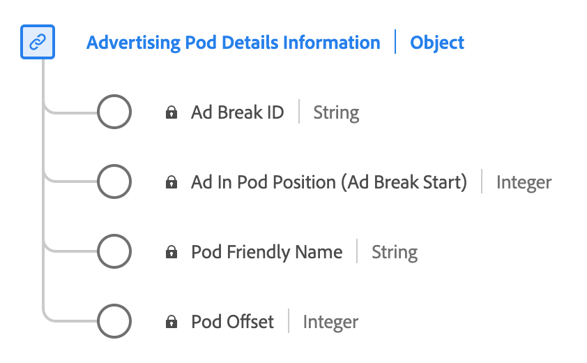

# Type de données de rapport des détails du pod Advertising 

[!UICONTROL Rapports détaillés sur les pods &#x200B;] est un type de données standard du modèle de données d’expérience (XDM). Il définit une séquence ou un groupe d’annonces généralement lues successivement pendant les pauses de contenu. Utilisez le type de données [!UICONTROL Rapports sur les détails des pods &#x200B;] pour capturer des détails tels que l’identifiant de la coupure publicitaire, un nom convivial pour la coupure publicitaire, l’index des publicités dans la coupure et le décalage de la coupure publicitaire dans le journal du contenu en secondes.

+++Sélectionnez cette option pour afficher un diagramme du type de données [!UICONTROL Rapports détaillés sur les pods &#x200B;].

+++

>[!NOTE]
>
>Ce type de données appartient au schéma `mediaReporting` : champs calculés par le serveur principal des médias en flux continu à partir des données `mediaCollection` envoyées par votre implémentation. Il s’agit des champs qu’Adobe ingère dans les jeux de données Platform. Voir [Schéma de reporting XDM des médias en flux continu](https://experienceleague.adobe.com/en/docs/media-analytics/using/implementation/edge/reporting-schema) pour plus d’informations.

Chaque nom d’affichage contient un lien vers des informations supplémentaires sur sa dimension ou sa mesure de reporting. Les pages liées contiennent des détails sur la manière dont Adobe calcule et signale ces données, y compris les répartitions par système de rapports.

| Nom d’affichage | Propriété | Type de données | Description |
|---|---|---|---|
| [!UICONTROL ID de coupure publicitaire] | `ID` | chaîne | Identifiant de la coupure publicitaire. |
| [[!UICONTROL Nom convivial du pod]](https://experienceleague.adobe.com/en/docs/media-analytics/using/reporting/dimensions/pod-name) | `friendlyName` | chaîne | Nom facilement compréhensible de la coupure publicitaire. |
| [[!UICONTROL Position de la publicité dans la capsule]](https://experienceleague.adobe.com/en/docs/media-analytics/using/reporting/dimensions/pod-position) | `index` | entier | Index de la publicité à l’intérieur du début de la coupure publicitaire parent. |
| [!UICONTROL Décalage de capsule] | `offset` | integer | Décalage de la coupure publicitaire dans le contenu, en secondes. |

Voir [advertisingpoddetails.schema.json](https://github.com/adobe/xdm/blob/master/components/datatypes/advertisingpoddetails.schema.json) dans le référentiel XDM public pour la définition complète du schéma.
