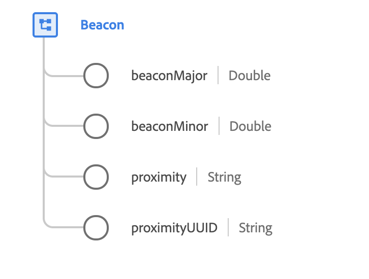

# Type de données [!UICONTROL Beacon]

[!UICONTROL Beacon] est un type de données XDM standard qui décrit l’appareil sans fil qui communique des informations d’identité aux applications mobiles lorsque des appareils mobiles arrivent à portée.

{width=450}

| Propriété | Type de données | Description |
| --- | --- | --- |
| `beaconMajor` | Double | Les valeurs majeures identifient et distinguent un groupe et des valeurs entières non signées comprises entre 1 et 65 535. |
| `beaconMinor` | Double | Les valeurs mineures identifient et distinguent un individu et des valeurs entières non signées comprises entre 1 et 65 535. |
| `proximity` | Chaîne | Distance estimée de la balise. Voir l’[annexe](#proximity) pour connaître les valeurs et définitions acceptées. |
| `proximityUUID` | Chaîne | Un identifiant universel unique (UUID) de proximité est un type d’identifiant spécial utilisé pour distinguer les balises de votre réseau de toutes les autres balises des réseaux hors de votre contrôle. L’UUID de proximité est configuré dans une balise, pour être transmis aux appareils mobiles à portée afin d’identifier les balises d’une organisation. |

{style="table-layout:auto"}

Pour plus d’informations sur ce type de données, reportez-vous au référentiel XDM public :

* [Exemple renseigné](https://github.com/adobe/xdm/blob/master/components/datatypes/deprecated/beacon-interaction-details.example.1.json)
* [Schéma complet](https://github.com/adobe/xdm/blob/master/components/datatypes/deprecated/beacon-interaction-details.schema.json)

## Annexe

La section suivante contient des informations supplémentaires sur le type de données [!UICONTROL Beacon].

## Valeurs acceptées pour la proximité {#proximity}

Le tableau suivant décrit les valeurs acceptées pour les `proximity` et leur signification associée :

| Valeur | Description |
| --- | --- |
| `immediate` | Dans quelques centimètres. |
| `near` | À moins de 10 mètres. |
| `far` | Plus de 10 mètres. |
| `unknown` | La distance n&#39;a pas pu être déterminée, probablement en raison d&#39;un signal faible. |
