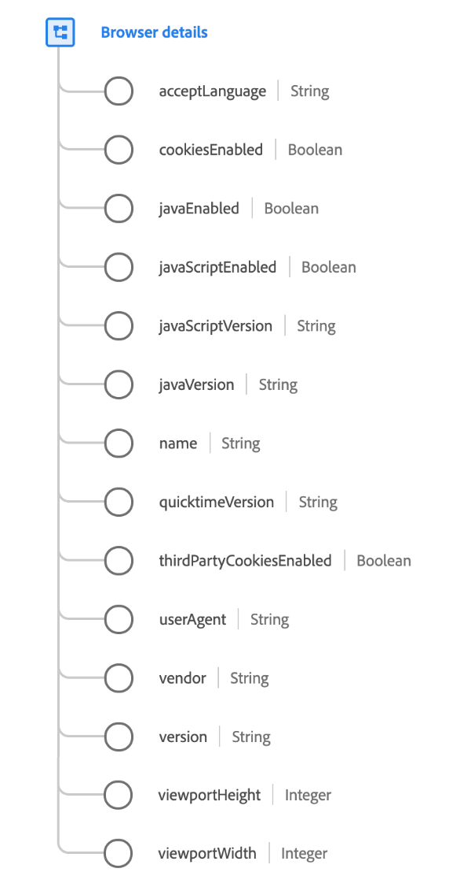

# Type de données [!UICONTROL Browser details]

[!UICONTROL Browser details] est un type de données XDM standard qui décrit les détails relatifs à un navigateur ou à une application.

{width=450}

| Propriété | Type de données | Description |
| --- | --- | --- |
| `acceptLanguage` | Chaîne | Balise de langue IETF ([RFC 5646](https://tools.ietf.org/html/rfc5646)). |
| `cookiesEnabled` | Booléen | Indique si les paramètres de l’utilisateur ou de l’utilisatrice permettent l’écriture de cookies. |
| `javaEnabled` | Booléen | Indique si Java a été activé sur l’appareil à partir duquel l’observation a été effectuée. |
| `javaScriptEnabled` | Booléen | Indique si JavaScript a été activé sur l’appareil à partir duquel l’observation a été effectuée. |
| `javaScriptVersion` | Chaîne | Version de JavaScript prise en charge lors de l’observation. |
| `javaVersion` | Chaîne | Version de Java prise en charge lors de l’observation. |
| `name` | Chaîne | Nom de l’application ou du navigateur. |
| `quicktimeVersion` | Chaîne | Version d’Apple Quicktime prise en charge lors de l’observation. |
| `thirdPartyCookiesEnabled` | Booléen | Indique si les cookies tiers ont été activés dans l’appareil à partir duquel l’observation a été effectuée. |
| `userAgent` | Chaîne | Chaîne user-agent HTTP de la requête client. |
| `vendor` | Chaîne | Fournisseur de l’application ou du navigateur. |
| `version` | Chaîne | Version de l’application ou du navigateur. |
| `viewportHeight` | Entier | Taille verticale en pixels de la fenêtre à l’intérieur de laquelle l’événement était affiché. Pour un événement d’affichage web, il s’agit de la hauteur de la fenêtre d’affichage du navigateur. |
| `viewportWidth` | Entier | Taille horizontale en pixels de la fenêtre à l’intérieur de laquelle l’événement était affiché. Pour un événement d’affichage web, il s’agit de la largeur de la fenêtre d’affichage du navigateur. |

{style="table-layout:auto"}

Pour plus d’informations sur ce type de données, reportez-vous au référentiel XDM public :

* [Exemple renseigné](https://github.com/adobe/xdm/blob/master/components/datatypes/browserdetails.example.1.json)
* [Schéma complet](https://github.com/adobe/xdm/blob/master/components/datatypes/browserdetails.schema.json)
