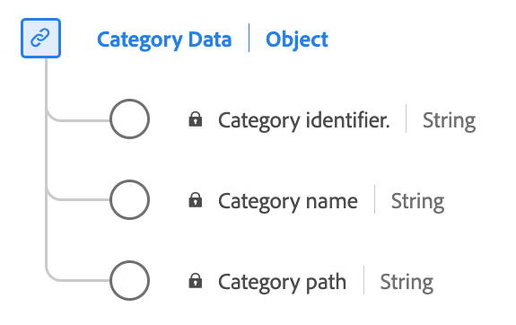

# [!UICONTROL Données de catégorie] type de données

[!UICONTROL Données de catégorie] est un type de données standard du modèle de données d’expérience (XDM) qui décrit les informations liées à la catégorie d’un produit.

| Nom d’affichage | Propriété | Type de données | Description |
|-----------------|--------------------|-----------|------------------------------------------|
| [!UICONTROL  Identifiant de la catégorie ] | `categoryID` | chaîne | Identifiant de la catégorie du produit. |
| [!UICONTROL Nom de la catégorie] | `categoryName` | chaîne | Nom de la catégorie du produit. |
| [!UICONTROL Chemin de la catégorie] | `categoryPath` | chaîne | Chemin d’accès de la catégorie du produit. |

{style="table-layout:auto"}

Pour plus d’informations sur ce type de données, reportez-vous au référentiel XDM public :

* [Exemple renseigné](https://github.com/adobe/xdm/blob/master/components/datatypes/categorydata.example.1.json)
* [Schéma complet](https://github.com/adobe/xdm/blob/master/components/datatypes/categorydata.schema.json)
