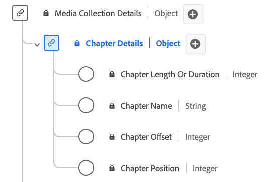

# Type de données de la collecte de [!UICONTROL Chapter Details]

La collecte de [!UICONTROL Chapter Details] est un type de données standard du modèle de données d’expérience (XDM) qui décrit divers attributs liés aux chapitres ou aux segments dans le contenu multimédia. Utilisez le type de données de la collecte de [!UICONTROL Chapter Details] pour capturer des informations telles que le nom du chapitre, le décalage, la durée et l’index de chapitre. Les champs de collecte de médias capturent des données et les envoient à d’autres services Adobe en vue d’un traitement ultérieur.

>[!NOTE]
>
>Chaque nom d’affichage contient un lien vers des informations supplémentaires sur ses paramètres audio et vidéo. Les pages liées contiennent des détails sur la vidéo et les données collectées par Adobe, les valeurs d’implémentation, les paramètres réseau, les rapports et des considérations importantes.

| Nom d’affichage | Propriété | Type de données | Obligatoire | Description |
|-------------------------------------------------------------------------------------------------------------------------------------------------------------------------|---------------|-----------|----------|---------------------------------------------------|
| [[!UICONTROL Chapter Length Or Duration]](https://experienceleague.adobe.com/docs/media-analytics/using/implementation/variables/chapter-parameters.html#chapter-length) | `length` | entier | Oui | Durée du chapitre, en secondes. |
| [[!UICONTROL Chapter Name]](https://experienceleague.adobe.com/docs/media-analytics/using/implementation/variables/chapter-parameters.html#chapter-name) | `friendlyName` | chaîne | Non | Nom du chapitre et/ou du segment. |
| [[!UICONTROL Chapter Offset]](https://experienceleague.adobe.com/docs/media-analytics/using/implementation/variables/chapter-parameters.html#chapter-offset) | `offset` | entier | Oui | Décalage du chapitre à l’intérieur du contenu (en secondes) depuis le début. |
| [[!UICONTROL Chapter Position]](https://experienceleague.adobe.com/docs/media-analytics/using/implementation/variables/chapter-parameters.html#chapter-position) | `index` | entier | Oui | Position (index, entier) du chapitre à l’intérieur du contenu. |

{style="table-layout:auto"}
