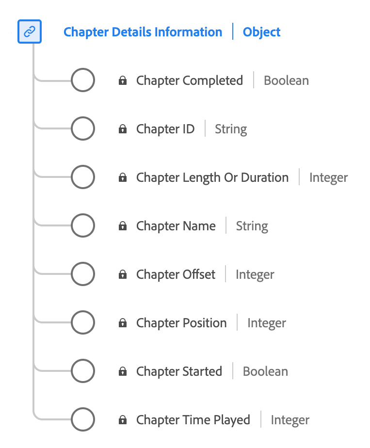

# [!UICONTROL Informations sur le chapitre] type de données

[!UICONTROL Informations sur le chapitre] est un type de données XDM (Experience Data Model) standard qui décrit divers attributs liés aux chapitres ou aux segments dans le contenu multimédia. Utilisez la variable [!UICONTROL Informations sur le chapitre] type de données pour capturer des détails tels que le nom, la durée, la position, l’identifiant, l’état de lecture (démarré/terminé) et la durée passée sur chaque chapitre.

| Nom d’affichage | Propriété | Type de données | Description |
|---------------------------|---------------|-----------|---------------------------------------------------|
| [!UICONTROL Nom du chapitre] | `friendlyName` | chaîne | Nom du chapitre et/ou du segment. |
| [!UICONTROL Durée Ou Durée Du Chapitre] | `length` | nombre entier | **Obligatoire** Durée du chapitre, en secondes. |
| [!UICONTROL Décalage de chapitre] | `offset` | nombre entier | **Obligatoire** Décalage du chapitre dans le contenu (en secondes) à partir du début. |
| [!UICONTROL Position du chapitre] | `index` | nombre entier | **Obligatoire** Position (index, entier) du chapitre dans le contenu. |
| [!UICONTROL ID de chapitre] | `ID` | chaîne | Identifiant généré automatiquement du chapitre. |
| [!UICONTROL Démarrage du chapitre] | `isStarted` | booléen | Indique si le chapitre a commencé. |
| [!UICONTROL Chapitre terminé] | `isCompleted` | booléen | Indique si le chapitre est terminé. |
| [!UICONTROL Durée de lecture des chapitres] | `timePlayed` | nombre entier | Temps passé sur le chapitre, en secondes. |

{style="table-layout:auto"}

Pour plus d’informations sur le groupe de champs, reportez-vous au [référentiel XDM public](https://github.com/adobe/xdm/blob/master/components/datatypes/chapterdetails.schema.json)
