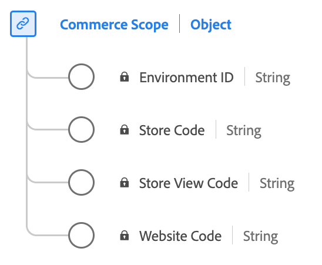

# Type de données [!UICONTROL Commerce Scope]

[!UICONTROL Portée de ] est un type de données standard du modèle de données d’expérience (XDM) qui définit les identifiants de l’endroit où un événement s’est produit dans un écosystème de commerce. Il distingue les environnements, les sites web, les boutiques et les affichages de boutique.

| Nom d’affichage | Propriété | Type de données | Description |
|---------------------------------|-------------------|-----------|-------------------------------------------------------|
| [!UICONTROL Identifiant d’environnement] | `environmentID` | chaîne | Identifiant d’environnement. Identifiant alphanumérique à 32 chiffres. |
| [!UICONTROL Code du site web] | `websiteCode` | chaîne | Code de site web unique dans un environnement. |
| [!UICONTROL Code de magasin] | `storeCode` | chaîne | Code de magasin unique au sein d’un site web. |
| [!UICONTROL Code d’affichage de la boutique] | `storeViewCode` | chaîne | Code d’affichage de magasin unique dans un magasin. |

{style="table-layout:auto"}

Pour plus d’informations sur ce type de données, reportez-vous au référentiel XDM public :

* [Exemple renseigné](https://github.com/adobe/xdm/blob/master/components/datatypes/commercescope.example.1.json)
* [Schéma complet](https://github.com/adobe/xdm/blob/master/components/datatypes/commercescope.schema.json)
