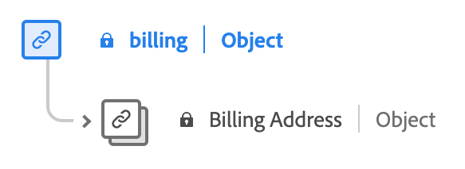

# Type de données 

 est un type de données standard de modèle de données d’expérience (XDM) qui décrit les enregistrements liés à l’achat et à la vente.

![Diagramme du type de données [!UICONTROL Commerce].](../images/data-types/commerce.png)

| Nom d’affichage | Propriété | Type de données | Description |
|------------------------------------------|-----------------------|------------------------------------|----------------------------------------------------------------------------------------------------------|
| [!UICONTROL Commande] | `order` | [[!UICONTROL Commande]](./order.md) | Décrit la commande passée pour un ou plusieurs produits. |
| [!UICONTROL ID de promotion] | `promotionID` | [!UICONTROL chaîne] | Identifiant de promotion de la commande passée, le cas échéant. |
| [!UICONTROL Abandons de panier] | `cartAbandons` | [[!UICONTROL Mesure]](./measure.md) | Décrit lorsqu’une liste de produits a été identifiée comme n’étant plus accessible ou ne pouvant plus être achetée par l’utilisateur. |
| [!UICONTROL Paiements] | `checkouts` | [[!UICONTROL Mesure]](./measure.md) | Action pendant le processus de passage en caisse d’une liste de produits. Il peut y avoir plusieurs événements de passage en caisse s’il existe plusieurs étapes dans un processus de passage en caisse. S’il existe plusieurs étapes, les informations sur l’heure de l’événement et la page ou l’expérience référencée sont utilisées pour identifier l’étape et les événements individuels représentés dans l’ordre. |
| [!UICONTROL Ajouts sur la liste de produits (panier)] | `productListAdds` | [[!UICONTROL Mesure]](./measure.md) | Ajout d’un produit à la liste des produits, par exemple un produit ajouté à un panier. |
| [!UICONTROL Ouverture de la liste de produits (panier)] | `productListOpens` | [[!UICONTROL Mesure]](./measure.md) | Initialisations d’une nouvelle liste de produits, telle que la création d’un panier. |
| [!UICONTROL Retraits De La Liste De Produits (Panier)] | `productListRemovals` | [[!UICONTROL Mesure]](./measure.md) | Retrait ou suppression d’une entrée de produit d’une liste de produits, tel qu’un produit retiré d’un panier. |
| [!UICONTROL Réouvertures de la liste de produits (panier)] | `productListReopens` | [[!UICONTROL Mesure]](./measure.md) | Liste de produits précédemment abandonnés et réactivés par l’utilisateur. |
| [!UICONTROL Vues de la liste de produits (panier)] | `productListViews` | [[!UICONTROL Mesure]](./measure.md) | Décrit le moment où une ou plusieurs vues d’une liste de produits se sont produites.Une liste de produits a été consultée une ou plusieurs fois. |
| [!UICONTROL Consultations produits] | `productViews` | [[!UICONTROL Mesure]](./measure.md) | Décrit le moment où une ou plusieurs vues d’un produit individuel se sont produites. |
| [!UICONTROL Achats] | `purchases` | [[!UICONTROL Mesure]](./measure.md) | Permet de suivre l’acceptation d’une commande. L’événement d’achat est la seule action requise dans une conversion commerciale. L’événement d’achat doit avoir une liste de produits référencée. |
| [!UICONTROL Enregistrer Pour Plus Tard] | `saveForLaters` | [[!UICONTROL Mesure]](./measure.md) | Décrit à quel moment une liste de produits est enregistrée pour une utilisation ultérieure, telle qu’une liste de souhaits. |
| [!UICONTROL Achat en magasin] | `inStorePurchase` | [[!UICONTROL Mesure]](./measure.md) | Indique un achat en magasin. Ces informations sont enregistrées à des fins d’analyse. |
| [!UICONTROL panier] | `cart` | [[!UICONTROL panier]](./cart.md) | Propriétés du panier qui contient un ou plusieurs produits. |
| [!UICONTROL Expédition] | `shipping` | [[!UICONTROL expédition]](./shipping.md) | Détails d’expédition d’un ou de plusieurs produits. |
| [!UICONTROL Facturation] | `billing` | [[!UICONTROL facturation]](#billing) | Détails de facturation pour un ou plusieurs paiements. |
| [!UICONTROL Achat instantané] | `instantPurchase` | [[!UICONTROL Mesure]](./measure.md) | Décrit le moment où un produit a été acheté instantanément, pouvant ignorer le panier ou le passage en caisse. |
| [!UICONTROL Ouverture de la liste des demandes d&#39;approvisionnement] | `requisitionListOpens` | [[!UICONTROL Mesure]](./measure.md) | Indique l&#39;initialisation d&#39;une nouvelle liste de demandes d&#39;approvisionnement. |
| [!UICONTROL Suppressions de listes de demandes d&#39;approvisionnement] | `requisitionListDeletes` | [[!UICONTROL Mesure]](./measure.md) | Indique la suppression de la liste de demandes d&#39;approvisionnement. |
| [!UICONTROL Ajouts de liste de demandes d&#39;approvisionnement] | `requisitionListAdds` | [[!UICONTROL Mesure]](./measure.md) | Indique l&#39;ajout d&#39;un ou de plusieurs produits à une liste de demandes d&#39;approvisionnement. |
| [!UICONTROL Retraits de la liste des demandes d&#39;approvisionnement] | `requisitionListRemovals` | [[!UICONTROL Mesure]](./measure.md) | Indique le retrait d&#39;un ou de plusieurs produits d&#39;une liste de produits de demande d&#39;approvisionnement. |
| [!UICONTROL Liste des demandes internes] | `requisitionList` | [[!UICONTROL requisitionlist]](./requisition-list.md) | Propriétés de la liste de demandes d&#39;approvisionnement créée par le client. |
| [!UICONTROL Périmètre] | `commerceScope` | [[!UICONTROL commercescope]](./commerce-scope.md) | Identifiants d’étendue de commerce de l’emplacement où un événement s’est produit (vue de magasin, magasin, site web, etc.). |

{style="table-layout:auto"}

## Type de données [!UICONTROL billing] {#billing}

[!UICONTROL billing] est un type de données standard du modèle de données d’expérience (XDM) qui contient des informations sur les détails de facturation. Plus précisément, il se concentre sur l’adresse de facturation.

| Nom d’affichage | Propriété | Type de données | Description |
|-------------------------------|-----------------|-----------------|--------------------------|
| [!UICONTROL Adresse de facturation] | `address` | [[!UICONTROL Adresse Postale]](./postal-address.md) | Adresse de facturation. |

{style="table-layout:auto"}

Pour plus d’informations sur le type de données , reportez-vous au référentiel XDM public :

* [Exemple renseigné](https://github.com/adobe/xdm/blob/master/components/datatypes/marketing/commerce.example.1.json)
* [Schéma complet](https://github.com/adobe/xdm/blob/master/components/datatypes/marketing/commerce.schema.json)
