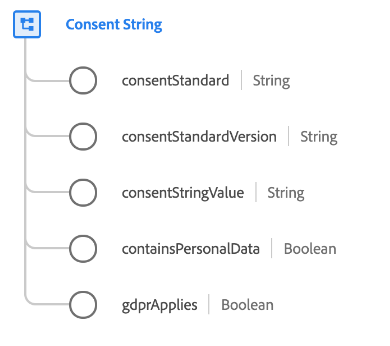

# [!UICONTROL Chaîne de consentement] type de données

[!UICONTROL &#x200B; Chaîne de consentement &#x200B;] est un type de données XDM standard qui décrit une valeur de chaîne représentant le consentement d’un client. Il comprend des informations contextuelles telles que la norme pour la chaîne de consentement (par exemple, le [&#x200B; IAB Transparency and Consent Framework (TCF) 2.0](../field-groups/profile/iab.md)).

| Propriété | Type de données | Description |
| --- | --- | --- |
| `consentStandard` | Chaîne | Norme de la chaîne de consentement. Cela permet de déterminer le format de la chaîne de consentement telle que définie par les services de gestion du consentement. |
| `consentStandardVersion` | Chaîne | Version de la norme de consentement utilisée pour définir précisément le format de la chaîne de consentement telle qu’elle est définie par les services de gestion du consentement. |
| `consentStringValue` | Chaîne | Chaîne de consentement complète fournie par le service de gestion du consentement. `consentStandard` et `consentStandardVersion` permettent de définir comment analyser cette chaîne. |
| `containsPersonalData` | Booléen | Lorsque ce champ est défini sur « true », cela signifie que cette chaîne de consentement doit être traitée pour l’application du consentement. |
| `gdprApplies` | Booléen | Lorsque ce champ est défini sur « vrai », cela signifie que le consentement s’accompagne de données personnelles. |

{style="table-layout:auto"}

Pour plus d’informations sur ce type de données, reportez-vous au référentiel XDM public :

* [Exemple renseigné](https://github.com/adobe/xdm/blob/master/components/datatypes/consent/consentstring.example.1.json)
* [Schéma complet](https://github.com/adobe/xdm/blob/master/components/datatypes/consent/consentstring.schema.json)
