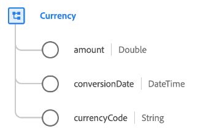

# Type de données [!UICONTROL Currency]

[!UICONTROL Devise] est un type de données XDM standard qui décrit un montant de devise, y compris le type de devise et la date de conversion.

| Propriété | Type de données | Description |
| --- | --- | --- |
| `amount` | Double | Montant de la devise tel que défini par le `currencyCode`. |
| `conversionDate` | DateTime | Date et heure du moment où la conversion monétaire a été effectuée. |
| `currencyCode` | Chaîne | Code ISO 4217 indiquant le type de devise que `amount` représente. |

{style="table-layout:auto"}

Pour plus d’informations sur le groupe de champs , consultez le référentiel XDM public :

* [Exemple renseigné](https://github.com/adobe/xdm/blob/master/components/datatypes/currency.example.1.json)
* [Schéma complet](https://github.com/adobe/xdm/blob/master/components/datatypes/currency.schema.json)
