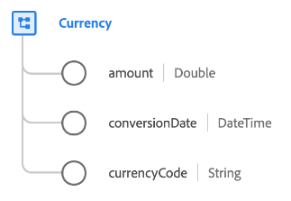

# [!UICONTROL Devise] type de données

[!UICONTROL Devise] est un type de données XDM standard qui décrit une quantité de devise, y compris le type de devise et la date de conversion.

| Propriété | Type de données | Description |
| --- | --- | --- |
| `amount` | Double | Le montant de la devise tel que défini par la variable `currencyCode`. |
| `conversionDate` | DateTime | Horodatage du moment où la conversion de devise a été effectuée. |
| `currencyCode` | Chaîne | Un code ISO 4217 indiquant le type de devise qui `amount` représente . |

{style=&quot;table-layout:auto&quot;}

Pour plus d’informations sur le groupe de champs, reportez-vous au référentiel XDM public :

* [Exemple rempli](https://github.com/adobe/xdm/blob/master/components/datatypes/currency.example.1.json)
* [Schéma complet](https://github.com/adobe/xdm/blob/master/components/datatypes/currency.schema.json)
