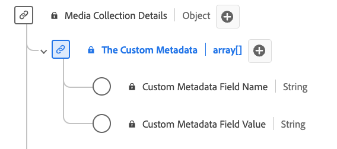

# Type de données de la collecte de [!UICONTROL Custom Metadata Details]

La collecte de [!UICONTROL Custom Metadata Details] est un type de données standard du modèle de données d’expérience (XDM) qui définit une structure de stockage des métadonnées personnalisées. Utilisez le type de données Collection de [!UICONTROL Custom Metadata Details] pour capturer des informations telles que le nom et la valeur de métadonnées personnalisées associées au contenu ou aux interactions.

| Nom d’affichage | Propriété | Type de données | Obligatoire | Description |
|--------------------------------------------|------------------|-----------|----------|-------------------------------|
| [!UICONTROL Custom Metadata Field Name] | `name` | string | Non | Nom du champ personnalisé. |
| [!UICONTROL Custom Metadata Field Value] | `value` | string | Non | Valeur du champ personnalisé. |

{style="table-layout:auto"}
