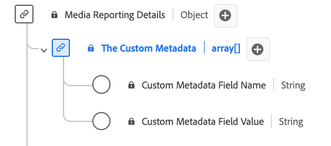

# Type de données [!UICONTROL Custom Metadata Details] Reporting

[!UICONTROL Custom Metadata Details] Reporting est un type de données standard du modèle de données d’expérience (XDM) qui définit une structure de stockage des métadonnées personnalisées. Le type de données Rapports [!UICONTROL Custom Metadata Details] capture des détails tels que le nom et la valeur des métadonnées personnalisées associées au contenu ou aux interactions. Les champs de création de rapports multimédia sont utilisés par les services Adobe pour analyser les champs de collecte multimédia envoyés par les utilisateurs. Ces données, ainsi que d’autres mesures d’utilisateur spécifiques, sont calculées et font l’objet de rapports.

| Nom d’affichage | Propriété | Type de données | Description |
|--------------------------------------------|------------------|-----------|-----------------------------------------|
| [!UICONTROL Custom Metadata Field Name] | `name` | chaîne | Nom du champ personnalisé. |
| [!UICONTROL Custom Metadata Field Value] | `value` | chaîne | Valeur du champ personnalisé. |

{style="table-layout:auto"}
