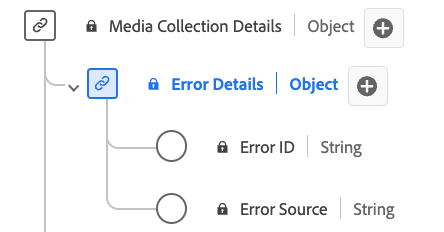

# [!UICONTROL Détails de l’erreur] Type de données de collection

[!UICONTROL Détails de l’erreur] la collecte est un type de données standard du modèle de données d’expérience (XDM) qui décrit les détails de l’erreur. Utilisez le type de données de collection [!UICONTROL Détails de l’erreur] pour capturer les détails de la source de l’erreur et de l’identification. L’ID d’erreur identifie l’erreur et la source de l’erreur indique si elle provient du lecteur ou d’une source externe (telle qu’un réseau CDN). Les agrégats d’erreurs calculés, notamment le nombre d’erreurs, les flux impactés et les tableaux d’ID d’erreur, sont disponibles dans le type de données [Rapports sur les détails des données de la qualité de service](./qoe-data-details-reporting.md).

+++Sélectionnez cette option pour afficher un diagramme du type de données Collection [!UICONTROL Détails de l’erreur].

+++

>[!NOTE]
>
>Ce type de données appartient au schéma `mediaCollection`, à savoir les champs que votre implémentation envoie au serveur principal des médias en flux continu. Adobe traite ces données et génère les champs de `mediaReporting` correspondants, qui sont ingérés dans les jeux de données Platform. Voir [Schéma de reporting XDM des médias en flux continu](https://experienceleague.adobe.com/en/docs/media-analytics/using/implementation/edge/reporting-schema) pour plus d’informations.

| Nom d’affichage | Propriété | Type de données | Obligatoire | Description |
|---|---|---|---|---|
| [!UICONTROL ID d’erreur] | `name` | string | Non | ID de l’erreur. |
| [!UICONTROL Erreur Source] | `source` | string | Non | Source de l’erreur. Utilisez « lecteur » pour les erreurs générées par le lecteur multimédia lui-même et « externe » pour les erreurs provenant de l’extérieur du lecteur, telles que les erreurs CDN. |

Voir [errordetails.schema.json](https://github.com/adobe/xdm/blob/master/components/datatypes/errordetails.schema.json) dans le référentiel XDM public pour la définition complète du schéma.
