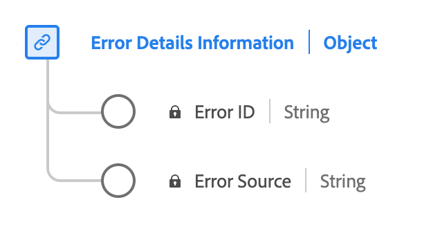

# [!UICONTROL Informations sur les erreurs] type de données

[!UICONTROL Informations sur les erreurs] est un type de données XDM (Experience Data Model) standard qui décrit les détails d’erreur. Utilisez la variable [!UICONTROL Informations sur les erreurs] type de données pour capturer les détails de la source et de l’identification de l’erreur. L’ID d’erreur identifie l’erreur et la source de l’erreur indique si elle provient du lecteur ou d’une source externe.

| Nom d’affichage | Propriété | Type de données | Description |
|----------------|----------------|-----------|----------------------------------------------|
| [!UICONTROL Identifiant d’erreur] | `name` | chaîne | ID d’erreur. |
| [!UICONTROL Source de l’erreur] | `source` | chaîne | Source de l’erreur. Énuméré : &quot;joueur&quot;, &quot;externe&quot; avec leurs significations respectives. |

{style="table-layout:auto"}

Pour plus d’informations sur le groupe de champs, reportez-vous au [référentiel XDM public](https://github.com/adobe/xdm/blob/master/components/datatypes/errordetails.schema.json)
