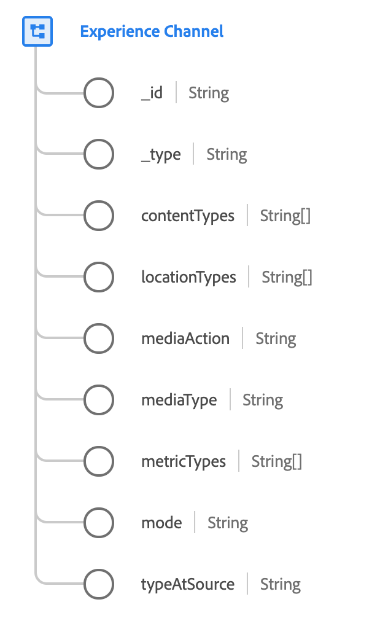

# Type de données [!UICONTROL canal Experience]

[!UICONTROL Canal d’expérience] est un type de données standard du modèle de données d’expérience (XDM) qui décrit un canal d’expérience. Un canal d’expérience représente une méthode ou un chemin d’accès pour la manière dont les expériences numériques sont utilisées.

Il existe plusieurs canaux d’expérience, chacun ayant des contraintes différentes sur la manière dont le contenu est diffusé, dont l’interaction client peut être observée et dont les données sont collectées. Au sein d’un canal, les expériences peuvent être diffusées à des emplacements spécifiques. Les emplacements et les types d’emplacements qui existent dans un canal varient d’un canal à l’autre.

| Propriété | Type de données | Description |
| --- | --- | --- |
| `_id` | Chaîne | Identifiant qui identifie le canal de manière unique. Chaque canal d’expérience spécifique définit un `@id` constant. |
| `_type` | Chaîne | Fournit une étiquette de classification approximative pour les canaux avec des propriétés similaires. |
| `contentTypes` | Tableau de chaînes | Types de contenu que ce canal peut diffuser. |
| `locationTypes` | Tableau de chaînes | Types d’emplacements (emplacements virtuels) correspondant à ce canal et vers lesquels il peut diffuser du contenu. |
| `mediaAction` | Chaîne | Décrit une action de média d’événement d’expérience, le cas échéant. |
| `mediaType` | Chaîne | Décrit le type de média : exposition médiatique achetée, exposition médiatique détenue ou exposition médiatique gagnée. |
| `metricTypes` | Tableau de chaînes | Mesures pouvant être collectées dans ce canal. |
| `mode` | Chaîne | Façon dont les expériences sont diffusées dans ce canal. |
| `typeAtSource` | Chaîne | Nom personnalisé du canal. |

{style="table-layout:auto"}

Pour plus d’informations sur ce type de données, reportez-vous au référentiel XDM public :

* [Exemple renseigné](https://github.com/adobe/xdm/blob/master/components/datatypes/channels/channel.example.1.json)
* [Schéma complet](https://github.com/adobe/xdm/blob/master/components/datatypes/channels/channel.schema.json)
