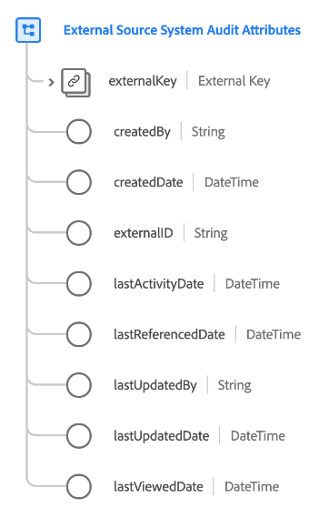

# [!UICONTROL Attributs d’audit du système Source externe] type de données

[!UICONTROL Attributs d’audit du système Source externe] est un type de données standard du modèle de données d’expérience (XDM) qui capture les détails d’audit d’un système source externe.

| Propriété | Type de données | Description |
| --- | --- | --- |
| `externalKey` | Source B2B]](./b2b-source.md)[[!UICONTROL  | Identifiant composite de la source utilisée pour le contrôle. |
| `createdBy` | Chaîne | Nom de l’utilisateur qui a créé cet enregistrement. |
| `createdDate` | DateTime | Date de création de cet enregistrement. |
| `externalID` | Chaîne | Identifiant unique externe de la source. Cette valeur est utilisée pour faciliter l’identification et la déduplication si nécessaire. |
| `lastActivityDate` | DateTime | Date de dernière activité du système source. |
| `lastReferencedDate` | DateTime | Dernière date référencée pour le système source. |
| `lastUpdatedBy` | Chaîne | Nom de la personne qui a mis à jour cet enregistrement pour la dernière fois. |
| `lastUpdatedDate` | DateTime | Date de dernière mise à jour du système source. Cette valeur est utilisée par la [politique de fusion des attributs](../../profile/api/merge-policies.md#attribute-merge) pour déterminer la priorité en cas de conflits de fusion. |
| `lastViewedDate` | DateTime | Date de la dernière consultation du système source. |

{style="table-layout:auto"}

Pour plus d’informations sur ce type de données, reportez-vous au référentiel XDM public :

* [Exemple renseigné](https://github.com/adobe/xdm/blob/master/components/datatypes/auditing/external-source-system-audit.example.1.json)
* [Schéma complet](https://github.com/adobe/xdm/blob/master/components/datatypes/auditing/external-source-system-audit.schema.json)
