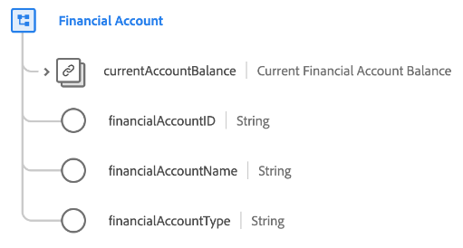

# Type de données [!UICONTROL Financial Account]

[!UICONTROL Financial Account] est un type de données XDM standard qui décrit les détails d’un compte financier, y compris son type, son propriétaire et son solde actuel.

| Propriété | Type de données | Description |
| --- | --- | --- |
| `currentAccountBalance` | [[!UICONTROL Currency]](./currency.md) | Solde actuel du compte. |
| `financialAccountId` | [!UICONTROL String] | ID unique du compte. |
| `financialAccountName` | [!UICONTROL String] | Nom attribué au compte. |
| `financialAccountType` | [!UICONTROL String] | Type de compte financier, tel que compte chèques, compte d’épargne ou compte de retraite. |

{style="table-layout:auto"}

Pour plus d’informations sur ce type de données, reportez-vous au [référentiel XDM public](https://github.com/adobe/xdm/blob/master/docs/reference/datatypes/financial-account.schema.json).
