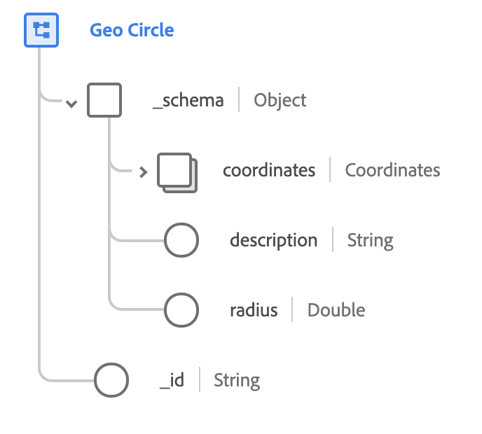

# Type de données [!UICONTROL Geo Circle]

[!UICONTROL Geo Circle] est un type de données XDM standard qui décrit une région géographique circulaire, selon un rayon particulier centré sur un ensemble spécifique de coordonnées. Ce type de données est basé sur la spécification publique documentée sur [schema.org](https://schema.org/GeoCircle).

{width=400}

| Propriété | Type de données | Description |
| --- | --- | --- |
| `_schema.coordinates` | [[!UICONTROL Geo Coordinates]](./geo-coordinates.md) | Décrit les coordonnées géographiques du centre du cercle. |
| `_schema.description` | Chaîne | Description du contenu du cercle. |
| `_schema.radius` | Double | Longueur du rayon du cercle. Cette valeur est conforme à la référence [WGS84](https://gisgeography.com/wgs84-world-geodetic-system/) et elle est mesurée en mètres. |
| `_id` | Chaîne | Identifiant unique généré par le système pour le cercle. |
