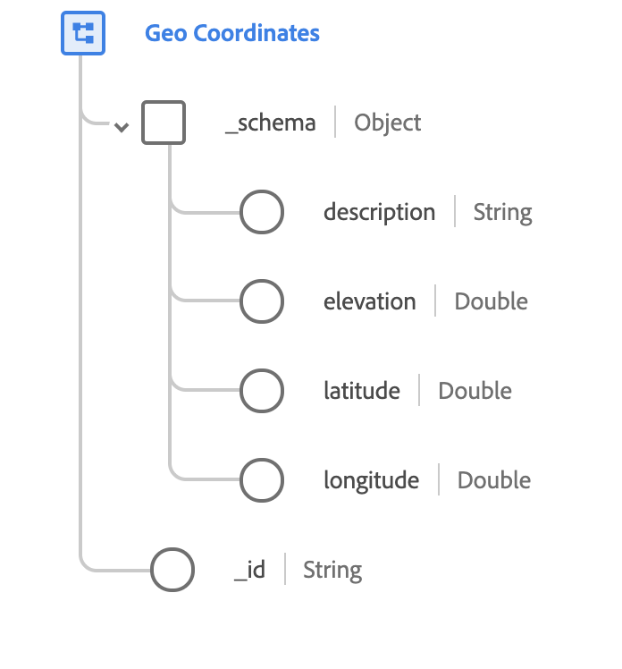

# Type de données [!UICONTROL Geo Coordinates]

[!UICONTROL Geo Coordinates] est un type de données XDM standard qui décrit les coordonnées géographiques d’un lieu. Ce type de données est basé sur la spécification publique documentée sur [schema.org](https://schema.org/GeoCoordinates).

{width=400}

| Propriété | Type de données | Description |
| --- | --- | --- |
| `_schema.description` | Chaîne | Description de ce que les coordonnées identifient. |
| `_schema.elevation` | Double | Altitude spécifique de la coordonnée définie. La valeur doit être conforme au système  et est mesurée en mètres. |
| `_schema.latitude` | Double | Coordonnée verticale signée du point géographique. |
| `_schema.longitude` | Double | Coordonnée horizontale signée du point géographique. |
| `_id` | Chaîne | Identifiant unique généré par le système pour les coordonnées. |
