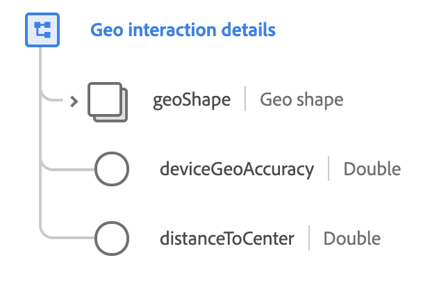

# [!UICONTROL Détails de l’interaction géographique] type de données

[!UICONTROL Détails de l’interaction géographique] est un type de données XDM standard qui décrit l’état actuel d’inclusion dans une zone définie géographiquement.

{width=400}

| Propriété | Type de données | Description |
| --- | --- | --- |
| `geoShape` | [[!UICONTROL Forme géographique]](./geo-shape.md) | Décrit la forme géographique de la zone avec laquelle il y a interaction. Ce champ peut décrire une boîte, un cercle ou un polygone. |
| `deviceGeoAccuracy` | Double | Précision du mécanisme ou du dispositif de mesure géographique, exprimée en mètres. |
| `distanceToCenter` | Double | Distance par rapport au centre de la zone dans le cas d’un cercle géographique, mesurée en mètres. |

{style="table-layout:auto"}

Pour plus d’informations sur ce type de données, reportez-vous au référentiel XDM public :

* [Exemple renseigné](https://github.com/adobe/xdm/blob/master/components/datatypes/geo-interaction-details.example.1.json)
* [Schéma complet](https://github.com/adobe/xdm/blob/master/components/datatypes/geo-interaction-details.schema.json)
